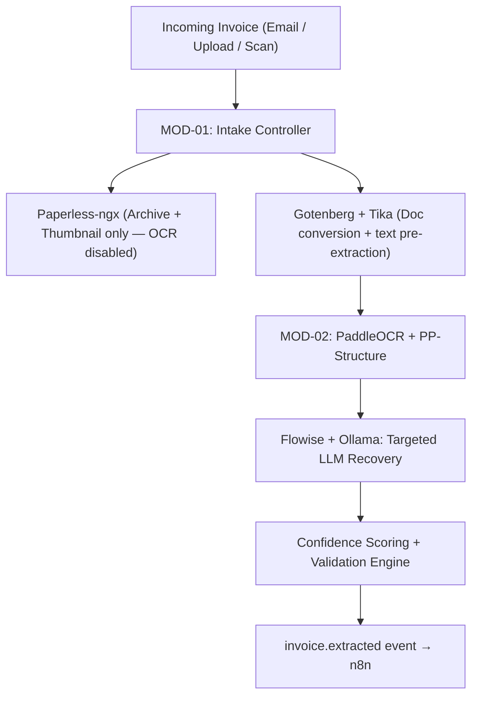
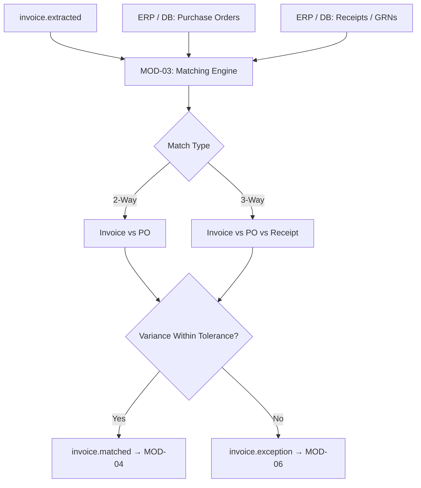
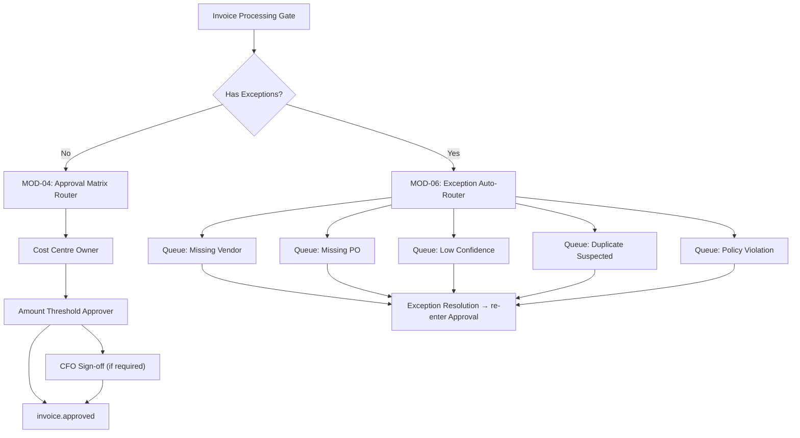
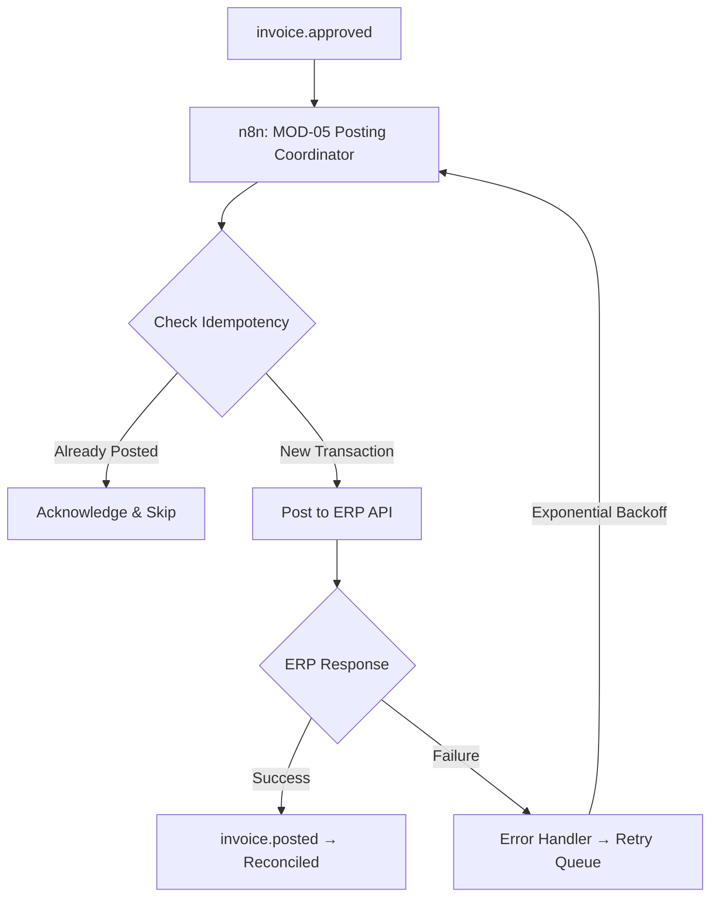
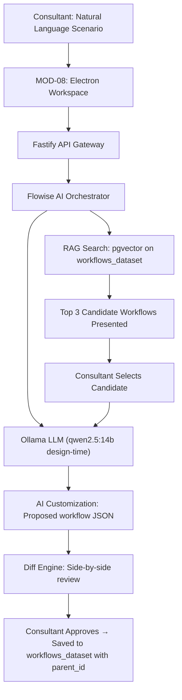
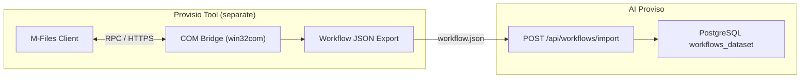

# AI Proviso Product Requirements Document (PRD)
## Version 12.0 — AI-First Backbone · Project Container Model · Dataset Intelligence · Auto-Versioning

---

## Document Metadata

| Field | Detail |
| :--- | :--- |
| **Product** | AI Proviso — AI-First AP Automation Platform |
| **Version** | 12.0 — AI-First Backbone · Project Container Model · Dataset Intelligence · Auto-Versioning |
| **Classification** | Internal — Confidential |
| **Author** | Harry Joseph / scriptdotnet — Xerox Canada |
| **Previous Versions** | PRD v11.0 (Project Container Model) · PRD v10.0 (Workflow Engine Boundary) · PRD v9.0 (Platform Boundary Clarification) · PRD v8.0 (Consolidated Production Architecture) |
| **Primary Stakeholder** | Michel LeBrun — Director, Software Pre-sales & Solution Design |
| **Demo Target** | 12-Week Michel LeBrun Pilot (Phase I Working Vertical Slice) |
| **Phase I Timeline** | 8 Weeks to Working Demo · 16 Weeks Production Hardening |
| **Architecture** | 9-Module Contract-First Isolation · Docker Compose (local baseline) · Kubernetes (enterprise scale path) · XState Workflow Engine · n8n Event Spine |
| **AI Stack** | Ollama · Flowise (Config-as-Code) · PaddleOCR · PP-Structure · @xyflow/react v12 (React Flow Pro baseline) |
| **Data Layer** | PostgreSQL 16 (Platform Master) + SQLite (Local Workspace Client Cache) |
| **Merge Basis** | Consolidated from PRD v11.0 + PRD v12.0 AI-First additions (single canonical PRD12) |

---

## 0. AI-First Architectural Law

> [!IMPORTANT]
> **This section is permanent and supersedes all other design guidance when a conflict arises. Every decision made in AI Proviso — architectural, feature, UX, or implementation — must be evaluated against this law before it is accepted.**

---

### 0.1 The Foundational Principle

AI Proviso is an **AI-first AP automation platform**. This means AI is not a feature added to the platform. AI is the backbone the platform is built on. Intelligence is baked into every layer — intake, extraction, matching, workflow design, ERP mapping, integrator workspace, and dataset management.

The distinction is not cosmetic. It defines how every component is designed.

```
AI AS A FEATURE (wrong — not AI Proviso)
  System runs.
  User asks AI a question.
  AI returns a suggestion.
  User decides what to do with it.
  AI is a bolt-on assistant.
  Human does the work.
  AI occasionally helps.

AI AS THE BACKBONE (correct — this is AI Proviso)
  AI runs first on every action.
  AI reads context before the human finishes typing.
  AI retrieves, ranks, and proposes.
  AI generates the diff, the version notes, the mapping.
  AI monitors live deployments and surfaces anomalies.
  Human approves decisions — not discovers them.
  AI does the work.
  Human is the authority.
```

The human role in AI Proviso is **judgment and authority** — not search and assembly. The AI handles mechanical intelligence. The integrator handles decisions that require professional judgment, contextual knowledge, and accountability.

---

### 0.2 The AI-First Test

Every feature, screen, workflow, and architectural decision must pass this test before it is accepted into the product.

> **Is the AI doing the work and the human approving the result?**
> **Or is the human doing the work and the AI occasionally helping?**

If the answer is the second — the feature must be redesigned. A feature where the human manually searches, manually compares options, manually assembles a result, or manually writes something the AI could generate is not an AI Proviso feature. It is a legacy AP tool feature that belongs in M-Files or ABBYY, not here.

This test applies to every layer:

| Layer | AI-First Behaviour | Non-AI-First (reject) |
| :--- | :--- | :--- |
| **Project creation** | AI reads scenario, ranks candidates, prepares diff before integrator opens the screen | Integrator opens search panel, types query, browses results |
| **Workflow design** | AI proposes complete workflow from base record + diff | Integrator drags states onto canvas manually |
| **ERP mapping** | AI maps fields from past deployments, flags ambiguous fields | Integrator opens field list, matches manually |
| **Version notes** | AI generates plain-language notes from JSON diff | Integrator writes change descriptions manually |
| **Touchless monitoring** | AI compares live rate against expected baseline, surfaces degradation | Integrator pulls a report to check performance |
| **Integrator workspace** | AI surfaces relevant past projects at the right moment | Integrator searches past projects when they remember to |
| **Exception routing** | AI classifies exceptions, proposes resolution path | AP user categorises exceptions manually |

---

### 0.3 Where AI Lives in Every Layer

AI is not concentrated in a single module or a chat panel. It is present in every layer of the platform with a specific role in each.

**Intake layer.**
The moment an invoice arrives the AI does not wait to be asked. It classifies the document type, selects the appropriate extraction model, and routes it. No human initiates this. It is the default behaviour of the intake layer.

**Extraction layer.**
The AI reads the vendor profile history, applies learned layout coordinates, decides which fields need LLM recovery and which can be resolved deterministically. It produces a structured result with per-field confidence scores and its own reasoning attached. The extraction is an AI decision, not a pipeline execution.

**Matching layer.**
When a new client scenario is described, the AI has already been reading the conversation as it was typed. By the time the integrator acts, the AI has ranked the top candidates from the 142-record dataset using four-dimensional similarity scoring — semantic, structural, configuration, and context. The integrator walks into a prepared room, not an empty one.

**Workflow layer.**
The AI does not generate a workflow when asked. It maintains a continuous model of what this client's workflow should look like. When something in the live deployment diverges from the expected pattern — touchless rate below baseline, exception rate spiking, SLA breaches clustering — the AI surfaces it without being asked.

**ERP mapping layer.**
The AI maps fields not by following a lookup table but by reasoning about the invoice structure, the ERP schema, and historical mappings from similar past deployments. When a field is ambiguous, the AI proposes the most likely mapping and explains its reasoning explicitly — which past deployments it is drawing from and why.

**Integrator workspace.**
The AI is not a chat panel the integrator opens when they have a question. It is a persistent, context-aware presence in every session — aware of the full project history, proactively surfacing relevant information from past projects at the right moment, without being asked.

**Version management.**
Every time a project changes, the AI reads the diff between the current JSON and the previous version and generates a plain-language change description automatically. No human writes change notes.

---

### 0.4 The Human Authority Gates

AI-first does not mean AI-only. The human retains explicit authority at defined decision points. These gates are non-negotiable — the AI cannot proceed past them without human approval.

```
GATE 1 — Dataset match selection
  AI presents top 3 candidates ranked by similarity.
  Human selects the base record.
  AI cannot self-select and proceed.

GATE 2 — Diff approval
  AI proposes every customisation with reasoning.
  Human approves or rejects each item individually.
  AI cannot apply changes without per-item approval.

GATE 3 — Workflow activation
  AI has verified all activation requirements.
  Human clicks Activate.
  AI cannot activate a project autonomously.

GATE 4 — ERP posting
  AI has mapped all fields and verified the connection.
  Human confirms the ERP configuration is correct.
  AI cannot begin live ERP posting without confirmation.

GATE 5 — Exception resolution
  AI has classified the exception and proposed resolution.
  Human approves the resolution path.
  AI cannot resolve exceptions autonomously.
```

Between the gates, AI operates autonomously. At the gates, the human is the authority. This division is the architecture of trust that makes AI-first safe for financial document processing.

---

### 0.5 What Is Already AI-First in the Current Stack

The AI-first principle is not aspirational — it is already expressed in the current architectural decisions. The table below shows how each existing component is an expression of this law.

| Component | AI-First Role |
| :--- | :--- |
| **pgvector on workflows_dataset** | The AI matching backbone — not a search feature |
| **Flowise orchestrating Ollama** | The AI reasoning layer — not a chat panel |
| **Diff approval gate** | The human authority checkpoint in an AI-driven flow |
| **parent_id lineage on every record** | How the AI traces deployment history — not a FK |
| **Four authoring modes** | Four expressions of the same AI backbone at different starting points |
| **PostgreSQL as single source of truth** | What makes AI access to project history reliable and auditable |
| **Auto-versioning with AI notes** | AI writes the institutional record — not the integrator |
| **Touchless rate tracking** | The metric the AI monitors against expected baseline |
| **project_dataset_refs table** | The permanent record of every AI proposal and human decision |

---

### 0.6 Integrator AI Workspace — Configured Access to Past Projects

The integrator workspace requires deliberate, configured access to past project history. This is not open access to everything. It is a structured, permissioned, audited connection between the AI and the integrator's deployment record.

**What the AI can access in the integrator workspace:**

```
INTEGRATOR WORKSPACE — Harry Joseph
│
├── My Projects (full AI access)
│     proj_047   Acme Corporation    active · 84% touchless
│     proj_063   TechSupply Inc      active · 79% touchless
│     proj_081   Northern Plastics   draft
│     proj_094   Quebec Distributor  archived
│
├── Shared With Me (explicit permission · read access)
│     proj_055   Philippe's SAP client
│
├── Dataset (sanitised · all integrators · AI access)
│     142 validated records · no PII
│
└── AI Access Configuration
      Which projects the AI can reference
      Audit log of every AI access to project data
      Per-project permission level
```

**What the AI does with this access:**

When Harry describes a new client, the AI does not just search the sanitised dataset. It also reads Harry's own project history and reasons across both. It knows that Harry deployed Acme Corporation in March 2024, that it reached 84% touchless after 60 days, and that the current client's scenario is 91% similar to that deployment. It surfaces that context as part of the candidate presentation — not as a separate search result.

When Harry troubleshoots a live deployment, the AI reads the version history of that specific project and identifies what changed between versions. It does not summarise — it pinpoints.

When Philippe needs to onboard a client similar to one Harry has deployed before, the AI — with Harry's permission — references Harry's project record as the starting point. Philippe gets the benefit of Harry's experience without Harry needing to be present.

**Access audit:**
Every AI read of a past project is logged to `integrator_ai_access_log`. This creates a traceable record of how the AI used deployment history and surfaces which projects are most frequently referenced — the strongest template candidates.

---

### 0.7 The Cold Start Plan

The AI-first backbone operates at full power when the dataset is large enough to provide reliable matches. The cold start path is explicit.

| Dataset Size | AI Capability | Integrator Experience |
| :--- | :--- | :--- |
| 0–10 projects | Structural matching only. Semantic similarity limited. | AI proposes structure. Integrator fills detail. |
| 10–50 projects | Semantic + structural matching reliable for common profiles. | AI matches confidently for Ontario SAP manufacturing. Other segments still developing. |
| 50–200 projects | Four-dimensional scoring reliable across major segments. | AI matches confidently across SAP, Dynamics, NetSuite for Canadian SME. |
| 200+ projects | Flywheel self-sustaining. Template clusters forming. | AI operates at full designed capability. Templates proposed automatically. |

Phase 1 demo operates on 142 records — sufficient to demonstrate the concept convincingly. Production quality at full capability requires real deployments feeding back into the dataset. This is a go-to-market execution requirement, not a technical limitation.

---

### 0.8 The Two Copies Principle

Every activated project produces two distinct artefacts with different owners and different purposes.

```
CLIENT COPY                         INTEGRATOR COPY
(handed over — client owns it)      (retained — Xerox owns it)
──────────────────────────────────────────────────────────────
Running AP automation               Full project history
Live invoices flowing               AI match record
Approved workflow active            Diff accepted/rejected
ERP posting live                    Version lineage
Audit trail of real invoices        Touchless rate over time
Their data, their environment       Parent_id to dataset record
No integrator internals visible     Template candidate data
Client independent of Harry         Feeds the dataset flywheel
                                    Philippe can build on it
                                    Harry revisits any time
```

The client gets a clean, self-contained AP deployment. The integrator retains the institutional record that makes the next similar client faster, cheaper, and more accurate to onboard. Every handover leaves something behind in the integrator record. Every integrator record improves the dataset. The work compounds. M-Files partners walk away with nothing. Proviso integrators walk away with a richer dataset every time.

---

### 0.9 Scope Discipline Rule

The AI-first principle creates a natural scope discipline rule for Phase 1.

**Build the smallest version of the AI-first backbone that is still convincing to Michel — and ship that.**

Do not build the full vision before the demo. Every Phase 1 feature must satisfy two conditions simultaneously:

1. It passes the AI-First Test from Section 0.2.
2. It is deliverable within the Phase 1 timeline.

If a feature passes the AI-First Test but is not deliverable in Phase 1, it goes on the Phase 2 roadmap. It does not delay Phase 1. If a feature is deliverable in Phase 1 but fails the AI-First Test, it is redesigned or dropped. It does not ship as a legacy feature with an AI wrapper.

---

## Seven Locked Architectural Decisions

> [!IMPORTANT]
> **Decision 1 — Paperless-ngx Boundary:** Paperless-ngx is strictly a document archive, search, and thumbnail storage service. **`PAPERLESS_OCR_MODE=skip`** is enforced in the Docker Compose environment. **MOD-02** owns all OCR text and layout extraction.
>
> **Decision 2 — Flowise Configuration-as-Code:** Flowise flows are not mutable infrastructure. Visual prompt chains are exported as JSON, committed to the Git repository, and auto-seeded via the Flowise REST API on container deployment. The Fastify API calls Flowise over HTTP, making it fully swappable for a native LangChain/LlamaIndex Python microservice without frontend changes.
>
> **Decision 3 — Phase I Demo Scope:** The pilot targets a working vertical slice: **MOD-01 (Intake)** + **MOD-02 (Extraction)** + **MOD-04 (Workflow/Diff Approval)**. **MOD-03 (Matching)** and **MOD-05 (ERP Posting)** are simulated via mock database tables and mock webhook callbacks. MOD-07 (Audit) is wired from day one — it is never retrofitted.
>
> **Decision 4 — Clean Tool Boundary (COM Bridge Removed):** AI Proviso does **not** talk to the M-Files COM API. The separate **Provisio** tool owns COM export and produces a workflow JSON file. AI Proviso ingests that file via a single platform-agnostic endpoint: `POST /api/workflows/import`. This removes the Windows-only deployment requirement, the `win32com` dependency, and the `host-native` profile from AI Proviso entirely.
>
> **Decision 5 — Development Truth Path:** Docker Compose plus PostgreSQL is the primary development and validation path for extraction persistence, workflow state transitions, audit traceability, and model-development outputs. The canonical development bootstrap path is the ordered migration set `001_initial_schema.sql` → `002_rls_policies.sql` → `003_triggers.sql` → `004_seed_data.sql`. Model-development work must validate against persisted PostgreSQL records, not transient in-memory fixtures.
>
> **Decision 6 — Workflow Runtime Boundary:** XState is a pure transition evaluator. PostgreSQL is the only source of truth for workflow state, transition history, timers, and audit records. n8n dispatches notifications and external calls only after the authoritative transaction commits.
>
> **Decision 7 — AI-First is Non-Negotiable:** Every feature, screen, module, and architectural decision must pass the AI-First Test defined in Section 0.2 before it is accepted into the product. A feature where the human manually searches, manually compares, manually assembles, or manually writes something the AI could generate is not an AI Proviso feature. AI does the work. The human approves at defined authority gates. This decision cannot be overridden by timeline pressure, scope convenience, or stakeholder preference. If a feature cannot be made AI-first within the Phase 1 timeline, it moves to Phase 2. It does not ship as a legacy feature with an AI label attached.

---

## 1. Vision & Strategic Promise

AI Proviso is an **AI-first** Accounts Payable automation platform. AI is not a feature — it is the backbone every layer is built on. Intelligence drives intake, extraction, matching, workflow design, ERP mapping, version management, and the integrator workspace. Humans retain authority at defined approval gates. Everything between those gates runs on AI.

AI Proviso is explicitly positioned to replace brittle M-Files-based AP configurations and legacy template capture tools (ABBYY FlexiCapture, CapturePerfect) through superior AI extraction, AI-driven workflow design, and an intelligent deployment dataset that compounds in value with every client onboarded.

### 1.1 Core Commitments

| Pillar | Commitment |
| :--- | :--- |
| **AI-First Backbone** | Intelligence is baked into every layer. AI does the work. Human approves at authority gates. See Section 0. |
| **Speed to Value** | Full AP deployment in under 7 days via a guided First-Run Wizard |
| **AI-First OCR** | PaddleOCR + PP-Structure + coordinate-based reconstruction, with LLM used only for ambiguous recovery cases. Delivers invoice extraction with lower operational cost and deployment risk than a DocTR-based pipeline |
| **No-Code Platform** | Drag-and-drop workflow, form, and app builders. No engineering required for configuration adjustments |
| **Workflow Integrity** | Every state transition is programmatically policy-enforced. Zero bypass paths. Zero passive pending states |
| **Learning System** | Every approved invoice makes the next one faster. Every deployed project makes the next onboarding faster. Vendor profiles, ERP mappings, and workflow templates accumulate confidence automatically |
| **Modular by Design** | 9 contract-isolated modules. Swap, upgrade, or extend any service layer without impact on the others |

### 1.1.1 Locked Designer Principle

AI Proviso's workflow designer is business-language first. Integrators configure states, transitions, approvals, SLAs, notifications, and escalations in operational terms. The platform compiles that intent into the underlying workflow engine, event routing, and timer infrastructure automatically. The implementation layer is hidden by default and exposed only in controlled diagnostic views.

### 1.1.2 Semantic View Modes

The workflow canvas is a polymorphic product surface with three sanctioned view modes:

| View Mode | Default User | Purpose | Authoring Model |
| :--- | :--- | :--- | :--- |
| **Business** | Analysts / consultants / operators | Clean Proviso-native workflow authoring in business language | Canonical source of truth |
| **Runtime** | Integrators / support / debugging | Shows route history, rule IDs, guard names, failed steps, and live execution facts | Read-only overlay on canonical model |
| **Target** | Systems integrators / advanced implementers | Shows compiled XState and n8n identities, webhook paths, and target metadata | Read-only overlay on canonical model |

The default experience must remain Business view. Runtime and Target views exist to reveal underlying execution structure on demand without forcing users to author directly in engine-specific primitives.

### 1.1.3 The Shiny Stars Pattern

AI Proviso uses a contextual overlay pattern internally referred to as **Shiny Stars**.

- The clean canvas remains a business map first.
- When a semantic lens is enabled, critical runtime and integration boundaries illuminate in place rather than replacing the business model.
- These illuminated markers represent runtime interceptors such as XState guards, transition metadata, n8n webhook boundaries, worker handoff points, and connector crossings.

This pattern preserves the product rule of **default clean, detail on selection, depth on demand**.

### 1.2 Competitive Positioning

| Capability | Legacy Tools (M-Files / ABBYY) | AI Proviso v12 |
| :--- | :--- | :--- |
| **Architecture** | AI as a bolt-on feature | AI as the backbone — every layer |
| **OCR Engine** | Single template-based OCR engine | PaddleOCR + PP-Structure + deterministic reconstruction, with LLM recovery only for ambiguous fields |
| **Workflow Config** | Proprietary XML — consultant-only edits, manual search | AI proposes complete workflow from dataset before integrator opens the screen |
| **ERP Mapping** | Manual Swagger browsing, Postman, integer ID lookup, VBScript per client | AI maps from past deployments, one adapter per ERP, reused forever |
| **Onboarding** | Weeks to months of setup, external programmer required | Under 7 days via AI-driven First-Run Wizard. No external programmer. |
| **Exception Mgmt** | Passive pending states | AI classifies exceptions, proposes resolution path, named queues + SLA timers |
| **Deployment** | Heavyweight server installation | Docker Compose — runs on a developer's laptop |
| **Cross-Project Learning** | None — every deployment starts from zero. Integrator walks away with nothing. | Dataset flywheel — every deployment improves the next. Integrator record compounds. |
| **Version management** | Manual. Integrator writes change notes. | Auto-versioned. AI writes change notes from JSON diff. |
| **Integrator workspace** | No persistent AI context | AI-first workspace with full project history access and proactive surfacing |

### 1.2.1 Workflow Designer Platform Decision (React Flow Pro + Tailwind)

AI Proviso adopts **React Flow Pro** as the workflow designer foundation and consolidates all new designer work on the Pro workflow-builder baseline.

Why this is the right move for product goals:

- It maximizes visual quality and interaction polish quickly, which is critical for consultant-led demos and enterprise buying confidence.
- It reduces technical risk by reusing proven canvas patterns (palette drag-drop, minimap, resizer, toolbars, properties panel behavior).
- It preserves domain differentiation: the team invests in AP semantics, policy intelligence, and generated workflow logic rather than canvas infrastructure plumbing.
- It aligns with Tailwind-led UI control for premium branded surfaces without sacrificing stability.

Competitive framing (including M-Files):

| Vendor / Class | Designer Strength | Limitation vs AI Proviso React Flow Pro Direction |
| :--- | :--- | :--- |
| **M-Files (legacy AP implementation style)** | Strong repository/governance model, established enterprise footprint | Workflow authoring UX is comparatively rigid and consultant-heavy; less fluid node-level visual interaction and lower perceived modernity in design-time experience |
| **Traditional BPM suites (Camunda/Nintex class)** | Mature process semantics and governance controls | Heavier implementation overhead for AP-focused, rapid consultant deployment; visual experience often optimized for process engineers over AP operations users |
| **Template OCR platforms (ABBYY/FlexiCapture class)** | Strong extraction and classification heritage | Workflow design is not the primary differentiator; less emphasis on modern, highly interactive canvas authoring surface |
| **AI Proviso (target)** | Pro-grade visual workflow UX + AP domain overlays + business-language authoring + runtime/target lenses | Requires disciplined productization of Pro baseline and controlled feature scope to avoid custom divergence |

Execution policy:

- Business-language authoring remains canonical.
- Runtime and Target remain overlays only.
- Pro baseline is extended; custom canvas primitives are minimized unless AP domain requirements justify them.

---

## 2. Product Strategy & Phasing

### 2.1 Phase Roadmap

| Phase | Scope | Timeline | Demo Target |
| :--- | :--- | :--- | :--- |
| **Phase I — Vertical Slice** | MOD-01 + MOD-02 + MOD-04. MOD-07 wired. Docker-backed PostgreSQL path active. Accepted AP Workbench and workflow shell baseline established. Stubs for MOD-03 and MOD-05 remain. | Weeks 1–8 | Michel LeBrun 12-week demo |
| **Phase II — UI Contract Freeze & Wiring** | Unified React shell hardened. Role-based views finalized. Remaining mock-backed surfaces replaced in delivery order with stable API contracts. | Weeks 9–16 | Demo-grade UI and API contract freeze |
| **Phase III — Pipeline Wiring & Pilot Hardening** | MOD-03 + MOD-05 + MOD-06 live. First-Run Wizard production-ready. UI components switched from mocks to real APIs. | Weeks 17–24 | First pilot client deployment |

### 2.2 Target Market

- SMB and mid-market organizations (50–2,000 employees) processing 200–50,000 invoices per month.
- ERP-integrated operating environments: SAP, Dynamics 365, NetSuite, QuickBooks, custom.
- Organizations currently using M-Files or legacy capture tools — direct replacement opportunity.

### 2.3 Project Container Model

Every client deployment in AI Proviso is organised under a **Project**. A Project is the top-level container for everything belonging to one client engagement — all workflows, ERP connections, users, dataset history, documents, and audit trail live inside it. Nothing crosses project boundaries.

The Project is the AI Proviso equivalent of what M-Files calls a vault — a managed, isolated, structured container for one client's AP domain. The name "Project" is intentional: it is the natural unit of work for an integrator onboarding a client, not a technical infrastructure concept.

#### 2.3.1 What a Project Contains

```
PROJECT — {Client Name}
│
├── Workflows
│     One or more AP workflows
│     Each workflow is independently versioned
│     Workflows can be linked to each other
│     (e.g. Invoice Approval → Exception Resolution)
│
├── ERP Configuration
│     Adapter type (SAP, Dynamics, NetSuite, etc.)
│     Connection credentials (vault-encrypted)
│     Field mapping configuration
│     Health status
│
├── Dataset Record
│     Which base record was selected from the dataset
│     Similarity score at time of selection
│     Full customisation diff — what AI proposed,
│     what the integrator accepted or rejected
│     Preserved so any future session can see exactly
│     where this workflow came from
│
├── Users
│     All users assigned to roles within this project
│     Approvers, AP managers, escalation targets
│     Their thresholds and notification preferences
│
├── Documents
│     Sample invoices used during setup
│     Test run results
│     Extraction confidence reports
│     Simulation sign-off PDFs
│
└── History
      Every provisioning action
      Every workflow version change
      Every ERP test result
      Full append-only audit trail scoped to this project
```

#### 2.3.2 Project Isolation Principle

Projects are fully isolated from each other at the data layer. A query inside one project can never return data from another project. This isolation is enforced at the PostgreSQL Row Level Security level using `tenant_id` as the isolation key — one project maps to one tenant context.

#### 2.3.3 Fill-in-Any-Order Rule

An integrator can populate a project in any order. ERP first, then workflow. Workflow first, then users. Dataset selection first, then ERP credentials later. The system imposes no forced sequence during design time.

Completeness is only enforced at **Activation**. When the integrator clicks Activate, the system checks:

| Requirement | Check |
| :--- | :--- |
| At least one workflow defined and approved | Required |
| ERP connection tested successfully | Required |
| Users assigned to all required roles | Required |
| At least one simulation run passed | Required |

Any unmet requirement blocks activation with a specific, named reason. No requirement is checked before that moment.

#### 2.3.4 Multiple Linked Workflows Per Project

A single project can contain multiple workflows that are explicitly linked. Linking is a named, intentional connection — not automatic. Examples:

- **Invoice Approval** linked to **Exception Resolution** — an invoice that hits Exception in Workflow 1 automatically creates a task in Workflow 2. When the task resolves, it returns the invoice to the approval chain.
- **Invoice Approval** linked to **PO Lifecycle** — the approval guard checks the linked PO's workflow state before allowing the invoice to proceed.
- **Invoice Approval** linked to **Vendor Onboarding** — invoices from vendors not yet fully onboarded are held at the matched state until the vendor workflow completes.

Each workflow inside a project is independently versioned. Adding a new workflow to a project increments the project's major version. Changing a workflow's configuration increments the workflow's own version.

#### 2.3.5 Project Templates

A Project Template is a pre-configured project for a specific client profile. When a new client closely matches an existing profile, the integrator starts from the template rather than from scratch. The template pre-populates the ERP connection pattern, the workflow structure, the typical customisation parameters, and the user role model. The integrator then adjusts only what differs for this client.

Over time the template library grows with each deployment. Every project that completes a successful activation is a candidate for promotion to a template. The AI identifies strong template candidates based on similarity score clustering — if five deployed projects are 90%+ similar to each other, that cluster is a template waiting to be named.

---

## 3. Architecture Overview

### 3.1 The Golden Rule: Contract-First Module Isolation

> - No module imports another module's source code.
> - Every module reads and writes only from the canonical PostgreSQL schema defined in **MOD-00**.
> - Module boundary events are transported asynchronously, but workflow decisions remain inside the owning module service.
> - This rule ensures every module is independently replaceable, testable, and deployable.
> - To safeguard operations, any transactional or external-facing event is backed by a persistent queue buffer.

```
              ┌────────────────────────┐
              │   MOD-01: Intake       │
              └───────────┬────────────┘
                          │ invoice.received
                          ▼
              ┌────────────────────────┐
              │   MOD-02: Extraction   │
              └───────────┬────────────┘
                          │ invoice.extracted
                          ▼
              ┌────────────────────────┐
              │   MOD-04: Workflow     │◄─── [MOD-08: UI React Client]
              └───────────┬────────────┘
                          │ invoice.approved
                          ▼
              ┌────────────────────────┐
              │   MOD-05: ERP Adapter  │
              └────────────────────────┘
                          │ (all modules)
                          ▼
              ┌────────────────────────┐
              │   MOD-07: Audit Trail  │  ← always on, consumes every event
              └────────────────────────┘
```

### 3.1.1 Event Buffering & Reliable Queueing (Redis BullMQ + DLQ)

To guarantee message delivery and prevent data loss during container restarts, network dropouts, or downstream system outages (e.g. ERP downtime or M-Files temporary lockups), all inter-module communication is buffered using **Redis BullMQ** job streams:
* **Event Ingestion & Queueing:** Fastify and n8n push events to Redis-backed BullMQ streams. Webhook endpoints do not process events synchronously; they write to the stream and acknowledge receipt immediately.
* **Retry Policy & Backoff:** Queue workers consume tasks from the queue with an automatic retry configuration:
  - *Max Retry Attempts:* 5.
  - *Backoff Interval:* Exponential (e.g., $1000\text{ms} \times 2^{\text{attempt}-1}$), giving the system up to 16 seconds to recover from transient glitches.
* **Dead Letter Queue (DLQ) Routing:**
  - If an event continues to fail after the 5th attempt, the BullMQ worker intercepts the failure and moves the payload to a Dead Letter Queue (`dlq:events`).
  - The fail state, event payload, correlation ID, and full error trace are logged into the database and flagged in the AP Workbench under the **AP Compliance Lead** exception queue for manual retry or correction.

### 3.1.2 Event Transport Authoritative Flow Paths

To avoid dual-routing complexity and maintain deterministic state flows, event paths are partitioned by class:
* **Transactional/State-Change Events:** Fired upon authoritative database state mutations (`invoice.matched`, `invoice.approved`, `invoice.exception`, `invoice.resolved`, `invoice.posted`). These use **Redis BullMQ streams** as the authoritative transport, guaranteeing at-least-once delivery, sequencing, and transactional safety.
* **Notification and Integration Hooks:** Approval emails, vendor notifications, ERP callbacks, and escalation dispatches are routed through **n8n** only after the underlying transaction commits.

### 3.1.3 Workflow Runtime Authority

The workflow runtime is split intentionally:

- **XState:** pure transition evaluator. Receives a stored snapshot, evaluates one event, returns a new snapshot, and retains no authoritative state.
- **PostgreSQL:** the only source of truth. `workflow_state`, `workflow_state_history`, `workflow_timers`, and `audit_events` hold the persisted lifecycle.
- **n8n:** post-commit notification and external-call layer. It never decides workflow state and never writes authoritative workflow state directly.

Every workflow transition must pass through `WorkflowEngine.advance()` inside **MOD-04**. No other module writes directly to workflow state tables.

### 3.1.4 Canonical Model, Compilation, and Overlays

AI Proviso follows a dual-engine cockpit architecture built on one canonical workflow model:

- **Canonical model:** the Proviso-native workflow definition managed in the application shell is the only authoring source of truth.
- **Compilation targets:**
  - **XState** receives compiled state, transition, guard, and timer semantics.
  - **n8n** receives compiled webhook, notification, connector, and side-effect orchestration specs.
- **Round-trip runtime facts:** runtime-owned fields such as `rule_id`, `guard_name`, route history, execution ticker events, and timer lifecycle data must flow back into the Integrator cockpit from authoritative persisted history.

This model intentionally separates product authoring from engine primitives:

- users author in business language
- engines execute on compiled artifacts
- overlays reveal runtime and target-specific detail without creating a second authoring system

### 3.2 Module Directory

| Module | Name | Phase | Single Responsibility |
| :--- | :--- | :--- | :--- |
| **MOD-00** | Core (Contract Layer) | Always | Canonical schemas, PostgreSQL migrations, n8n event topic definitions |
| **MOD-01** | Document Intake | Phase I | Accept documents from any source. Produce `invoice.received` event |
| **MOD-02** | OCR & AI Extraction | Phase I | OCR ensemble + LLM field extraction + per-field confidence scoring |
| **MOD-03** | Matching Engine | Phase III | 2-way / 3-way PO and receipt matching with configurable tolerance rules |
| **MOD-04** | Workflow & Approval | Phase I | State machine + approval routing + drag-and-drop designer + RAG engine |
| **MOD-05** | ERP Adapter | Phase III | Connector + Mapper + Poster. Idempotent ERP integration |
| **MOD-06** | Exception Management | Phase III | Named queues + SLA timers + escalation chains + resolution workflows |
| **MOD-07** | Audit Trail | Phase I* | Append-only event store. INSERT-only DB role. Immutable. |
| **MOD-08** | Unified UI Layer | Phase II | One React codebase with role-based views, contract-first mocks, and staged API hookup |

*\* MOD-07 is wired from day one — audit is never retrofitted.*

### 3.2.1 Deployment Topology — Local and Cloud

AI Proviso supports two deployment topologies with one contract model:

- Local and integration environments: Docker Compose is the canonical development and validation baseline.
- Cloud and enterprise environments: the same service boundaries are containerized and deployed on Kubernetes.

Enterprise scalability posture:

- Horizontal scale for stateless services (backend-api, workflow-engine, OCR workers, async workers).
- Independent scaling of OCR and queue consumers based on workload depth.
- Managed data-plane services recommended for production PostgreSQL and Redis.
- Preferred managed Kubernetes target: AKS (or equivalent managed Kubernetes platform).

### 3.2.2 Architecture Classification — SPA vs Backend Shape

- Frontend is a SPA: one React browser interface with role-filtered experiences.
- Phase I backend includes a temporary Flask sandbox route layer for rapid contract validation.
- Target backend is not monolithic: it is a modular service architecture with clear runtime boundaries (backend-api gateway, workflow-engine evaluator, OCR workers, n8n integration spine, and platform data services).

Current architecture summary:

- Frontend: one SPA with RBAC-based feature visibility.
- Backend: containerized multi-service platform (not intended to remain monolithic).
- Local runtime baseline: Docker Compose.
- Cloud enterprise scale path: Kubernetes.

Backend structure in the current implementation:

- API layer: temporary Flask sandbox in `backend/app.py` for Phase I validation.
- Workflow runtime: dedicated workflow-engine service in `workflow-engine/server.mjs`.
- Data authority: PostgreSQL is the authoritative source for workflow state, audit, and AP data.
- Cache and async transport: Redis with queue patterns.
- Integration and notifications: n8n workflows under `config/n8n/workflows`.
- OCR pipeline: isolated worker service in `ocr-worker/worker.py`.
- Infrastructure entrypoint: `docker-compose.yml`.

Official architecture label:

- Same SPA for all users via RBAC.
- Backend transition path: Phase I single-service validation route to service-oriented container architecture.
- Deployment posture: Docker local baseline, Kubernetes enterprise scalability.

### 3.3 Canonical Event Schema

Every event crossing module boundaries must conform to the canonical envelope defined in **MOD-00**:

```json
{
  "event": "invoice.extracted",
  "schema_version": "1.0",
  "invoice_id": "uuid-v4",
  "tenant_id": "uuid-v4",
  "payload": {
    "vendor": "Acme Corp",
    "invoice_number": "INV-2026-001",
    "total": 12500.00
  },
  "confidence": {
    "vendor": 0.97,
    "invoice_number": 0.95,
    "total": 0.99
  },
  "source_module": "ocr",
  "correlation_id": "uuid-v4",
  "timestamp": "2026-05-25T21:43:00Z"
}
```

### 3.4 Event Registry

| Event | Fired By | Consumed By | Note / Description |
| :--- | :--- | :--- | :--- |
| `invoice.received` | MOD-01 | MOD-02 | Triggers OCR and document pre-extraction |
| `invoice.extracted` | MOD-02 | MOD-03 (Phase II) / MOD-04 (Phase I) | Delivers structured data fields and confidence scores |
| `invoice.matched` | MOD-03 | MOD-04 | Confirms PO/receipt matches within threshold limits |
| `invoice.exception` | MOD-03 / MOD-02 | MOD-06 | Routes to specific exceptions workbench |
| `invoice.resolved` | MOD-06 | MOD-04 | Re-enters approval workflow post-correction |
| `invoice.approved` | MOD-04 | MOD-05 | Initiates posting execution routines |
| `invoice.posted` | MOD-05 | MOD-07 | Confirms transaction posted to client ERP |
| `invoice.rejected` | MOD-04 | MOD-06 / MOD-07 | Ends invoice lifecycle and writes audit log |
| `audit.event` | ALL modules | MOD-07 | Logs payload for append-only audit trace |

### 3.5 Workflow Metadata Round-Trip Contract

To support deterministic debugging and semantic overlays, the workflow runtime must preserve the following metadata whenever available:

| Field | Source | Consumer | Purpose |
| :--- | :--- | :--- | :--- |
| `rule_id` | workflow-engine / history persistence | Integrator Runtime View + Rule Card | Stable link to the business rule catalog |
| `guard_name` | workflow-engine / XState execution layer | Integrator Runtime View + Target View | Identifies the structural runtime guard |
| `routeHistory` | backend runtime payload | Runtime overlay + execution ticker | Shows authoritative path traversal |
| `executionTicker` | backend runtime payload | Footer live execution bar | Reinforces invoice context with recent events |
| `xstate.stateId` / `xstate.eventType` | compiler target projection | Target View | Shows state-machine identity without changing authoring mode |
| `n8n.nodeId` / `n8n.webhookPath` | compiler target projection | Target View | Shows orchestration target identity |

---

## 4. Technology Stack & Service Map

### 4.1 Service Directory

| Layer | Technology | Version | Role |
| :--- | :--- | :--- | :--- |
| **Infrastructure** | Docker + Docker Compose | Latest | All platform services — single compose file deployment |
| **Data — Master** | PostgreSQL | 16 | Invoices, workflows, audit logs, vectors, ERP configurations |
| **Data — Cache/Broker** | Redis | 7 | Session cache, retry queues, pub/sub event routing |
| **Data — Local Cache** | SQLite | 3 | Electron client workspace only — never AP transactions |
| **DMS / Archive** | Paperless-ngx | Latest | Document storage, thumbnails, search. **OCR DISABLED** |
| **Doc Conversion** | Gotenberg + Tika | Latest | Office-to-PDF conversion, text pre-extraction before OCR |
| **Workflow Engine** | XState | 5 | Pure transition evaluator hosted inside the dedicated workflow-engine service |
| **Workflow Notifications** | n8n | Latest | Event spine, notification dispatch, and external integration automation |
| **AI Orchestration** | Flowise | Latest | LangChain agents, RAG pipelines — flows saved as Git-tracked JSON |
| **LLM Runtime** | Ollama | Latest | External HTTP service — decoupled from client binary |
| **OCR — Primary** | PaddleOCR | 2.7+ | Deep learning character recognition using PP-OCRv4 for invoice text extraction |
| **OCR — Structure** | PP-Structure | 2.7+ | Table extraction, region detection, and structural hints for deterministic parsing |
| **OCR — Fallback** | Tesseract | 5 | Clean, standard, high-contrast document parsing |
| **Backend API** | Fastify | 4 | API gateway — production service gateway |
| **Frontend** | React + Vite | 18/6 | Electron desktop client UI |
| **Workflow Canvas** | @xyflow/react (React Flow Pro) | 12.x | Pro workflow-builder baseline with AP-domain customization |
| **Vector Search** | pgvector | 0.7+ | RAG embeddings stored in PostgreSQL master database |

### 4.3 Semantic Lens & Canvas View Modes (The Shiny Stars Pattern)

The React Flow Pro-based designer surface in `src/modules/workflow-designer/` operates as a polymorphic visual surface. It retains one underlying workflow definition from `useWorkflowStore.js` while projecting different operational depths according to the active lens.

| Mode | Purpose | Rendering Behavior |
| :--- | :--- | :--- |
| **Proviso Native Mode** | Human AP triage and business-authoring clarity | Renders abstract states and transitions such as Draft, Review, Extracted, Approved |
| **Engine / Runtime Overlay** | Runtime debugging and systems visibility | Superimposes backend-owned metadata onto the same canvas coordinates without mutating the business model |

The Engine / Runtime Overlay must support the following runtime projections:

- **XState primitives:** entry/exit action identity, guard name, transient-state context, and compiled event identity anchored to the active node or edge.
- **n8n boundaries:** webhook triggers, external API crossings, queue handoffs, worker dispatch points, and connector execution boundaries rendered as contextual badges.
- **Runtime-owned authority fields:** `rule_id`, `guard_name`, route history, failed-step markers, and execution ticker events sourced from persisted backend state rather than UI inference.

These overlays are non-destructive. They do not create a second workflow authoring system. The business-language model remains canonical, while the runtime and target layers are revealed as contextual stars pinned over the same Proviso-native geometry.

### 4.3.1 Workflow Designer Consolidation Plan (React Flow Pro)

Implementation sequence is milestone-based, not date-bound. The delivery team may complete in one intensive day or across multiple days.

1. Foundation Gate: Enable React Flow Pro and clone the Pro workflow-builder example as baseline.
2. Visual Language Gate: Replace base node cards with `WorkflowStateNode`; apply Tailwind theme system and AP kind accents.
3. Transition Semantics Gate: Replace default edges with `WorkflowTransitionEdge` (Bezier curvature 0.4, semantic color inheritance, delayed-transition dash animation, pill labels).
4. Interaction Gate: Implement left palette with Dataset, Scratch, and AI Gen tabs, including drag ghost preview.
5. Inspector Gate: Wire `CanvasInspector` sliding panels for node and transition properties with live mutation behavior.
6. State Integrity Gate: Connect Zustand store with `@zustand/temporal` undo/redo and PostgreSQL definition loading.
7. Layout Reliability Gate: Integrate ELK auto-layout, AP topological ordering, and post-layout `fitView`.

Fast-track policy:

- One-day execution is acceptable when each gate passes minimum stability checks before merge.
- Quality gates are mandatory regardless of timeline compression.

Scope constraints:

- Avoid rebuilding capabilities already provided by Pro.
- Keep node/edge customization AP-domain specific.
- Maintain deterministic state and history boundaries with PostgreSQL as authority.

### 4.3.2 Workflow 2 Consolidation — Three AI Authoring Modes

All workflow authoring modes are AI-powered. The distinction is the starting point, not whether AI is used.

| Mode | Start Point | AI Responsibility | Human Responsibility | Typical Time | Risk Profile |
| :--- | :--- | :--- | :--- | :--- | :--- |
| **Mode 1 — AI Customizes from Dataset** | Closest validated deployment record | Compare new client requirements to base record, apply minimum required changes, produce explainable diff | Approve/reject each change in diff gate | 5–15 min | Lowest |
| **Mode 2 — AI Assist While Drawing** | Blank canvas | Suggest next states/transitions, warn on gaps, suggest SLAs/guards from dataset patterns | Own topology and accept/reject inline suggestions | 30–60 min | Medium |
| **Mode 3 — Full AI Generation** | Plain English scenario | Parse scenario and generate complete workflow definition + explanation | Review and refine generated flow | 2–5 min draft | Highest |

Corrected Mode 1 statement:

- Mode 1 is not template lookup. It is AI customization from a proven base.
- AI loads the best matching dataset record, computes required modifications, and presents an explicit change set with reasoning.
- Activation is blocked until the Integrator approves the resulting diff.

Mode 1 operational contract:

1. Integrator enters new client requirements.
2. Retrieval layer returns top dataset match (pgvector + model ranking).
3. AI generates:
  - `modified_definition` (full proposed workflow definition)
  - `diff[]` where each item contains `type`, `target`, `field`, `from`, `to`, `reason`.
4. Canvas loads proposed definition and opens a diff panel.
5. Integrator accepts/rejects globally or per item.
6. Final approved definition is persisted to PostgreSQL.

Diff gate policy by mode:

- **Mode 1:** targeted diff from known base (mandatory approval gate).
- **Mode 2:** suggestion acceptance happens inline during authoring (no post-generation bulk diff).
- **Mode 3:** full generated-flow walkthrough is mandatory before activation.

Recommended implementation order (AI is the backbone):

1. Build shared AI backbone first: retrieval, prompt-chain runtime, schema validator, explanation formatter, and approval gate APIs.
2. Implement **Mode 1** next: highest production value, fastest safe deployment path, strongest compounding advantage from dataset quality.
3. Implement **Mode 2** after Mode 1: reuse the same AI backbone for inline suggestions.
4. Implement **Mode 3** last: full generation is high leverage but needs strongest guardrails and review UX.

This sequence optimizes for business reliability first while preserving rapid innovation velocity.

### 4.2 Docker Compose Service Topology

| Service | Port | Profile | Notes |
| :--- | :--- | :--- | :--- |
| **postgres** | 5432 | default | Persistent volume. Never wiped between restarts |
| **redis** | 6379 | default | Ephemeral cache for queues and pub/sub |
| **backend-api** | 5000 | default | Fastify gateway — single entry point for React client |
| **workflow-engine** | 5100 | default | Dedicated XState runtime. Persists no state locally |
| **ocr-worker** | — | default | Python container executing PaddleOCR + PP-Structure jobs |
| **n8n** | 5678 | default | Event spine — flows auto-seeded from `/config/n8n/` on startup |
| **paperless-ngx** | 8000 | default | `PAPERLESS_OCR_MODE=skip` enforced in compose env |
| **gotenberg** | 3000 | default | Office-to-PDF — invoked by MOD-01 |
| **tika** | 9998 | default | Raw text pre-extraction — invoked by MOD-01 |
| **flowise** | 3001 | default | Prompt flows auto-seeded from `/config/flowise/` on startup |
| **ollama** | 11434 | local-ai | Optional profile. Or point to Mac M2 via `OLLAMA_BASE_URL` |
| **ollama-pull** | — | local-ai | Helper container — pulls default model weights, then exits |

### 4.3 AI Runtime Boundary

- **API-First Isolation:** LLM execution uses Ollama over HTTP API. No weights or model runtimes are compiled into the client executable.
- **Dedicated Hardware Profile (Mac M2 32GB):** Ollama runs on a dedicated local machine to prevent GPU/CPU resource contention on the Windows host running OCR tasks.
- **Dual-Mode AI Model Strategy:**
  - **Design-Time AI (Cockpit):** RAG search, NL workflow generation, SOW/PRD writing. Use `qwen2.5:14b` or `deepseek-r1:14b`.
  - **Run-Time AI (AP Pipeline):** Fast invoice field extraction from raw OCR text. Use `llama3.2:3b` or `phi4-mini`.
- **OCR Execution & Scaling:** PaddleOCR and PP-Structure execute within the dedicated `ocr-worker` container. The worker polls job payloads from a Redis-backed queue. This keeps the OCR path CPU-friendly for Docker Desktop deployments while still allowing horizontal scaling (increasing the count of running replica containers) based on queue depth.
- **Flowise Orchestration:** Manages LangChain/LlamaIndex agents. Routes to configured Ollama endpoints.
- **Persistence:** Agent memory (MemOS context) and RAG vectors stored in PostgreSQL. Ollama runtime remains stateless.

### 4.4 Port & Environment Governance

- All service endpoints are environment-driven via `.env` configuration.
- Remote Mac M2 Ollama access: set `OLLAMA_HOST=0.0.0.0` and `OLLAMA_ORIGINS="*"` on Mac. Set `OLLAMA_BASE_URL=http://MacBook-M2.local:11434` in the Windows host `.env`.
- M-Files COM integration is handled entirely by the **Provisio** tool (separate). AI Proviso has no M-Files ports, COM bridge, or `win32com` dependency.

### 4.5 Backend Transition Strategy: Flask (Current) vs Fastify + Workflow Engine (Target)

* **Current State (Phase I):** The active vertical slice runs against Docker-backed PostgreSQL and Redis, while the Python/Flask application (`backend/app.py`) remains a temporary route sandbox for the Michel LeBrun demo and contract validation.
* **Target State (Phase II):** The architecture mandates transitioning to a Fastify (Node.js) API gateway (`backend-api:5000`) plus a dedicated Node-based `workflow-engine` service hosting XState. Fastify owns API contracts and authentication. The workflow-engine owns transition evaluation only. PostgreSQL remains authoritative for persisted workflow state.

### 4.5.2 Workflow Persistence Invariants

- PostgreSQL is the only source of truth for current workflow state.
- XState actors are created per request, evaluate one event, and are discarded immediately after snapshot extraction.
- Every workflow transition writes state, history, audit, and timer changes in one transaction.
- n8n is called after commit only.
- Every workflow state update must use optimistic locking on `version`.
- Terminal invoices do not transition again.
- Workflow state is only mutated through `WorkflowEngine.advance()`.
- Workflow tables are not deleted during active processing or retention windows.

### 4.5.3 Workflow Persistence Tables

- `workflow_state`: one active snapshot row per invoice
- `workflow_state_history`: append-only transition history
- `workflow_timers`: delayed transition and SLA timer registry
- `audit_events`: immutable audit log linked to every committed transition

### 4.5.1 Development Database Policy

- Docker Compose is the authoritative local platform bootstrap path.
- PostgreSQL is the system of record for all AP transactions, extraction evidence, workflow state, dataset lineage, and audit events.
- SQLite remains limited to local consultant workspace cache only and never stores AP transaction truth.
- The canonical development seed path is:
  - `001_initial_schema.sql`
  - `002_rls_policies.sql`
  - `003_triggers.sql`
  - `004_seed_data.sql`
- A valid development environment must be rebuildable from zero by running the Compose stack and the ordered migration and seed path without manual table edits.
- Model-development work does not expand until corrected-field capture and extraction outputs are persisting into PostgreSQL tables, especially `invoice_extractions`, `vendors`, `vendor_extraction_profiles`, and `audit_events`.
- Current validated state: invoice intake, extraction persistence, and audit persistence are live on the Docker/PostgreSQL stack; corrected-field persistence remains an explicit implementation gate.

### 4.6 Workflow Import Contract

AI Proviso accepts workflow data through a single platform-agnostic HTTP endpoint:

- **Endpoint:** `POST /api/workflows/import`
- **Accepted format:** Provisio-exported JSON (produced by the separate **Provisio** tool)
- **Pipeline:** JSON received → XML/PII sanitization → schema validation → dataset ingestion → new workflow tab opened in designer
- **No COM dependency:** AI Proviso has no knowledge of M-Files vaults, GUIDs, or authentication. The Provisio tool owns that boundary.

---

## 5. Module Specifications

### MOD-00 — Core (Contract Layer)

Shared schema and type package. Zero business logic. Zero runtime services.

- **Owner:** Platform Architect
- **Consumes:** None
- **Produces:** PostgreSQL schemas, event topic strings, canonical TypeScript types
- **Contents:**
  - `core/schemas/` — JSON Schema files for every canonical type
  - `core/migrations/` — Numbered SQL migration files, executed in sequence on every deploy
  - `core/events.ts` — Event topic enums (all modules import from here — no hardcoding)
  - `core/types.ts` — TypeScript interfaces for all canonical data shapes

> **Developer Rule:** When changing a data shape, change it here first. Then update consuming modules. Never let modules define their own versions of shared types.

---

### MOD-01 — Document Intake

Accepts documents from any source. Archives to Paperless-ngx. Fires `invoice.received`.

- **Owner:** `MOD-01/intake-controller`
- **Consumes:** Email (IMAP), HTTP uploads, watched folders, scanner webhooks
- **Produces:** `invoice.received` → n8n

| Source | Mechanism | n8n Trigger |
| :--- | :--- | :--- |
| Email attachment | IMAP watcher (n8n email node) | On new email with attachment |
| HTTP upload | Fastify multipart endpoint | `POST /api/intake/upload` |
| Watched folder | n8n filesystem watcher | On file created in `/intake/drop/` |
| Scanner webhook | HTTP POST from scanner | `POST /api/intake/scan` |

**Archiving Policy:** Raw file uploaded to Paperless-ngx via REST API. Paperless document ID stored in `invoices.paperless_id`. Paperless OCR explicitly disabled. MOD-01 writes to Paperless — it never reads back.

**Swap Test:** To add a new intake source (e.g. WhatsApp, SFTP), create a new adapter posting to `POST /api/intake/upload`. Nothing else changes.

---

### MOD-02 — OCR & AI Extraction

Runs the OCR, structure extraction, deterministic parsing, and targeted recovery pipeline. Outputs structured invoice JSON with per-field confidence scores.

- **Owner:** `MOD-02/ocr-pipeline`
- **Consumes:** `invoice.received` (from n8n)
- **Produces:** `invoice.extracted` → n8n

For AI Proviso Phase I, PaddleOCR plus PP-Structure plus coordinate-based reconstruction is the right OCR architecture because it delivers the required invoice extraction capability with materially lower operational cost and less deployment risk than a DocTR-based pipeline. The LLM is a recovery layer for ambiguous fields, not the default parser.

**12-Stage Pipeline:**

| Stage | Tool | Responsibility |
| :--- | :--- | :--- |
| 1 — File Detection | `python-magic` | Detect file type and choose native PDF fast path or rasterization path |
| 2 — Native PDF Fast Path | `pdfplumber` | Extract native PDF text and coordinates when the source is text-backed |
| 3 — Rasterization | `pymupdf` | Render page images only when OCR is required |
| 4 — Preprocessing | OpenCV / Gotenberg | Deskew, denoise, binarize, normalize resolution, convert to OCR-ready slices |
| 5 — OCR | PaddleOCR | Primary OCR pass using PP-OCRv4 for invoice text detection and recognition |
| 6 — Structure Extraction | PP-Structure | Table extraction, region detection, and structural hints in parallel with OCR |
| 7 — Coordinate Reconstruction | `numpy` | Recover reading order, block grouping, and simple column separation from OCR coordinates |
| 8 — Classification | `scikit-learn` | Classify type: Invoice / Credit Note / PO / Receipt / Statement |
| 9 — Field Extraction Priority | Deterministic parser + vendor heuristics + LLM recovery | Deterministic first, vendor profile second, narrow `phi4-mini` prompt only for ambiguous fields |
| 10 — Normalization | `rapidfuzz` + `dateparser` + `babel` | Normalize vendor names, dates, numbers, and currency values |
| 11 — Validation & Confidence | `pydantic` + `python-stdnum` + math checks | Validate schema, tax identifiers, and line-item math. Assign per-field 0.0-1.0 confidence |
| 12 — Routing & Persistence | Validation engine + PostgreSQL | Auto-route, review queue, or exception queue. Persist extraction, confidence, and evidence |

**Stage 9 — Field Extraction Priority:**

1. **Deterministic first:** If PP-Structure yields a table cell or labeled region, parse it directly with regex, `dateparser`, `babel`, or `python-stdnum`. If it parses cleanly and validates, use it with confidence `0.95+`. The LLM is not called.
2. **Heuristic second:** If a known vendor profile provides a position hint for the field, extract from that coordinate region. If it validates, use it with confidence `0.85+`. The LLM is not called.
3. **LLM recovery only:** Call `phi4-mini` only for ambiguous or recovery cases such as non-standard labels, semantic disambiguation, or broken table structure after PP-Structure fails. Use a narrow prompt for one field only, not a general extraction prompt.
4. **Human review when still uncertain:** If LLM confidence remains below threshold, do not retry the LLM and do not escalate to a larger model. Route the field to the review queue with a reason code and raw OCR evidence.

**Pluggable OCR Interface:**
```typescript
interface OCRAdapter {
  extract(docId: string, rawBytes: Buffer): Promise<OCRResult>;
}
// Implementations: LocalAdapter (PaddleOCR+PP-Structure), CloudAdapter (Azure DI), TestAdapter (mock)
// Selected at runtime via ADAPTER_OCR environment variable
```

**Confidence Routing:**

| Threshold | Action |
| :--- | :--- |
| ≥ 0.90 all critical fields | Auto-route to workflow — no human review |
| 0.70–0.89 any critical field | Flag field for human review in AP Workbench. Continue pipeline |
| < 0.70 any critical field | Route to Low Confidence exception queue. Hold pending review |

**Swap Test:** To add Azure Document Intelligence: implement `AzureDIAdapter` satisfying `OCRAdapter`. Set `ADAPTER_OCR=azure` in `.env`. Zero pipeline changes.

---

### MOD-03 — Matching Engine

Compares extracted invoice fields against Purchase Orders and Receipt records.

- **Owner:** `MOD-03/matching-engine`
- **Consumes:** `invoice.extracted` (from n8n)
- **Produces:** `invoice.matched` or `invoice.exception` → n8n
- **Phase I Stub:** Queries `mock_purchase_orders` table. Returns `invoice.matched` for all demo invoices.

**Phase II Logic:**
- 2-way match: Invoice vs PO (vendor, amounts, currency within tolerance rules)
- 3-way match: Invoice vs PO vs GRN/Receipt (adds quantity and receipt confirmation)
- Tolerance rules stored as JSON in `tenant_configurations` — editable via UI without code changes

---

### MOD-04 — Workflow & Approval Engine

Pure state machine. Owns the AP invoice lifecycle, approval matrix, workflow designer, AI generation, and the RAG dataset engine.

- **Owner:** `MOD-04/workflow-engine` + `MOD-04/designer-api` + `MOD-04/rag-engine`
- **Consumes:** `invoice.matched` (Phase II) or `invoice.extracted` (Phase I)
- **Produces:** `invoice.approved` or `invoice.rejected` → n8n

**Two Workflow Creation Paths — One Destination:**

| Path | Entry Point | AI Role | Saved to Dataset |
| :--- | :--- | :--- | :--- |
| Manual Build | react-flow canvas drag-and-drop | None — consultant has full visual control | Yes, with scenario metadata |
| AI Generation | Natural language scenario description | Full — LLM generates complete workflow JSON | Yes, `source = ai_generated` |
| AI Customization | RAG candidate selection | High — LLM adapts base template to requirements | Yes, `source = ai_customized`, `parent_id` set |
| Import | Provisio JSON file (`POST /api/workflows/import`) | Sanitization pipeline — scrubs PII, normalizes | Yes, `source = imported` |

**Future Project — Workflow Reuse Flow:**

| Step | Actor | Action |
| :--- | :--- | :--- |
| 1 — Describe | Consultant | Types a natural language scenario for the new client |
| 2 — RAG Search | System | Embeds description. Hybrid search: vector similarity + structured filters (type, industry, complexity). Returns top 3 matches with similarity scores |
| 3 — Candidate Selection | Consultant | Reviews 3 candidate cards: name, scenario summary, similarity %, state count, usage count. Picks best starting point |
| 4 — AI Customization | LLM | Loads selected sanitized template JSON. Applies new requirements. Generates proposed customization |
| 5 — Diff Review | Consultant | Side-by-side diff: original template (left) vs AI-customized (right). Accept all / reject individual changes / edit manually |
| 6 — Approve & Activate | Consultant | Approved workflow saved as new dataset record. `usage_count` on source template incremented. `parent_id` set |

**Canonical AP Workflow States:**

| State | Entry Condition | Exits To |
| :--- | :--- | :--- |
| Received | `invoice.received` fired | Extracted |
| Extracted | `invoice.extracted` fired | Matched (Phase II) / Pending Approval (Phase I) |
| Matched | `invoice.matched` fired | Pending Approval |
| Pending Approval | Routed by approval matrix | Approved / Rejected / Exception |
| Approved | All required approvals completed | Posted (Phase II) / Reconciled |
| Exception | Any exception event | Pending Approval (after resolution) |
| Posted | ERP posting confirmed | Reconciled |
| Reconciled | Posting verified | — (terminal) |
| Rejected | Approver rejects | — (terminal, audited) |

**Workflow Integrity Controls:**
- Grid edits cannot bypass workflow states — all field changes route through the state machine
- Approval-required fields become read-only post-submission
- Posting is blocked in any state other than Approved — enforced at database level via CHECK constraint
- Bulk edits run per-row validation. Partial success committed row by row with individual audit records
- Optimistic locking on concurrent edits — conflict detection + merge/reload flow

---

### MOD-05 — ERP Adapter

Three independently versioned sub-components: Connector, Mapper, Poster.

- **Owner:** `MOD-05/erp-adapter`
- **Consumes:** `invoice.approved` (from n8n)
- **Produces:** `invoice.posted` or `audit.event` → n8n
- **Phase I Stub:** Mock webhook returns `{ "status": "posted", "ref": "SAP-98124" }` after 1.5s simulated latency.

**ERP Mapping Resolution Order (always in this sequence):**

```
Step 1 — Check erp_configs Registry
   Exists AND confidence >= 0.90  →  Load & apply automatically. Done.
   Exists AND confidence < 0.90   →  Load as draft. Highlight low-confidence fields for validation.
   Not found                      →  Proceed to Step 2.

Step 2 — AI Auto-Map
   All fields >= 0.90             →  Apply and save to registry. Done.
   Partial match                  →  Pre-fill matched fields. Highlight gaps. Proceed to Step 3.
   Auto-map fails                 →  Proceed to Step 3.

Step 3 — Manual Map
   Consultant maps remaining fields in field mapping UI.
   On save                        →  Saved to erp_configs. confidence_score = 0.75, usage_count = 1.
```

**Auto-Map Techniques:**

| Technique | How It Works | Best For |
| :--- | :--- | :--- |
| Name Similarity | Fuzzy string match (Levenshtein + phonetic) | Standard fields: `invoice_number`, `total_amount` |
| Type Compatibility | Restrict to matching data types — used as a filter | Narrowing when name similarity is ambiguous |
| Semantic Embedding | Cosine similarity between field name + description embeddings | Synonyms: `supplier` ↔ `vendor`, `due_date` ↔ `payment_due` |
| Historical Inference | Apply known mappings from previous deployments of same ERP type | Very high accuracy on repeat ERP installs |
| LLM Inference | LLM reasons about likely mapping for ambiguous fields | Last resort — always presented for human confirmation |

**Learning Loop:**
- `confidence_score = 0.75` on first save
- Each successful posting: `confidence_score += 0.02`, `usage_count++`
- At `confidence_score >= 0.90`: auto-applied without review prompt
- At `confidence_score >= 0.95` and `usage_count >= 10`: flagged as `is_trusted_standard = true` — visible to all consultants as a recommended starting point
- Failed posting: `confidence_score -= 0.10`. Score below `0.60`: flagged for review

**Template Versioning:**
- `erp_version` field prevents applying a SAP 2020 mapping to a SAP 2024 schema
- ERP version upgrade detected: existing template loads with version-mismatch flag. AI re-runs auto-map on new schema. Changed fields highlighted for consultant review
- Previous version archived, not deleted. Rollback available
- Consultant can fork a template (`forked_from` field set): client-specific variant maintained independently

**Workflow Lineage Fingerprinting:**
Every workflow saved to the dataset carries an immutable JSON signature stored in the `workflows` table. This provides complete audit traceability and drift detection:
```json
{
  "proviso_workflow_id": "uuid-v4",
  "parent_template_id": "uuid-v4-or-null",
  "tenant_id": "uuid-v4",
  "imported_at": "timestamp-iso8601",
  "imported_by": "user-uuid",
  "checksum": "sha256-hash-of-workflow-logic-json"
}
```
> **Note:** M-Files Named Value Storage (vault alias isolation, `VaultNamedValueStorageOperations`) is the responsibility of the **Provisio** tool. AI Proviso stores lineage in its own PostgreSQL dataset only.

---

### MOD-06 — Exception Management

Named exception queues with typed reason codes, SLA timers, and escalation chains. Deliberately separate from MOD-04 because exception policy changes frequently.

- **Owner:** `MOD-06/exception-router`
- **Consumes:** `invoice.exception` (from n8n)
- **Produces:** `invoice.resolved` → n8n (re-enters MOD-04 approval flow)

| Queue | Reason Code | Owner | SLA |
| :--- | :--- | :--- | :--- |
| Missing Vendor Reference | `VENDOR_UNKNOWN` | AP Data Validation | 4 hours |
| Missing PO Reference | `PO_REQUIRED` | AP Matching Team | 8 hours |
| Missing Vendor + PO | `VENDOR_AND_PO` | AP Compliance Lead | 4 hours (CRITICAL) |
| Low Confidence Extraction | `LOW_CONFIDENCE` | AP Data Validation | 4 hours |
| Duplicate Suspected | `DUPLICATE_RISK` | AP Compliance Lead | 2 hours |
| Policy Violation | `POLICY_BREACH` | AP Compliance Lead | 2 hours |
| ERP Reconciliation Failure | `ERP_POST_FAIL` | AP Integration Team | 4 hours |
| Match Variance | `MATCH_VARIANCE` | AP Matching Team | 8 hours |

**Escalation Chain:**
1. SLA breach: notify Queue Owner + AP Manager
2. Double SLA breach: notify Controller
3. Triple SLA breach: notify Finance Operations Lead + place payment on hold

---

### MOD-07 — Immutable Audit Trail

Consumes every event from every module. Writes to an append-only table. Never updates, never deletes.

- **Owner:** `MOD-07/audit-consumer`
- **Consumes:** `audit.event` (all modules, via n8n)
- **Produces:** Records in `audit_events` + read-only query API for UI

**Integrity Controls:**
- PostgreSQL role `audit_writer` has INSERT-only on `audit_events`. No UPDATE, no DELETE, no TRUNCATE.
- `recorded_at` is always set by the database (`DEFAULT now()`) — never accepted from client payload
- Audit export: full history as CSV or PDF, available to any authorised user on demand

---

### MOD-08 — Unified UI Layer

One React application delivered in two host modes: Electron for consultants and browser-hosted web for client teams. Visibility is controlled by authenticated role claims, not by maintaining separate applications.

- **Owner:** `MOD-08/react-client`
- **Host Modes:** Electron shell for consultant deployments. Web shell for tenant/client deployments.
- **Consumes:** REST API (`backend-api:5000`) and n8n webhooks
- **Produces:** User-facing interfaces. All state changes route through `backend-api`
- **Delivery Standard:** Component-driven, contract-first UI. Build with static mock data first, then replace each mocked contract with real API calls without changing component structure.

**Unified Navigation Model:**
- Always visible: Dashboard, AP Workbench, Exceptions, Reports, Audit Trail
- Consultant or tenant-admin only: Workflow Designer, ERP Mapping, AI Cockpit, advanced configuration
- Role visibility is enforced in the UI shell and revalidated server-side by JWT claims and tenant-scoped authorization

**Screen Group A — AP Workbench:**
- Spreadsheet-like invoice queue — fast, keyboard-navigable, bulk-action capable
- Confidence colour coding: green ≥ 0.90, amber 0.70–0.89, red < 0.70
- Inline field correction: click → edit → change flagged for audit with reason capture
- Bulk actions: approve selection, assign to user, export CSV
- Optimistic locking: conflict badge shown if another user edits the same invoice concurrently

**Screen Group B — Integrator Cockpit:**
- Workflow Designer (react-flow) with typed sidebar palette and state/transition canvas
- Double-click inspector for states and transitions must stay business-language first: assignees, SLAs, escalations, notifications, approval rules, exception handling, and edit permissions. Raw XState or queue configuration is not the primary editing surface
- ERP Mapping views for field crosswalks and posting targets
- AI Cockpit panel for natural-language workflow generation, diff review, and simulation prep
- Simulation mode: step a test invoice through the workflow before activating. Shows each routing decision with the rule that fired
- Controlled Runtime View: consultant/support-only diagnostic screen that shows how canvas intent compiled into XState evaluation, PostgreSQL persistence, timers, audit entries, and post-commit n8n dispatch without exposing raw runtime internals to normal integrators
- Save → serializes to `workflow_json` (MOD-00 schema) → committed to `workflows_dataset`

**Screen Group C — Shared Operational Views:**
- Exceptions workspace with named queues, SLA badges, assignee actions, and escalation visibility
- Audit Trail with immutable event history, search, filters, and export actions
- Approval inbox views tailored for approvers and AP managers within the same shell

**Contract-First UI Rule:**
- Every screen is built first against mock payloads that exactly match the canonical production response shape
- Canonical response contracts live in `MOD-00` and `core/types.ts`
- Swapping a component from mocked data to real API data must be an adapter-free substitution whenever possible
- Backend route naming and response properties must conform to the UI contract rather than forcing late UI rewrites

**Implementation Sequence:**
- Phase II: Build all screens with realistic static or local mock data and full click-through interactivity
- Phase III: Replace mocked sources incrementally with real endpoints in delivery order (`GET /api/invoices`, `GET /api/invoices/:id`, `POST /api/invoices/:id/approve`, `POST /api/intake/upload`, `GET /api/audit?...`)

**Static Asset Proxy Endpoints (Fastify Gateway):**
To avoid mounting shared Docker volumes directly into the host-native Electron application (which breaks container boundaries, creates network share dependencies, and introduces permission safety issues), the Fastify `backend-api` acts as a secure streaming proxy for Paperless-ngx documents and thumbnails:
- `GET /api/invoices/:id/file`: Streams the original raw invoice PDF from Paperless-ngx.
- `GET /api/invoices/:id/thumbnail`: Streams the generated invoice page thumbnail image.
- *Security & Isolation:* The gateway validates the user's session token and verifies that the requesting user's `tenant_id` matches the invoice's `tenant_id` in the database. Upon verification, Fastify internally fetches the asset via HTTP from Paperless-ngx (`http://paperless-ngx:8000/api/documents/:paperless_id/download/` or `/preview/`) using Paperless system credentials, streaming the bytes back to Electron. This ensures air-tight multi-tenant isolation.

---

### 5.1 System-Wide Security Controls & Auditor Compliance

* **Secret Management:** Plaintext credentials inside code or databases are strictly forbidden. Production settings use Docker Secrets or a secure HashiCorp Vault instance. Development environments load credentials via local, Git-ignored `.env` variables.
* **API Authentication:** All cross-container internal REST API calls between Fastify, Flowise, and n8n require authentication using ephemeral HS256 JWT tokens.
* **Key Rotation:** JWT signing keys are rotated automatically every 30 days via a background schedule in `MOD-00`.
* **Audit Log Retention Window:** The PostgreSQL database enforces a strict 7-year retention policy on `audit_events`. DB security policies revoke delete permissions from all runtime application accounts, preventing truncation or alteration.

### 5.2 Schema Evolution & Event Versioning Policy

To prevent schema changes from breaking downstream consumers in an event-driven setup, the platform mandates strict backward compatibility:
* **Event Versioning:** Every canonical event payload specifies a `schema_version` in SemVer format (e.g. `1.0.0`).
* **Additive Policy:** Updates to the event payload within a major schema version must be additive-only. Adding optional keys is permitted. Renaming, deleting, or changing the datatypes of existing keys is strictly prohibited.
* **Migration Strategy:** Major changes (e.g., `1.x.x` to `2.0.0`) must execute a corresponding payload mapping transformer inside n8n to translate legacy payloads to updated structures.

---

## 6. Data Model & Database Schemas

### 6.1 Complete PostgreSQL Schema (MOD-00 Migrations)

```sql
-- Enable pgvector extension if not already loaded
CREATE EXTENSION IF NOT EXISTS vector;

-- ─────────────────────────────────────────────────────────────
-- TENANT CONFIGURATION (v7 addition)
-- Single source of truth for all per-tenant AP policy settings.
-- ─────────────────────────────────────────────────────────────
CREATE TABLE tenant_configurations (
  id                  UUID PRIMARY KEY DEFAULT gen_random_uuid(),
  tenant_id           UUID NOT NULL UNIQUE,
  config_json         JSONB NOT NULL,
  -- config_json shape:
  -- {
  --   "po_required":          true,
  --   "match_type":           "3-way",  -- "2-way" | "3-way"
  --   "default_currency":     "CAD",
  --   "approval_thresholds":  [{ "amount": 5000, "approver_role": "manager" }, ...],
  --   "sla_overrides":        { "VENDOR_UNKNOWN": 2, "PO_REQUIRED": 6 },
  --   "ocr_confidence_floor": 0.70,
  --   "duplicate_window_days": 30,
  --   "alias_prefix":         "XERX"    -- v8 prefixing for vault alias configuration
  -- }
  version             INT DEFAULT 1,
  updated_at          TIMESTAMPTZ DEFAULT now()
);

-- ─────────────────────────────────────────────────────────────
-- USERS REGISTRY (v8 addition)
-- Core user identity, system roles, and multi-tenant isolation keys.
-- ─────────────────────────────────────────────────────────────
CREATE TABLE users (
  id           UUID PRIMARY KEY DEFAULT gen_random_uuid(),
  tenant_id    UUID NOT NULL REFERENCES tenant_configurations(tenant_id),
  email        VARCHAR(255) NOT NULL UNIQUE,
  display_name VARCHAR(255),
  role         VARCHAR(50) NOT NULL, -- admin, consultant, ap_operator, approver, viewer
  sso_subject  VARCHAR(255),         -- OIDC sub claim for SSO authentication linkage
  active       BOOLEAN DEFAULT TRUE,
  created_at   TIMESTAMPTZ DEFAULT now()
);

-- ─────────────────────────────────────────────────────────────
-- CORE INVOICES
-- ─────────────────────────────────────────────────────────────
CREATE TABLE invoices (
  id              UUID PRIMARY KEY DEFAULT gen_random_uuid(),
  tenant_id       UUID NOT NULL REFERENCES tenant_configurations(tenant_id),
  status          VARCHAR(50) NOT NULL
                    CHECK (status IN (
                      'received','extracted','matched','pending_approval',
                      'approved','exception','posted','reconciled','rejected'
                    )),
  correlation_id  UUID NOT NULL,
  paperless_id    VARCHAR(100),
  received_at     TIMESTAMPTZ DEFAULT now()
);

-- ─────────────────────────────────────────────────────────────
-- OCR EXTRACTION METADATA (v8: UUID PK, version, raw text, page/processing metrics)
-- ─────────────────────────────────────────────────────────────
CREATE TABLE invoice_extractions (
  id              UUID PRIMARY KEY DEFAULT gen_random_uuid(),
  invoice_id      UUID NOT NULL REFERENCES invoices(id) ON DELETE CASCADE,
  version         INT NOT NULL DEFAULT 1,
  extracted_json  JSONB NOT NULL,
  confidence_json JSONB NOT NULL,
  ocr_engine      VARCHAR(50) NOT NULL,
  raw_ocr_text    TEXT,           -- raw pre-LLM OCR output; retained for debugging
  page_count      INT,            -- number of pages processed
  processing_ms   INT,            -- total OCR pipeline duration in milliseconds
  created_at      TIMESTAMPTZ DEFAULT now(),
  UNIQUE (invoice_id, version)    -- prevents duplicates during extraction re-runs
);

-- ─────────────────────────────────────────────────────────────
-- VENDOR REGISTRY (v7: added name, display_name, tenant_id)
-- ─────────────────────────────────────────────────────────────
CREATE TABLE vendors (
  id                  UUID PRIMARY KEY DEFAULT gen_random_uuid(),
  tenant_id           UUID NOT NULL,           -- v7: tenant isolation
  name                VARCHAR(255) NOT NULL,   -- v7: required for fuzzy name match (section 9.1)
  display_name        VARCHAR(255),            -- v7: human-readable alias (e.g. "Acme Corp Ltd.")
  erp_vendor_number   VARCHAR(100) NOT NULL,
  account_number      VARCHAR(100),
  tax_id              VARCHAR(100),
  email_domain        VARCHAR(100),
  risk_score          DECIMAL(3,2) DEFAULT 0.00,
  created_at          TIMESTAMPTZ DEFAULT now()
);

-- ─────────────────────────────────────────────────────────────
-- VENDOR EXTRACTION PROFILES (v8 addition)
-- Learns and stores extraction layout coordinates, OCR anchors, and sample histories.
-- ─────────────────────────────────────────────────────────────
CREATE TABLE vendor_extraction_profiles (
  id              UUID PRIMARY KEY DEFAULT gen_random_uuid(),
  tenant_id       UUID NOT NULL REFERENCES tenant_configurations(tenant_id),
  vendor_id       UUID NOT NULL REFERENCES vendors(id) ON DELETE CASCADE,
  profile_json    JSONB NOT NULL,  -- field layout positions and known formats
  sample_count    INT DEFAULT 0,   -- number of invoices trained on
  accuracy_score  DECIMAL(4,3),    -- accuracy metrics for validation
  updated_at      TIMESTAMPTZ DEFAULT now()
);

-- ─────────────────────────────────────────────────────────────
-- MOCK PURCHASE ORDERS (Phase I Stub — MOD-03)
-- ─────────────────────────────────────────────────────────────
CREATE TABLE mock_purchase_orders (
  id              UUID PRIMARY KEY DEFAULT gen_random_uuid(),
  vendor_id       UUID REFERENCES vendors(id),
  po_number       VARCHAR(100) NOT NULL,
  total           DECIMAL(12,2) NOT NULL,
  currency        VARCHAR(10) NOT NULL,
  status          VARCHAR(50) NOT NULL
);

-- ─────────────────────────────────────────────────────────────
-- APPROVAL ROUTING MATRIX
-- ─────────────────────────────────────────────────────────────
CREATE TABLE approval_matrix (
  id              UUID PRIMARY KEY DEFAULT gen_random_uuid(),
  tenant_id       UUID NOT NULL,
  rules_json      JSONB NOT NULL,
  version         VARCHAR(50) NOT NULL,
  active          BOOLEAN DEFAULT TRUE
);

-- ─────────────────────────────────────────────────────────────
-- ACTIVE WORKFLOW DEFINITIONS
-- ─────────────────────────────────────────────────────────────
CREATE TABLE workflow_definitions (
  id              UUID PRIMARY KEY DEFAULT gen_random_uuid(),
  tenant_id       UUID NOT NULL REFERENCES tenant_configurations(tenant_id),
  workflow_json   JSONB NOT NULL,
  version         VARCHAR(50) NOT NULL,
  active          BOOLEAN DEFAULT TRUE,
  created_at      TIMESTAMPTZ DEFAULT now()
);

-- ─────────────────────────────────────────────────────────────
-- WORKFLOW RAG DATASET (v7: added parent_id for lineage tracking)
-- ─────────────────────────────────────────────────────────────
CREATE TABLE workflows_dataset (
  id              UUID PRIMARY KEY DEFAULT gen_random_uuid(),
  tenant_id       UUID NOT NULL,
  name            VARCHAR(255) NOT NULL,
  scenario_text   TEXT,                   -- searchable natural language description
  workflow_json   JSONB NOT NULL,         -- full workflow (may contain client data)
  sanitized_json  JSONB NOT NULL,         -- client PII replaced with placeholders
  type            VARCHAR(100) NOT NULL,  -- AP, contract, NDA, approbation
  industry        VARCHAR(100) NOT NULL,
  complexity      VARCHAR(50)  NOT NULL,  -- simple, standard, complex
  source          VARCHAR(50)  NOT NULL,  -- manual, ai_generated, ai_customized, imported
  parent_id       UUID REFERENCES workflows_dataset(id) ON DELETE SET NULL, -- v7: lineage
  usage_count     INT DEFAULT 0,          -- incremented each time reused as a base template
  embedding       vector(768),            -- semantic embeddings vector (nomic-embed-text default; falls back to 1536 if OpenAI text-embedding-3-small / text-embedding-ada-002 is configured via env)
  created_at      TIMESTAMPTZ DEFAULT now()
);

-- ─────────────────────────────────────────────────────────────
-- WORKFLOW SIMULATION RUNS (v7 addition)
-- Persists simulation results so sign-off PDFs can be regenerated.
-- ─────────────────────────────────────────────────────────────
CREATE TABLE workflow_simulation_runs (
  id                  UUID PRIMARY KEY DEFAULT gen_random_uuid(),
  tenant_id           UUID NOT NULL REFERENCES tenant_configurations(tenant_id),
  workflow_id         UUID REFERENCES workflow_definitions(id) ON DELETE CASCADE,
  run_by              UUID NOT NULL REFERENCES users(id), -- consultant who verified
  test_invoice_json   JSONB NOT NULL,             -- raw test values
  result_trace        JSONB NOT NULL,             -- step-by-step routing logic
  unreachable_states  TEXT[],                     -- lint warnings
  orphan_transitions  TEXT[],                     -- edge warnings
  passed              BOOLEAN NOT NULL,
  pdf_ref             VARCHAR(255),               -- local storage pointer
  ran_at              TIMESTAMPTZ DEFAULT now()
);

-- ─────────────────────────────────────────────────────────────
-- ERP INTEGRATION CONFIGURATIONS (v7: added is_trusted_standard, forked_from)
-- ─────────────────────────────────────────────────────────────
CREATE TABLE erp_configs (
  id                  UUID PRIMARY KEY DEFAULT gen_random_uuid(),
  erp_type            VARCHAR(100) NOT NULL,  -- SAP, Dynamics365, QuickBooks, NetSuite, custom
  erp_version         VARCHAR(50),
  entity_type         VARCHAR(100) NOT NULL,  -- invoice_posting, vendor_master, po_matching
  mapping_json        JSONB NOT NULL,
  auto_mapped         BOOLEAN DEFAULT FALSE,
  confidence_score    DECIMAL(4,3) DEFAULT 0.750,
  usage_count         INT DEFAULT 0,
  is_trusted_standard BOOLEAN DEFAULT FALSE,  -- v7: promoted at confidence>=0.95, usage>=10
  forked_from         UUID REFERENCES erp_configs(id) ON DELETE SET NULL, -- v7: fork lineage
  last_used_at        TIMESTAMPTZ,
  created_by          UUID,
  tenant_id           UUID NOT NULL REFERENCES tenant_configurations(tenant_id)
);

-- ─────────────────────────────────────────────────────────────
-- EXCEPTION CASES (MOD-06)
-- ─────────────────────────────────────────────────────────────
CREATE TABLE exception_cases (
  id              UUID PRIMARY KEY DEFAULT gen_random_uuid(),
  invoice_id      UUID REFERENCES invoices(id) ON DELETE CASCADE,
  reason_code     VARCHAR(100) NOT NULL,
  queue           VARCHAR(100) NOT NULL,
  assignee_id     UUID,
  sla_due         TIMESTAMPTZ NOT NULL,
  resolved_at     TIMESTAMPTZ
);

-- ─────────────────────────────────────────────────────────────
-- IMMUTABLE AUDIT TRAIL (MOD-07)
-- INSERT-only. Database role audit_writer has no UPDATE or DELETE.
-- ─────────────────────────────────────────────────────────────
CREATE TABLE audit_events (
  id              BIGSERIAL PRIMARY KEY,
  event_type      VARCHAR(80) NOT NULL,
  invoice_id      UUID NOT NULL,
  user_id         UUID REFERENCES users(id),
  old_value       JSONB,
  new_value       JSONB,
  reason          TEXT,                 -- mandatory on human overrides and approvals
  source_module   VARCHAR(20) NOT NULL,
  tenant_id       UUID NOT NULL,
  recorded_at     TIMESTAMPTZ DEFAULT now()  -- server-set, never client-supplied
);

-- Enforce INSERT-only at the database level
REVOKE UPDATE, DELETE, TRUNCATE ON audit_events FROM audit_writer;

-- ─────────────────────────────────────────────────────────────
-- FORM DEFINITIONS (MOD-08)
-- ─────────────────────────────────────────────────────────────
CREATE TABLE form_definitions (
  id              UUID PRIMARY KEY DEFAULT gen_random_uuid(),
  tenant_id       UUID NOT NULL REFERENCES tenant_configurations(tenant_id),
  name            VARCHAR(255) NOT NULL,
  form_json       JSONB NOT NULL,
  version         VARCHAR(50) NOT NULL,
  active          BOOLEAN DEFAULT TRUE,
  created_at      TIMESTAMPTZ DEFAULT now()
);

-- ─────────────────────────────────────────────────────────────
-- ENFORCE SIMULATION PASS BEFORE ACTIVATION GATE
-- Enforces that a workflow cannot set active=true unless a passed simulation exists.
-- ─────────────────────────────────────────────────────────────
CREATE OR REPLACE FUNCTION check_workflow_simulation_pass()
RETURNS TRIGGER AS $$
BEGIN
  IF NEW.active = TRUE THEN
    IF NOT EXISTS (
      SELECT 1 FROM workflow_simulation_runs
      WHERE workflow_id = NEW.id AND passed = TRUE
    ) THEN
      RAISE EXCEPTION 'A workflow cannot be activated unless a simulation run with passed = true exists for it.';
    END IF;
  END IF;
  RETURN NEW;
END;
$$ LANGUAGE plpgsql;

CREATE CONSTRAINT TRIGGER trg_enforce_simulation_gate
AFTER INSERT OR UPDATE OF active ON workflow_definitions
DEFERRABLE INITIALLY DEFERRED
FOR EACH ROW EXECUTE FUNCTION check_workflow_simulation_pass();

-- ─────────────────────────────────────────────────────────────
-- ROW-LEVEL SECURITY (RLS) MULTI-TENANCY POLICIES
-- ─────────────────────────────────────────────────────────────
-- Enable RLS on all tenant-specific tables
ALTER TABLE tenant_configurations ENABLE ROW LEVEL SECURITY;
ALTER TABLE users ENABLE ROW LEVEL SECURITY;
ALTER TABLE invoices ENABLE ROW LEVEL SECURITY;
ALTER TABLE invoice_extractions ENABLE ROW LEVEL SECURITY;
ALTER TABLE vendors ENABLE ROW LEVEL SECURITY;
ALTER TABLE vendor_extraction_profiles ENABLE ROW LEVEL SECURITY;
ALTER TABLE mock_purchase_orders ENABLE ROW LEVEL SECURITY;
ALTER TABLE approval_matrix ENABLE ROW LEVEL SECURITY;
ALTER TABLE workflow_definitions ENABLE ROW LEVEL SECURITY;
ALTER TABLE workflows_dataset ENABLE ROW LEVEL SECURITY;
ALTER TABLE workflow_simulation_runs ENABLE ROW LEVEL SECURITY;
ALTER TABLE erp_configs ENABLE ROW LEVEL SECURITY;
ALTER TABLE exception_cases ENABLE ROW LEVEL SECURITY;
ALTER TABLE audit_events ENABLE ROW LEVEL SECURITY;
ALTER TABLE form_definitions ENABLE ROW LEVEL SECURITY;

-- Create policies to restrict access based on current tenant context
-- (Context is set per session using: SET LOCAL app.current_tenant_id = 'uuid')
CREATE POLICY tenant_isolation_policy ON tenant_configurations FOR ALL USING (tenant_id = NULLIF(current_setting('app.current_tenant_id', true), '')::uuid);
CREATE POLICY tenant_isolation_policy ON users FOR ALL USING (tenant_id = NULLIF(current_setting('app.current_tenant_id', true), '')::uuid);
CREATE POLICY tenant_isolation_policy ON invoices FOR ALL USING (tenant_id = NULLIF(current_setting('app.current_tenant_id', true), '')::uuid);
CREATE POLICY tenant_isolation_policy ON invoice_extractions FOR ALL USING (invoice_id IN (SELECT id FROM invoices));

-- Phase III optimization note:
-- For high-volume tenants, add a direct tenant_id column to invoice_extractions
-- to reduce nested policy evaluation and improve large-scale query performance.
CREATE POLICY tenant_isolation_policy ON vendors FOR ALL USING (tenant_id = NULLIF(current_setting('app.current_tenant_id', true), '')::uuid);
CREATE POLICY tenant_isolation_policy ON vendor_extraction_profiles FOR ALL USING (tenant_id = NULLIF(current_setting('app.current_tenant_id', true), '')::uuid);
CREATE POLICY tenant_isolation_policy ON mock_purchase_orders FOR ALL USING (vendor_id IN (SELECT id FROM vendors));
CREATE POLICY tenant_isolation_policy ON approval_matrix FOR ALL USING (tenant_id = NULLIF(current_setting('app.current_tenant_id', true), '')::uuid);
CREATE POLICY tenant_isolation_policy ON workflow_definitions FOR ALL USING (tenant_id = NULLIF(current_setting('app.current_tenant_id', true), '')::uuid);
CREATE POLICY tenant_isolation_policy ON workflows_dataset FOR ALL USING (tenant_id = NULLIF(current_setting('app.current_tenant_id', true), '')::uuid);
CREATE POLICY tenant_isolation_policy ON workflow_simulation_runs FOR ALL USING (tenant_id = NULLIF(current_setting('app.current_tenant_id', true), '')::uuid);
CREATE POLICY tenant_isolation_policy ON erp_configs FOR ALL USING (tenant_id = NULLIF(current_setting('app.current_tenant_id', true), '')::uuid);
CREATE POLICY tenant_isolation_policy ON exception_cases FOR ALL USING (invoice_id IN (SELECT id FROM invoices));
CREATE POLICY tenant_isolation_policy ON audit_events FOR ALL USING (tenant_id = NULLIF(current_setting('app.current_tenant_id', true), '')::uuid);
CREATE POLICY tenant_isolation_policy ON form_definitions FOR ALL USING (tenant_id = NULLIF(current_setting('app.current_tenant_id', true), '')::uuid);
```

### 6.2 SQLite Local Client Tables (Electron Workspace)

> These tables are local to the consultant's desktop. They are **never** the system of record for AP transactions.

| Table | Purpose |
| :--- | :--- |
| `conformity_refs` | AP compliance settings and configuration templates |
| `projects` | Consultant work-in-progress project workspace state — active project, open tabs, unsaved draft changes |
| `conversations` | AI chat histories per workspace tab, scoped to the active project |
| `protected_fields` | Workflow states and transitions marked as locked within a project |
| `project_templates` | Cached project template definitions for offline access during client onboarding |

### 6.3 Development Seed & Rebuild Contract

The development database must support a repeatable bootstrap path for demos, workflow validation, and model iteration.

**Canonical development seed contents:**
- one dev tenant
- baseline dev users and roles
- baseline vendor set
- one approval matrix
- representative mock purchase orders
- representative invoice, extraction, and audit data suitable for UI and model evaluation

**Rebuild requirement:**
- infrastructure starts via Docker Compose
- migrations run in a fixed order
- seed data repopulates the same canonical development baseline
- no manual SQL edits are required to reach a usable developer environment

---

## 7. Workflow Dataset & Reuse Engine (RAG)

The system becomes increasingly valuable with every deployment. See **Section 7A** for the full Project JSON model, auto-versioning specification, and multi-dimensional similarity scoring engine that powers this flywheel.

```
Consultant defines workflow (Manual or AI)
        │
        ▼
Saved to workflows_dataset with scenario_text, type, industry,
province, erp_type, tags, parent_id, touchless_rate
        │
        ▼
RAG vector embedding generated from scenario_text + workflow summary
Auto-version assigned · AI generates version_notes
        │
        ▼
Next project: Consultant inputs prompt
        │
        ▼
RAG retrieves top 3 candidates
(pgvector semantic + structural + configuration + context scoring)
        │
        ▼
Consultant selects best candidate
        │
        ▼
AI generates diff → Consultant approves per item →
Saved with parent_id and project_dataset_ref record
```

### 7.1 Candidate Presentation

Each candidate card shows: project name, original scenario summary, industry tag, province, ERP type, similarity %, state count, workflow count, usage count, and real touchless rate where available. A read-only react-flow preview of the workflow is available. Maximum 3 candidates presented. "None of these — build manually" always available as an escape hatch. Selection never modifies the source record — a new project is always created as a derived copy with `parent_id` pointing back to the source.

### 7.2 Diff Review

| Change Type | Display | Consultant Action |
| :--- | :--- | :--- |
| State added | Green highlight in right panel | Accept (default) or remove |
| State removed | Red strikethrough in right panel | Accept (default) or restore |
| Transition condition changed | Side-by-side expression text | Accept or edit manually |
| Approver changed | Old name crossed out, new in green | Accept or override |
| Threshold changed | Old amount vs new highlighted | Accept or enter custom value |

### 7.3 Tiered Sanitization Before Saving

| Level | What Is Replaced | Example |
| :--- | :--- | :--- |
| Level 1 — Direct | Company names, emails, amounts | `Acme Corp` → `{{CLIENT_NAME}}` · `50000` → `{{APPROVAL_THRESHOLD}}` |
| Level 2 — Semantic | Role-specific organization titles | `CFO Approval` → `{{ROLE_FINANCE_APPROVER}}` |
| Level 3 — Pattern | Business logic abstracted to reusable rules | `if amount > 50000 → CFO` → `{ "pattern": "approval_by_amount" }` |

---

## 7A. Project JSON · Auto-Versioning · Dataset Intelligence

This section defines the intelligence model that makes every AI Proviso deployment reusable and every dataset record comparable. It is the mechanism that turns 142 validated records into a compounding asset that improves with every new client.

### 7A.1 The Project JSON as the Unit of Intelligence

Every project, every workflow, every customisation is persisted as a structured JSON artefact. This JSON is not just storage — it is the unit that the AI reads, compares, versions, and learns from. The richer and more consistent the JSON structure, the more reliable every AI operation that touches it.

A Project JSON carries two distinct layers:

**The description layer** — what this project is, who it is for, what business context it came from. Written in plain language. This is what the AI reads to understand semantic meaning. It is the searchable face of the project.

**The structure layer** — the actual workflow definitions, ERP configuration, approval thresholds, SLA values, escalation chains, user roles. This is what gets customised and deployed.

```
PROJECT JSON SHAPE
{
  "meta": {
    "id":           "proj_047",
    "project_name": "Acme Corporation — AP Automation",
    "version":      "2.3.1",
    "created":      "2024-03-15T09:00:00Z",
    "modified":     "2024-11-22T14:30:00Z",
    "description":  "Ontario manufacturer · SAP S/4HANA · dual approval
                     · CFO sign-off over $25k · 4h SLA · 9 states
                     · 84% touchless · regulated industry",
    "tags":         ["AP", "SAP", "Ontario", "manufacturing",
                     "dual-approval", "regulated"],
    "erp":          "sap_s4hana",
    "industry":     "manufacturing",
    "province":     "ON",
    "touchless_rate": 0.84,
    "parent_id":    "proj_031"
  },
  "workflows": [
    {
      "id":          "wf_001",
      "name":        "Invoice Approval",
      "version":     "2.1.0",
      "states":      [...],
      "transitions": [...],
      "thresholds":  {...},
      "sla":         {...},
      "escalation":  [...]
    }
  ],
  "erp_config":   {...},
  "users":        [...],
  "dataset_ref": {
    "base_record_id":   "ds_031",
    "similarity_score": 0.94,
    "diff_accepted":    [...],
    "diff_rejected":    [...]
  },
  "history":      [...]
}
```

### 7A.2 Auto-Versioning

Every change to a project — threshold adjusted, state added, user reassigned, ERP credential updated — automatically creates a new version. The integrator never manually versions anything. The system determines the version increment based on what changed.

**Version increment rules:**

| Change Type | Increment | Example |
| :--- | :--- | :--- |
| New workflow added to project | Major (x.0.0) | 1.2.3 → 2.0.0 |
| Workflow removed from project | Major (x.0.0) | 2.0.0 → 3.0.0 |
| Workflow structure changed (state added or removed, transition added or removed) | Minor (x.y.0) | 2.0.0 → 2.1.0 |
| Configuration values changed (threshold, SLA duration, assignee) | Patch (x.y.z) | 2.1.0 → 2.1.1 |
| ERP config updated | Patch (x.y.z) | 2.1.1 → 2.1.2 |

The **version description** on each entry is auto-generated by the AI. The system compares two consecutive JSON versions, identifies what changed, and writes a plain-language summary automatically. The integrator does not write change notes — the AI reads the structural diff and translates it.

```
VERSION HISTORY — Project Acme Corporation

v1.0.0   2024-03-15   Initial deployment
         "Invoice Approval · 2 tiers · $25k threshold · 4h SLA"

v1.1.0   2024-05-20   Threshold raised
         "AP Manager threshold $25k → $50k · client growth"

v1.2.0   2024-08-10   Compliance state added
         "Compliance Review state added after Matched
          · new regulatory requirement detected"

v2.0.0   2024-11-22   Second workflow added
         "PO Lifecycle workflow added · linked to Invoice Approval
          · three-way match now automated"
```

### 7A.3 Multi-Dimensional Similarity Scoring

When a new client scenario arrives, the AI scores every project in the dataset across four dimensions and combines them into a single similarity percentage.

**Dimension 1 — Semantic similarity.**
The AI embeds the new scenario description and compares it to the `description` field of every saved project JSON using cosine similarity via pgvector. This captures meaning, not just keywords. "Ontario plastics manufacturer needs invoice approval with executive sign-off on large purchases" correctly matches "Ontario manufacturer · SAP S/4HANA · dual approval · CFO sign-off" even though no exact words overlap.

**Dimension 2 — Structural similarity.**
The AI compares the JSON workflow structure directly — state count, transition count, approval tier count, whether optional states like Compliance Review or Vendor Onboarding gate are present. Two workflows with different thresholds but the same structural shape score higher on this dimension than two workflows where one has three states and one has nine.

**Dimension 3 — Configuration similarity.**
Numeric proximity on configurable values. A $30k threshold is closer to $25k than to $100k. A 6h SLA is closer to 4h than to 48h. These are continuous values scored by proximity, not binary match.

**Dimension 4 — Context similarity.**
Industry, province, and ERP match. An Ontario manufacturer on SAP scores higher on this dimension than a Quebec distributor on Dynamics, even if the workflow shapes are identical.

**Combined score:**

```
similarity = (
  semantic_score    × 0.40 +
  structural_score  × 0.30 +
  config_score      × 0.20 +
  context_score     × 0.10
)
```

Weights are configurable and can be tuned based on real usage data as the dataset grows.

### 7A.4 The Diff Engine — From Match to Deployment

After the closest match is found, the AI does not stop at "here is the closest record." It goes further — it reads the new scenario description and the matched JSON, identifies every dimension where they differ, and produces an explicit proposed diff before any customisation is applied.

The diff is the proposal. The integrator is the authority. Nothing is changed in the project until the integrator approves each item.

```
MATCHED RECORD        proj_047 · 94% similarity
                      Ontario manufacturer · SAP S/4HANA
                      dual approval · $25k threshold · 4h SLA

NEW CLIENT SCENARIO   Ontario plastics manufacturer · SAP S/4HANA
                      CFO sign-off over $30k · 6h SLA
                      compliance review required

AI PROPOSED DIFF
  threshold           $25k → $30k
                      reason: "higher threshold described"

  sla_hours           4h → 6h
                      reason: "longer SLA described"

  add state           Compliance Review
                      position: after Matched, before Pending Approval
                      reason: "compliance requirement detected"

INTEGRATOR ACTIONS
  threshold           ✓ accepted
  sla_hours           ✓ accepted
  add state           ✓ accepted
```

The approved diff is then saved to the project's `dataset_ref` block, permanently recording what the AI proposed and what the integrator decided. This is the lineage record — traceable from any future session.

### 7A.5 Dataset Flywheel

Every activated project adds to the dataset. The dataset grows with every deployment. The AI gets better matches with every new record. The value compounds continuously — not as a theoretical property but as a structural one built into the architecture.

```
DATASET FLYWHEEL

New client arrives
        ↓
AI finds closest match in dataset
        ↓
Integrator approves customised diff
        ↓
Project activated and running
        ↓
Touchless rate measured over time
        ↓
Project JSON saved to dataset with parent_id
performance metrics, and real touchless rate
        ↓
Next similar client gets a better match
because the dataset now includes this deployment
        ↓
Repeat
```

The `usage_count` on each dataset record tracks how many times it has been used as a base. The `parent_id` tracks lineage — every derived project points back to the record it came from. Over time this builds a lineage tree that shows how the dataset evolved, which base records are most reusable, and where the strongest clustering exists for template creation.

### 7A.6 Dataset Schema Additions (v11)

The following additions to `workflows_dataset` support the Project JSON and auto-versioning model. These extend the existing schema — no existing fields are modified.

```sql
-- v11 additions to workflows_dataset

ALTER TABLE workflows_dataset
  ADD COLUMN IF NOT EXISTS project_name    VARCHAR(255),
  ADD COLUMN IF NOT EXISTS province        VARCHAR(10),
  ADD COLUMN IF NOT EXISTS erp_type        VARCHAR(100),
  ADD COLUMN IF NOT EXISTS touchless_rate  DECIMAL(4,3),
  ADD COLUMN IF NOT EXISTS version         VARCHAR(20) DEFAULT '1.0.0',
  ADD COLUMN IF NOT EXISTS version_notes   TEXT,        -- AI-generated change description
  ADD COLUMN IF NOT EXISTS tags            TEXT[];      -- searchable tag array
```

A new table holds the full version history per project:

```sql
CREATE TABLE IF NOT EXISTS project_version_history (
  id              UUID PRIMARY KEY DEFAULT gen_random_uuid(),
  tenant_id       UUID NOT NULL REFERENCES tenant_configurations(tenant_id),
  project_id      UUID NOT NULL REFERENCES workflows_dataset(id) ON DELETE CASCADE,
  version         VARCHAR(20) NOT NULL,
  version_notes   TEXT NOT NULL,         -- AI-generated plain-language summary
  snapshot_json   JSONB NOT NULL,        -- full project JSON at this version
  changed_by      UUID REFERENCES users(id),
  changed_at      TIMESTAMPTZ DEFAULT now()
);
```

A new table holds the dataset selection and diff record per deployment:

```sql
CREATE TABLE IF NOT EXISTS project_dataset_refs (
  id                UUID PRIMARY KEY DEFAULT gen_random_uuid(),
  tenant_id         UUID NOT NULL REFERENCES tenant_configurations(tenant_id),
  project_id        UUID NOT NULL REFERENCES workflows_dataset(id) ON DELETE CASCADE,
  base_record_id    UUID REFERENCES workflows_dataset(id) ON DELETE SET NULL,
  similarity_score  DECIMAL(4,3) NOT NULL,
  diff_proposed     JSONB NOT NULL,   -- what AI proposed
  diff_accepted     JSONB NOT NULL,   -- what integrator accepted
  diff_rejected     JSONB NOT NULL,   -- what integrator rejected
  selected_at       TIMESTAMPTZ DEFAULT now()
);
```

---

See full resolution logic in MOD-05 above. Supported ERP connectors:

| ERP | Integration Method | Phase |
| :--- | :--- | :--- |
| SAP S/4HANA | REST API (OData v4) | Phase II — P1 |
| Microsoft Dynamics 365 | REST API (Graph + Finance) | Phase II — P1 |
| QuickBooks Online | REST API (OAuth 2.0) | Phase II — P2 |
| NetSuite | REST API (TBA 2.0) | Phase II — P2 |
| Custom / Legacy | Direct SQL (JDBC/ODBC) | Phase II — P3 |

---

## 9. AP Workflow & Exception Routing Standards

### 9.1 Vendor Identity Resolution Order

When an invoice is missing an explicit Vendor Number or PO:

1. ERP Vendor Number — exact lookup
2. Account Number — matches bank or billing accounts
3. Name Similarity — fuzzy match threshold ≥ 0.85 against `vendors.name`
4. Tax / VAT ID — matches tax registration entries
5. Email Domain — matches `vendors.email_domain`
6. Historical Pattern Fingerprint — amount + date cycle pattern

| Confidence | Action |
| :--- | :--- |
| ≥ 0.90 — High | Auto-link vendor. Record signal used in `audit_events`. Continue pipeline |
| 0.60–0.89 — Medium | Suggest top 3 candidates in AP Workbench. AP user confirms. Audit records choice |
| < 0.60 — Low | Route to Missing Vendor Reference queue. Hold invoice |

### 9.2 Exception Queues & Escalation

See MOD-06 specification above.

---

## 10. Non-Functional Requirements

### 10.1 Performance & Latency SLOs

| Metric / SLO | Target Threshold |
| :--- | :--- |
| Invoice intake acknowledgment | < 500ms (P95) |
| OCR pipeline latency (intake to `invoice.extracted`) | < 8 seconds per page (P90) |
| Approval UI load time | < 1.5 seconds (P95) |
| AP Workbench queue render (1,000 invoices) | < 2 seconds |
| ERP posting latency (Phase II) | < 10 seconds end-to-end |
| Queue retry max duration | Exponential backoff capped at 24 hours before DLQ escalation |
| Posting success rate (Phase II) | ≥ 99.5% clean API calls |

### 10.1.1 Model Development Readiness Requirements

| Requirement | Expectation |
| :--- | :--- |
| Extraction persistence | Every extraction attempt persists structured fields, confidence payloads, raw OCR evidence, and timing metadata |
| Human correction capture | Corrections in AP Workbench persist with reason, actor, timestamp, and before/after values |
| Dataset traceability | Vendor learning, workflow reuse, and audit events remain linked by tenant and correlation ID |
| Reproducible evaluation | A canonical dev dataset can be replayed against new extraction logic without changing schema shape |
| Tenant isolation | No model-improvement workflow may bypass PostgreSQL RLS boundaries for tenant-owned operational data |

Current implementation note: the live Docker validation passes for invoice creation, extraction persistence, and audit persistence. The dedicated human correction persistence path is still pending and should be treated as a blocker for model-training expansion.

### 10.2 Security & Compliance

- **RBAC & SoD:** Role-based access control and segregation of duties enforced across all modules
- **Encryption:** Column-level encryption for PII fields in PostgreSQL; TLS in transit
- **SSO:** OIDC and SAML identity integration
- **Audit Trail:** Append-only `audit_events` table. INSERT-only database role
- **Webhooks:** Signed inbound webhooks on all n8n endpoints
- **Logs:** PII-safe structured logging — no invoice amounts or vendor names in log output

### 10.3 Offline & Air-Gapped Operation

- Docker Compose mounts persistent local volumes for PostgreSQL and OCR artifacts
- Full offline operation when running the `local-ai` Ollama profile
- Service startup profiles: `core-stack` (default) and `local-ai` (optional)

---

## 11. Testing & Workflow Integrity Engine

### 11.1 Simulation Mode

- Steps a test invoice through the state machine with configurable field values
- Displays each routing decision along with the specific transition rule that fired
- Highlights unreachable states and orphan transitions
- Simulation run persisted to `workflow_simulation_runs` for audit and PDF regeneration
- Generates a sign-off simulation report PDF — attached to the workflow activation audit record
- **A workflow cannot be activated unless a simulation run with `passed = true` exists for it**

### 11.2 Test Pack Coverage

| Pack | Coverage | Executed On |
| :--- | :--- | :--- |
| Unit: OCR Extraction | 50 sample invoices across 5 formats; assert accuracy ≥ 95% | Every commit to MOD-02 |
| Unit: Matching Logic | 2-way and 3-way match scenarios including tolerance edge cases | Every commit to MOD-03 |
| Unit: Workflow Rules | 100 routing scenarios covering all approval matrix combinations | Every commit to MOD-04 |
| Integration: Vertical Slice | Full journey: intake → OCR → workflow → approval → stub posting | Every commit to any module |
| Integration: ERP (Phase II) | Real ERP sandbox: post, idempotency, retry, reconciliation | Phase II — weekly |

### 11.3 Workflow Integrity Guarantees

- No state jump is possible without a valid defined transition
- Every transition records the triggering user, rule, and timestamp in `audit_events`
- Posting blocked in any state other than Approved — enforced via database CHECK constraint
- No workflow can go live without a passing simulation run on record

---

## 12. First-Run Wizard — 7-Day Onboarding

The First-Run Wizard is the primary onboarding interface. It writes directly to `tenant_configurations`, `vendors`, `approval_matrix`, and `workflow_definitions`. It guides a finance team from zero to live processing without requiring engineering support.

| Step | Day | Action | Output |
| :--- | :--- | :--- | :--- |
| 1 — Connect ERP | Day 1 | Select ERP type, enter credentials, test connection. AI auto-detects available API endpoints | ERP connector configured. First `erp_configs` record created |
| 2 — Configure AP Policy | Day 1 | Set: PO required (yes/no), match type (2-way/3-way), default currency, duplicate detection window | `tenant_configurations` seeded |
| 3 — Load Vendor Master | Day 2 | Import or sync vendor list from ERP. AI flags duplicates and missing fields | `vendors` table populated |
| 4 — Build Approval Matrix | Day 2–3 | Drag-and-drop approval rules. Set amount thresholds, cost centre owners, escalation chains | `approval_matrix` active |
| 5 — Map Top Vendors | Day 3–4 | Process 10 sample invoices from top vendors. AI learns extraction patterns per vendor | Vendor extraction profiles trained |
| 6 — Validate Workflow | Day 5 | Run simulation mode on 20 test invoices. Review routing decisions and sign off | `workflow_simulation_runs` record with `passed = true`. Activation unlocked |
| 7 — Exception Policies | Day 6 | Assign queue owners. Set SLA overrides in `tenant_configurations` to match company policy | Exception routing live |
| 8 — Go Live | Day 7 | Activate intake connectors. Monitor first real invoices in AP Workbench | Production processing begins |

## 12.1 Model Development Contract

AI Proviso's model strategy is deterministic-first extraction with operational learning, not a black-box replacement for workflow policy.

### Data Sources

- raw OCR text and layout evidence from `invoice_extractions`
- structured extraction JSON and per-field confidence payloads
- AP Workbench field corrections with explicit reason capture
- vendor profile updates stored in `vendor_extraction_profiles`
- exception and approval outcomes linked through `audit_events`

### Label Quality Rules

- human-confirmed AP corrections are the primary supervised signal
- automated values are not promoted to trusted labels without deterministic validation or human confirmation
- conflicting corrections remain auditable and tenant-scoped until resolved

### Evaluation Scope

- vendor name accuracy
- invoice number accuracy
- invoice date normalization accuracy
- total amount accuracy
- PO number recovery accuracy
- confidence calibration quality for critical fields
- reduction in manual review volume for recurring vendors

### Learning Boundary

- deterministic parsing remains the first extraction path
- vendor heuristics are the second path
- narrow LLM recovery is the third path for ambiguity only
- model-development work improves ambiguity recovery, confidence quality, and vendor adaptation without obscuring deterministic auditability

### Data Governance

- tenant-owned operational data remains tenant-scoped by default
- any cross-tenant reuse requires sanitization and abstraction before dataset promotion
- model-improvement artifacts remain traceable through PostgreSQL records and immutable audit logs

---

## 13. Implementation Plan

Execution reference for workflow designer rollout:

- `workflow_implementation_plan.md` is the operational sequence for standalone build, validation, and integration.
- `workflowDesignerFeature.md` is the official workflow designer feature catalog companion to this PRD.
- This PRD defines product architecture and acceptance gates; delivery ordering for the workflow designer follows the companion implementation plan.

### Phase I — Vertical Slice (Weeks 1–8)

| Week | Focus | Deliverable |
| :--- | :--- | :--- |
| Week 1 | MOD-00 + Infrastructure | Core schemas, all migrations (including v8 tables), event topics. Docker Compose stack running |
| Week 2 | MOD-01 Intake | Email + HTTP intake. `invoice.received` events firing. Paperless archive confirmed |
| Week 3–4 | MOD-02 OCR | PaddleOCR + PP-Structure pipeline. Targeted `phi4-mini` recovery prompts. Confidence scoring live |
| Week 5 | MOD-07 Audit | Audit consumer wired. INSERT-only role confirmed. Basic audit UI contract defined in MOD-08 |
| Week 6 | MOD-04 Workflow | State machine live. Approval routing by amount threshold. Workflow Designer mock contract scaffold |
| Week 7 | MOD-08 AP Workbench | Invoice queue with confidence colour coding. Inline field correction. Approval buttons on mock-backed React screens |
| Week 8 | Demo Hardening | MOD-03 + MOD-05 stubs polished. Simulation mode working. Unified app shell ready for stakeholder walkthrough |

* **Migration Sequencing Note:** During Week 1 migrations, all database schemas are created. However, only Phase I tables (`tenant_configurations`, `users`, `invoices`, `invoice_extractions`, `vendors`, `vendor_extraction_profiles`, `workflow_definitions`, `workflow_simulation_runs`, `audit_events`) are activated. Phase II tables (`mock_purchase_orders`, `erp_configs`, `exception_cases`, `form_definitions`) are created in the database but remain inactive until Phase II execution starts.

### Phase II — GUI Interface Design (Weeks 9–16)

- Unified React shell with role-based sidebar visibility hardened for consultant and client personas
- Remaining AP Workbench, Integrator Cockpit, Exceptions, Audit Trail, and approval surfaces moved from static contract fixtures to stable API-backed contracts in delivery order
- Canonical response schemas frozen in `MOD-00` and mirrored in frontend mocks
- Story-driven demo path polished so the product can be shown at any time without requiring the full backend stack
- Component behaviour hardened first: loading states, empty states, optimistic updates, keyboard navigation, and responsive layout

### Phase III — Pipeline Wiring & Pilot Hardening (Weeks 17–24)

- MOD-03: Real 2-way / 3-way matching against live ERP PO data
- MOD-05: First real ERP connector (SAP or Dynamics 365 based on client priority)
- MOD-06: Exception queues, SLA timers, escalation chains live
- First-Run Wizard production-complete (all 8 steps functional)
- Security hardening: RBAC, SoD enforcement, SSO integration, column-level PII encryption
- UI components switched incrementally from mocks to real endpoints using the frozen contracts
- Broader DMS capabilities: contract management, NDA workflows, approbation

### 13.1 Phase Acceptance & Sign-Off Criteria

* **Phase I Acceptance Criteria (Michel LeBrun Demo Gate):**
  - Intake triggers the `invoice.received` event within 500ms of document arrival.
  - OCR ensemble extracts fields in $< 8$ seconds per page with $\ge 95\%$ accuracy on the 50 unit-test sample invoices.
  - State machine dynamically routes the mock invoices based on amount thresholds.
  - The react-flow workspace canvas successfully loads, edits, and saves workflow JSON.
  - A mock workflow simulation successfully runs and generates a sign-off audit PDF.
* **Phase II Acceptance Criteria (Pilot Deployment Gate):**
  - Matching engine executes 2-way/3-way checks under configured tolerance rules.
  - ERP posting connects, posts, and registers reconciliation tokens idempotently.
  - Exception routing routes SLA breach escalations to AP Managers in $< 60$ seconds.
  - First-run onboarding wizard seeds client environment setup from scratch in $< 1$ hour.
  - RLS policies block database reads/writes if session `app.current_tenant_id` context is omitted.

---

## 14. Risks & Mitigations

| Risk | Likelihood | Impact | Mitigation |
| :--- | :--- | :--- | :--- |
| Overbuilding before demo | Medium | High | Strict Phase I scope gates. MOD-03 and MOD-05 are stubs until Phase II |
| OCR accuracy below 95% on edge cases | Medium | High | Ensemble strategy. Confidence routing to human review. Feedback loop improves vendor profiles |
| ERP integration edge cases | High | Medium | Idempotent posting. Retry queue. Reconciliation report. Stub for demo |
| Flowise version breaking flows | Medium | High | Flows are Git-tracked JSON. Seeded via REST API. Flowise is swappable |
| User bypass of workflow controls | Low | High | Database-level CHECK constraints. No API endpoint accepts out-of-state transitions |
| Module boundary violation by developer | Medium | Medium | MOD-00 contract layer. Code review gate: does this module import another module's source? |
| **Multi-tenancy data leakage** | Medium | Critical | `tenant_id` column and Row-Level Security (RLS) policies on PostgreSQL. Every request executes under `app.current_tenant_id` session context |
| **Simulation gap — workflow goes live untested** | Low | High | Database trigger `trg_enforce_simulation_gate` prevents setting `workflow_definitions.active = true` without a passing `workflow_simulation_runs` record |
| **Dataset lineage blind spot** | Low | Medium | `parent_id` on `workflows_dataset` and `forked_from` on `erp_configs` make all template derivation traceable |

---

## 15. Success Metrics

| Metric | Phase I Target | Phase III Target |
| :--- | :--- | :--- |
| Touchless invoice processing rate | 40% | 70%+ |
| OCR field extraction accuracy | ≥ 95% | ≥ 98% |
| Vendor auto-identification rate | ≥ 80% | ≥ 95% |
| Approval cycle time reduction | Demo baseline established | 50%+ reduction |
| ERP mapping reuse rate | N/A (stub) | ≥ 70% |
| Workflow template reuse rate | ≥ 60% (RAG active) | ≥ 80% |
| Onboarding time to first processed invoice | Demo in 1 hour | Live in 7 days |
| Simulation pass rate before go-live | 100% (enforced by DB) | 100% |

---

## 16. Modular System Diagrams

### Module 1: Invoice Intake & OCR Flow



### Module 2: Matching Engine (2-Way / 3-Way)



### Module 3: Approval & Exception Routing



### Module 4: ERP Integration & Posting Queue



### Module 5: AI Orchestration & Workflow Generation



### Tool Boundary: Provisio → AI Proviso



> M-Files COM interaction is fully isolated in the Provisio tool. AI Proviso only receives normalized JSON.

---

## 17. Appendix: Implementation Reality Map

To assist developers in mapping this PRD against the active sandbox code and settings in the repository workspace, use the following linkage:

| Core PRD Target Architecture | Relevant Section | Target Stack Service | Active Sandbox File in Repository |
| :--- | :--- | :--- | :--- |
| **API Gateway Backend** | Section 4.5 / MOD-08 | Fastify (Node.js) gateway (`backend-api:5000`) | `backend/app.py` (current Flask Python sandbox backend) |
| **Services Stack orchestration** | Section 4.2 | 10-container Docker Compose schema | `docker-compose.yml` |
| **Workflow Import Endpoint** | Section 4.6 / MOD-04 | `POST /api/workflows/import` (Provisio JSON) | `backend/app.py` — `/api/workflows/import` route |
| **Docker Configuration Specs** | Section 4.2 | Container deployment configurations | Removed from active repository (refer to Git history if needed) |
| **Historical Blueprint Shifts** | Section 2.1 | Design trajectory and past planning references | `Proviso_Change_Blueprint.md` |

---

*AI Proviso — scriptdotnet — Xerox Canada — Confidential 2026 — PRD v12.0*
