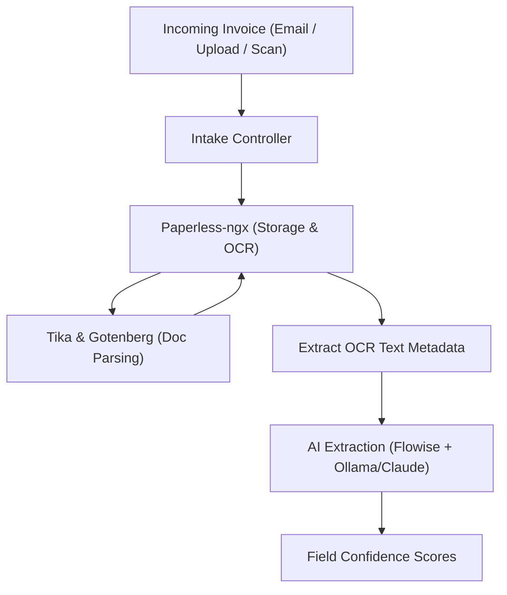
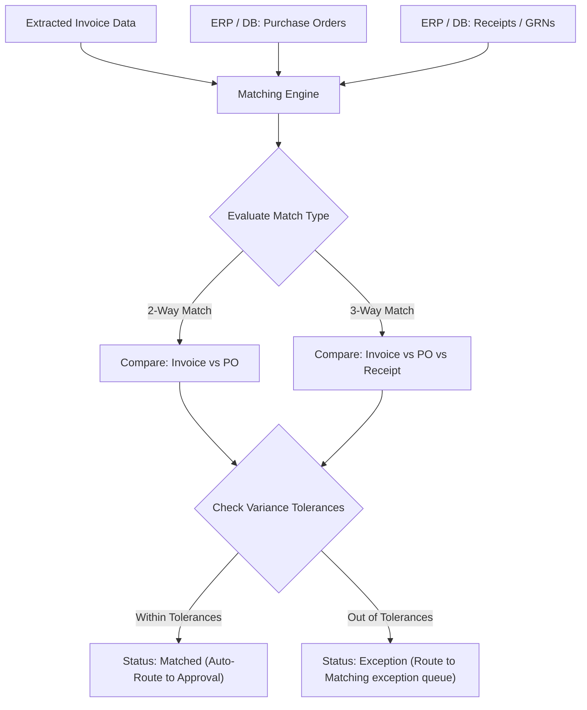
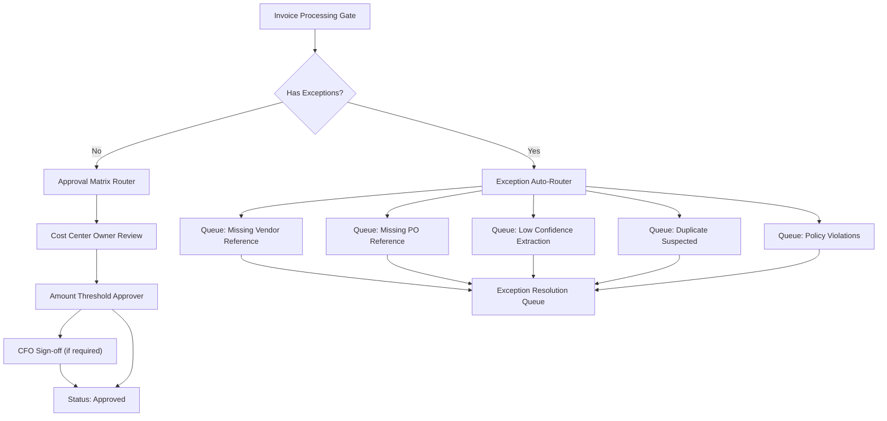
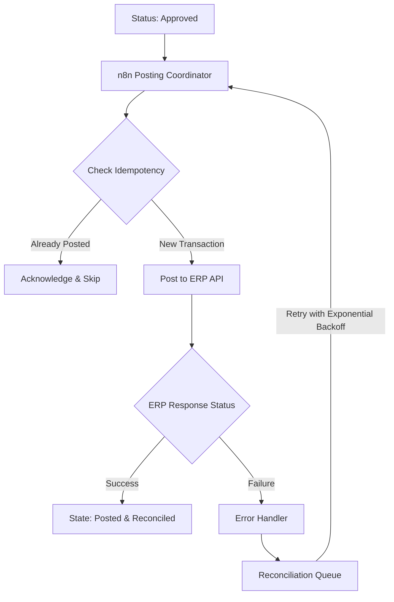
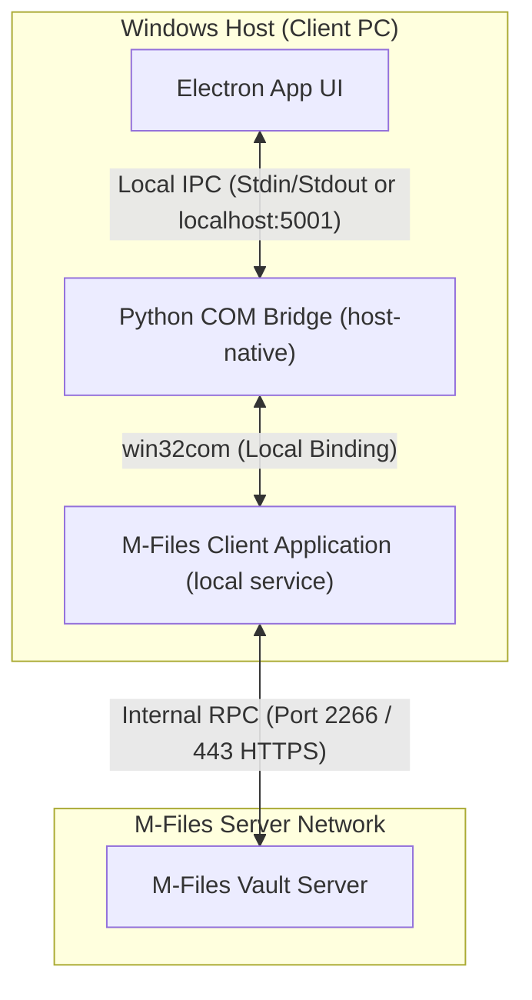
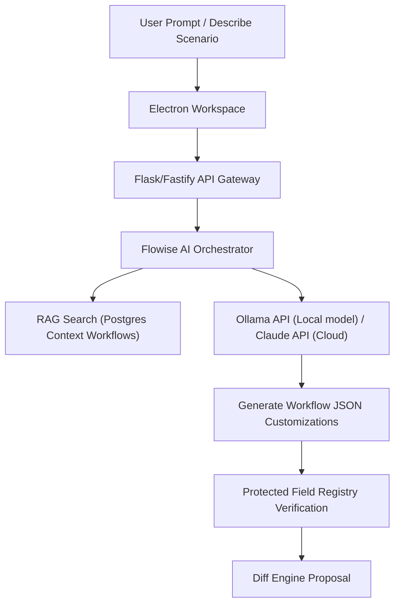

# AI Proviso PRD V4
## Final - AP-First, Simple, AI-Native, Docker-Based, Workflow-Integrity-Driven

---

## 1. Vision

AI Proviso is a next-generation AP automation platform designed to deliver enterprise-grade outcomes with a business-user-first experience.

The platform will:
- Deliver value in days, not months.
- Replace M-Files-style complexity with simple configuration.
- Provide drag-and-drop builders for forms, menus, and workflows.
- Preserve strict workflow integrity, auditability, and compliance.
- Scale across entities, vendors, and invoice volume without engineering-heavy redesign.

---

## 2. Product Strategy

### Positioning
- AP Automation FIRST
- Workflow + DMS SECOND

### Target Market
- SMB and mid-market organizations
- Finance and accounting teams
- ERP-integrated operating environments

### Core Strategy
Faster value first, then feature parity.

### Strategic Promise
- Easy to use
- Easy to onboard
- Fast to value
- Strong and scalable
- No unnecessary complexity

---

## 3. Scope and Phasing

## 3.1 Phase 1 (Critical MVP)

### Invoice Intake
- Email ingestion
- File upload
- Scanner and OCR-enabled PDF intake

### OCR and AI Extraction
- Extract vendor name, vendor account number (if present), invoice number, invoice date, due date, amount, tax, currency, PO number (if present).
- Provide confidence score per extracted field.
- Highlight low-confidence fields for review and correction.
- Support vendor-aware extraction profiles.

### Matching
- 2-way matching: invoice vs PO
- 3-way matching: invoice vs PO vs receipt
- Tolerance rules for quantity and amount variances

### Approval Workflow
Routing based on:
- Amount
- Cost center
- Vendor
- Exception type
- Legal entity policy

### ERP Integration & Mapping Reuse
- **API-Based Mapping (Primary):** Standard REST/GraphQL integration to push approved invoices and pull vendor master / PO details.
- **Direct SQL Mapping (Fallback):** Direct JDBC/ODBC query connectivity to local or legacy databases where API endpoints are unavailable.
- **Automated Mapping Registry:**
  - When field mappings or SQL queries are defined for an ERP vendor (e.g. mapping `invoice_number` to `BELNR` for SAP, or query `SELECT CardCode FROM OCRD WHERE CardName = ?`), the configuration is stored in the PostgreSQL `erp_configs` registry table.
  - Mappings are cataloged by ERP Vendor and entity type.
  - Future client workflows using the same ERP will automatically retrieve and apply these saved mappings, avoiding manual re-mapping.
- **Posting Reliability:** Retry logic with backoff, reconciliation queue for failures, and idempotent posting controls.

### Audit Trail
- Field-level change tracking
- Decision tracking
- Full history and exportable trace

### Exception Management
- Exception workbench
- Suggested fixes
- Duplicate invoice detection
- Fraud flags

### No-Code Platform
- Drag-and-drop workflow builder
- Drag-and-drop form builder
- Drag-and-drop menu/app builder

### Security
- Role-based access control
- Segregation of duties

## 3.2 Phase 2+
- SLA timers and escalations
- Month-end AP dashboard
- Vendor-specific AI tuning
- Workflow and form template library
- Broader workflow and DMS capabilities

---

## 4. Metadata and AP Data Model

### Core Structure
Class -> Properties -> Value Lists

### AP Core Entities
- Invoice
- Vendor
- Purchase Order
- Receipt
- Approval Task
- Exception Case
- ERP Posting Event
- Audit Event

### Vendor Identity Requirements
Every vendor must include:
- Internal vendor ID
- ERP vendor number
- Vendor account number

Optional identifiers for fallback matching:
- Tax or VAT ID
- Bank account fingerprint (masked/hashed)
- Sender email/domain
- Historical template signature

### Invoice Minimum Properties
- Vendor reference set
- Invoice number
- Invoice and due dates
- Currency, subtotal, tax, total
- PO reference when available
- Cost center and coding fields
- Confidence metrics
- Exception status and reason

### Storage Tier Model
- Local Client Cache: Lightweight SQLite cache in the desktop client for session continuity, workspace drafts, and offline scratch state.
- Platform Database: PostgreSQL 16 as the master system for workflows, queue state, audit logs, user access, OCR metadata, and integration state.
- Design rule: Local cache is never the system of record for AP transactions.

### Workflow Dataset Creation & Sanitization (LLM RAG Engine)
- **Import and Ingest:** Consultants can import previous workflow configurations (M-Files `.xml` or `.json` exports) directly into the platform.
- **AI Sanitization Pipeline:** During import, a sanitization script scrubs client-specific data (e.g. client names, specific email domains, transaction values) and replaces them with standardized placeholders (e.g., `{{CLIENT_NAME}}`, `{{CFO_EMAIL}}`, `{{APPROVAL_THRESHOLD}}`).
- **Master Dataset Loading:** The sanitized workflow schemas are saved as vector embeddings in the platform PostgreSQL database (`workflows` table).
- **RAG Reuse:** When a consultant describes a new client scenario, the vector engine retrieves the closest matching historical template from the master database to act as the AI base workflow.

### Workflow Ingestion Pipeline Specifications
- **Ingestion Sources:** Supports M-Files XML, JSON workflows, n8n exports, and API imports.
- **Normalization Schema:**
  All ingested workflows are normalized to:
  ```json
  {
    "workflow_name": "",
    "states": [],
    "transitions": [],
    "rules": [],
    "metadata": {}
  }
  ```
- **Tiered Sanitization Rules:**
  - *Level 1 (Direct):* Company name $\rightarrow$ `{{CLIENT_NAME}}`, Email $\rightarrow$ `{{USER_EMAIL}}`, threshold amounts $\rightarrow$ `{{APPROVAL_THRESHOLD}}`.
  - *Level 2 (Semantic):* Contextual roles like "CFO Approval" $\rightarrow$ `{{ROLE_FINANCE_APPROVER}}`.
  - *Level 3 (Pattern):* Abstracting logic like `{ "pattern": "approval_by_amount", "rule": "if amount > threshold → approval" }`.
- **Validation Gates:** Enforces valid transitions, prevents orphan states, and validates logical rule syntaxes.
- **Classification Tags:** Automatically tags workflows by type (e.g., AP, contract), industry, and complexity.
- **Embedding & Storage Schema:**
  - Workflows are chunked into description, rules, and transitions.
  - Stored in PostgreSQL using `pgvector` across three registry tables: `workflows_dataset`, `workflow_patterns`, and `workflow_chunks`.
- **Hybrid Retrieval:** Employs a hybrid retrieval strategy combining semantic vector search and structured metadata filters (e.g. `type = AP` AND `industry = retail`).
- **Generation:** The LLM merges the retrieved historical workflow chunks with the new requirement prompt to compile the output workflow JSON.

---

## 5. Workflow Model & Creation Pipeline

### 5.1 Dual-Path Creation Engine
The platform supports two visual entry paths to draft or modify a workflow, converging onto a single canonical schema:
1. **Manual Build Path:** The consultant builds the workflow manually by dragging and dropping states, transitions, rules, and actions directly on a **React-Flow** visual canvas.
2. **AI Generation Path:** The consultant describes the requirements in natural language (e.g. *"Invoice approval for retail, over $10k needs CFO signoff"*). The local/remote LLM parses the description, searches the historical dataset, and automatically generates the workflow JSON.

### 5.2 Unified Destination & Metadata Storage
Either path outputs the exact same **normalized JSON schema**. Every saved workflow is committed to the PostgreSQL dataset with rich metadata context:
- Complete states, transitions, actions, and VBScript properties.
- Contextual metadata: Client Scenario (raw text), Industry, Workflow Type, and Complexity.

### 5.3 Compounding Reuse Loop
For all future projects, when a consultant enters a new scenario:
1. The AI performs a vector search over the PostgreSQL database to locate the closest matching historical workflow.
2. The system loads the matching workflow directly into the React-Flow canvas as a visual baseline.
3. The LLM applies the new requirements to customize the baseline workflow, presenting a checkbox-based diff drawer of the proposed edits.
4. The consultant approves the diff to finalize.

### 5.4 Core Model Characteristics
- State-based lifecycle tracking
- Rule-based deterministic transitions
- Approve, reject, and return action paths
- Multi-step reviews and escalation routes
- Policy validation gates before posting

---

## 6. Pending and Exception Routing Standard

Invoices missing critical information must never remain in passive pending state. They must be routed to structured queues with ownership, SLA, escalation, and audit.

### Exception Queues
- Missing Vendor Reference
- Missing PO Reference
- Missing Vendor and PO
- Low Confidence Extraction
- Duplicate Suspected
- Policy Violation
- ERP Reconciliation Failure

### Auto-Routing Rules
- Missing vendor identifier with low match confidence -> Missing Vendor Reference queue
- Missing PO where PO is required -> Missing PO Reference queue
- Missing both -> Missing Vendor and PO queue (high priority)
- Confidence below threshold -> Low Confidence queue
- Duplicate risk above threshold -> Duplicate queue and post-block

### Ownership
- AP Data Validation Team
- AP Matching Team
- AP Compliance Lead
- AP Integration Team

### SLA and Escalation
- Missing vendor: 4 business hours
- Missing PO: 8 business hours
- Missing vendor + PO: 4 business hours
- Duplicate suspected: 2 business hours
- ERP reconciliation: 4 business hours

Escalations:
1. Queue owner and AP manager
2. Controller
3. Finance operations lead and payment hold

### Resolution Outcomes
- Auto-resolved by enrichment
- Manually resolved by AP user
- Returned to vendor for correction
- Approved as non-PO exception by policy
- Rejected and closed with reason

### Mandatory Audit Data
- Exception type and reason code
- Assignee and assignment time
- SLA due time and breach count
- Signals used for inference
- Override details
- Final disposition

---

## 7. Missing Vendor Number and PO Best Practice

When invoices do not include vendor number or PO:

1. Attempt vendor resolution using:
- Vendor account number
- Vendor name similarity
- Tax ID
- Email domain
- Historical invoice fingerprint

2. Apply confidence policy:
- High confidence: auto-link vendor
- Medium confidence: suggest top candidates
- Low confidence: route to exception queue

3. Apply PO policy:
- PO required: hold and route to missing PO queue
- PO optional: continue as non-PO with approval controls

4. Preserve full trace:
- Signals
- Score
- User overrides
- Final decision path

---

## 8. Bidirectional Workflow Standard (n8n)

AI Proviso uses n8n as bidirectional process orchestration layer.

### Inbound to AI Proviso
- Invoice intake payloads
- PO and receipt updates
- Vendor master updates
- ERP status callbacks

### Outbound from AI Proviso
- Approved posting requests to ERP
- Status updates and exception notifications
- Supplier correction requests
- Audit and observability events

### n8n Workflow Patterns

1. Trigger Layer
- Webhooks for push
- Schedules for polling
- Manual reprocess triggers

2. Validation Layer
- Schema validation
- Required field checks
- Policy gate checks

3. Idempotency Layer
- Deterministic idempotency key
- Duplicate-safe behavior
- Exactly-once business effect

4. Orchestration Layer
- Parent invoice lifecycle workflow
- Child subflows for OCR, AI extraction, matching, approval, posting

5. Error Handling Layer
- Retries with backoff
- Dead-letter queue
- Reconciliation queue

6. Acknowledgment Layer
- ACK or NACK where supported
- Correlation IDs across all steps

7. Observability Layer
- Structured logs
- Workflow metrics
- Alerting on stuck or failed flows

### State Synchronization
Canonical states:
- Received
- Extracted
- Matched
- Pending Approval
- Approved
- Exception
- Posted
- Reconciled
- Failed

### Security Controls
- Signed webhooks
- Least-privilege connector credentials
- Secure secrets handling
- PII-safe logs

### AI Runtime Boundary
- **API-First Isolation:** LLM execution uses Ollama over HTTP API and is strictly decoupled from both the desktop client and Docker services. No weights or model runtimes are compiled into the client executable.
- **Dedicated Hardware Profile (Mac M2 32GB):** To prevent GPU/CPU resource contention on the Windows host running OCR and local Windows/COM tasks, the system supports running Ollama on a dedicated local machine (recommended: Mac M2 with 32GB Unified Memory). This allows loading and running larger models entirely in Apple Silicon's shared high-speed GPU memory.
- **Dual-Mode AI Model Strategy:** The same Ollama host handles both design-time and run-time AI tasks dynamically:
  - **Design-Time AI (Client Cockpit):** Handles RAG-based search, natural language workflow scenario description parsing, customisation proposals, and SOW/PRD writing. Uses larger reasoning models (recommended: `qwen2.5:14b` or `deepseek-r1:14b`).
  - **Run-Time AI (AP Pipeline):** Processes raw OCR text chunks from n8n/Paperless to compile validation-ready JSON structures. Uses fast, highly-efficient models (recommended: `llama3.2:3b` or `phi4-mini`).
- **Flowise Orchestration:** Flowise manages the LangChain/LlamaIndex agents and routes requests to the configured Ollama model endpoints.
- **Persistence:** Agent memory (MemOS context) and RAG vectors are stored in the platform PostgreSQL database, keeping the Ollama runtime database-backed and stateless.

---

## 9. ERP Mapping Reuse Engine

### 9.1 Objective
Reduce manual ERP mapping effort by reusing existing configurations.

### 9.2 ERP Detection
Detect automatically:
- SAP
- Dynamics
- QuickBooks
- Custom

### 9.3 Mapping Registry
Stored in the PostgreSQL `erp_mappings` table:
- `id` (primary key)
- `erp_type` (SAP, Dynamics, etc.)
- `entity_type` (Vendor Master, Invoice Posting, PO Matching)
- `mapping_json` (field associations)
- `version`
- `confidence_score`
- `usage_count`

### 9.4 Template Engine
Default mapping structures (e.g., `sap_invoice_standard`, `dynamics_po_matching`) stored for baseline application.

### 9.5 ERP Auto-Mapping & AI Inference
- **First-Encounter Inferences:** On first connection to an ERP, the AI performs auto-mapping by matching semantic similarity between OCR fields and the ERP's table parameters.
- **Consultant Correction Fallback:** If the AI's auto-map confidence score is low, the platform prompts the consultant to complete the field mappings manually.
- **Registry Persistence:** The approved or corrected mapping is stored in the `erp_mappings` table as a verified template.
- **Subsequent Implementation Automation:** On all future projects connecting to the same ERP type, the system retrieves the saved mapping configuration from the registry and auto-applies it, eliminating manual mapping.

### 9.6 Pre-Posting Validation
Verifies vendor existence, General Ledger (GL) validity, and currency codes against the ERP master records prior to triggering any transaction posting.

### 9.7 Idempotency & Execution
Ensures exactly-once posting: if `external_id` exists in the ERP registry, the transaction is skipped.

### 9.8 Retry & Reconciliation
Maintains a retry queue, records error logs, and compiles auto-generated reconciliation reports for transaction exceptions.

### 9.9 Active Learning Loop
On successful transaction verification:
- Saves mapping metadata back to the registry.
- Increments the confidence score and usage count of the mapping.
- Automatically selects the mapping for subsequent runs of the same ERP type.

---

## 10. Advanced AI OCR System

### 10.1 Objective
Build an AI-native OCR system that outperforms rigid template-based processing (e.g. ABBYY FlexiCapture) through multi-engine text recognition, layout intelligence, and semantic LLM parsing.

### 10.2 Document Processing Pipeline
The document intake conforms to the following sequential phases:
$$\text{Document Intake} \rightarrow \text{Image Preprocessing} \rightarrow \text{PaddleOCR Text Extraction} \rightarrow \text{DocTR Layout Detection} \rightarrow \text{AI Semantic Extraction} \rightarrow \text{Validation Check} \rightarrow \text{Confidence Scoring} \rightarrow \text{Feedback Loop}$$

### 10.3 Multi-Engine Ensemble Strategy
Rather than relying on a single engine, the system coordinates multiple models:
- **Primary Engine:** **PaddleOCR** (deep learning) optimized for character line recognition, speed, and tabular structures.
- **Secondary Engine:** **DocTR** (layout-aware) optimized for visual text block grouping and logical reading order.
- **Fallback Engine:** **Tesseract** used for clean, standard document types.

### 10.4 AI Extraction Model & Schema
Processes the OCR output into a structured, validation-ready JSON schema:
```json
{
  "vendor": "",
  "invoice_number": "",
  "date": "",
  "total": 0.00,
  "line_items": [
    {
      "description": "",
      "quantity": 0,
      "unit_price": 0.00,
      "amount": 0.00
    }
  ],
  "confidence": 0.0
}
```

### 10.5 Validation Layer
Performs programmatic validations on the extracted schema:
- Sum of `line_items[].amount` matches the invoice `total`.
- Extracted vendor exists in the PostgreSQL database matching registry.
- Checks formatting (dates, currency symbols, PO numbers).

### 10.6 AI Prompt Instruction
The system uses specialized prompts (e.g. `EXTRACT_WORKFLOW`, `ADAPT_WORKFLOW`) configured in Flowise to extract the invoice fields and calculate semantic confidence scores.

### 10.7 Performance Philosophy
Superior AP OCR performance is achieved by overall **system design** (ensemble voting, verification math, LLM comprehension) rather than relying on a single, brittle OCR character engine.

---

## 11. Architecture and Stack Layers

### Technology Stack
- Frontend: React + Vite
- Backend API Gateway: service API layer (current bridge implementation may be Flask; target platform implementation Fastify)
- Data Layer: PostgreSQL
- Workflow Orchestration: n8n
- OCR and DMS: Paperless-ngx
- AI Orchestration: Flowise
- LLM Runtime Service: Ollama API endpoint (external by default, optional local profile)
- Runtime and deployment: Docker and Docker Compose

### Runtime Separation Rules
- Electron desktop client remains host-native.
- Windows COM bridge remains host-native and is never containerized.
- Docker stack hosts platform services only.
- M-Files COM operations are executed by host process utilities and invoked by the desktop client.

### Integration Topology
- Windows Host Boundary:
- Electron desktop client UI and local workspace.
- COM bridge utility for win32/PowerShell M-Files calls.
- M-Files Desktop/Server COM access.
- Docker Service Boundary:
- Backend API gateway.
- PostgreSQL and Redis.
- n8n orchestration runtime.
- Paperless-ngx OCR and document services.
- Flowise AI orchestration.
- Optional local Ollama profile.

### Port and Environment Governance
- All service endpoints must be environment-driven through .env configuration.
- Recommended default service ports:
  - PostgreSQL: 5432
  - Redis: 6379
  - n8n: 5678
  - Paperless-ngx: 8000
  - Flowise: 3001
  - Ollama: 11434 (when local profile is enabled)
  - Backend API: 5000
  - Local COM Bridge: Port-free (when using host child-process stdin/stdout IPC) or `5001` (when running as a local socket-based daemon)
- **Ollama Remote Local Network Access (e.g., Mac M2):**
  - To allow the Docker containers (Backend API, Flowise) on the Windows host to communicate with Ollama on a separate Mac M2, Ollama on the Mac must bind to the network interface by setting environment variables `OLLAMA_HOST=0.0.0.0` and `OLLAMA_ORIGINS="*"` on launch.
  - The connection is configured in the Windows host `.env` using local mDNS domain names rather than dynamic IPs: `OLLAMA_BASE_URL=http://MacBook-M2.local:11434`.
- **M-Files Port 2266 / 443 Delegation:** Our application does **not** need to bind to or open port 2266 (TCP/IP RPC) or 443 (gRPC/HTTPS). The host-native COM Bridge establishes a local IPC (Inter-Process Communication) connection to the local M-Files Client software (`MFStatus.exe` / `MFClient.exe`). The M-Files Client background services handle routing to the remote M-Files Server automatically over these ports.
- Use a single gateway endpoint from the desktop client for downstream service access when feasible.

### Docker Stack Deployment Guide
- **Service-Oriented Decoupled Pattern:** The application does not bundle Ollama or local LLM runtimes directly into the primary container images. Ollama is treated as an external pluggable service accessed via HTTP API.
- **Default Docker Compose Stack:**
  Running `docker compose up -d` starts:
  - PostgreSQL 16 (Data Layer)
  - Redis 7 (Caching & Broker)
  - Backend-api (API Gateway)
  - n8n (Orchestration Engine)
  - Paperless-ngx (DMS & Document Processing)
  - Gotenberg (Office to PDF Converter)
  - Tika (Text Extraction)
  - Flowise (AI Agent UI & Pipeline Orchestrator)
- **Local AI Profile (Optional):**
  To launch the local Ollama LLM runtime and auto-pull the default model:
  ```bash
  docker compose --profile local-ai up -d
  ```
  This spins up the additional `ollama` container and executes the `ollama-pull` helper container to fetch the default model (e.g. `llama3.2:3b`).
- **Environment Setup:**
  Consultants copy `.env.docker.example` to `.env` on deployment and configure target credentials:
  - `POSTGRES_PASSWORD`
  - `PAPERLESS_SECRET_KEY`
  - `FLOWISE_SECRETKEY`
  - `OLLAMA_BASE_URL` (points to `http://host.docker.internal:11434` for host-GPU execution, or a remote host like `http://MacBook-M2.local:11434`)
  - `OLLAMA_MODEL` (e.g. `llama3.2:3b` or `qwen2.5:14b`)

### Layered Architecture
1. Infrastructure Layer -> Docker
2. Data Layer -> PostgreSQL
3. DMS and OCR Layer -> Paperless-ngx
4. Workflow Layer -> n8n
5. AI Layer -> Flowise + Ollama
6. Backend Service Layer -> Fastify
7. Client Experience Layer -> React drag-and-drop builders

### Event Flow
Invoice -> OCR -> AI extraction -> validation -> DB/state -> n8n orchestration -> ERP -> reconciliation -> audit

---

## 12. Client Experience Requirements

AI Proviso must be a no-code, drag-and-drop client platform.

### Core Builders
- Form Builder (drag and drop)
- Menu and App Builder (drag and drop)
- Workflow Designer (drag and drop)

### Spreadsheet-Like AP Workbench
The system may provide an Excel-like interface for speed, but workflow integrity is mandatory.

#### Integrity Controls
- Grid edits cannot bypass workflow states
- No invalid state jumps
- Approval-required fields become controlled post-submission
- Posting is blocked outside approved states
- Bulk edits run full validation and policy checks

#### Concurrency and Consistency
- Optimistic locking
- Conflict detection and merge/reload flow
- Active editor visibility

#### Audit Controls
- Cell-level old/new value tracking
- User, time, reason capture
- Itemized audit on bulk updates

#### Security in Grid Mode
- Role-based field masking and edit rights
- Segregation of duties enforced in all interfaces

### First-Run Wizard
- Connect ERP
- Define approval matrix
- Map top vendors and references
- Validate workflow rules
- Go live target under 7 days

---

## 13. Testing and Workflow Integrity Engine

- Workflow simulation before activation
- Step-by-step execution trace
- Error highlighting and guidance
- Replay failed runs safely
- Rule and integration test packs
- Versioned workflow deployment gates

---

## 14. Non-Functional Requirements

### Performance
- Fast intake acknowledgment
- SLA-bound extraction and posting pipeline

### Scalability
- Horizontal scaling of workers and APIs
- Queue-based load leveling for peak volume

### Reliability
- Retry policies and graceful degradation
- Backup and restore procedures

### Offline and Air-Gapped Consistency
- Docker compose configuration must mount persistent local volumes for PostgreSQL, OCR artifacts, and optional local model storage.
- Platform must support consultant operation when internet is unavailable, assuming required local services are already provisioned.
- Service startup profiles should support both core stack mode and optional local AI mode.

### Security and Compliance
- RBAC and SoD
- Encryption in transit and at rest
- SSO-ready identity integration
- Immutable audit records

---

## 15. Success Metrics

### Time to Value
- Deployment in under 7 days for AP starter setup

### Automation and Accuracy
- Touchless rate progression: 40 percent -> 70 percent+
- OCR and extraction accuracy: 95 percent+
- Vendor auto-identification accuracy

### Operational Quality
- Approval cycle reduction: 50 percent+
- Exception resolution time by queue
- SLA breach rate
- ERP posting success and reconciliation resolution time
- Percentage processed without explicit vendor number or PO

---

## 16. Risks and Mitigation

### Risks
- Overbuilding too early
- AI hallucination or low-confidence extraction
- ERP integration edge cases
- User bypass attempts in spreadsheet-like UI

### Mitigations
- Strict phased scope gates
- Confidence thresholds with mandatory review
- Idempotent integration with retry and reconciliation queues
- Workflow integrity controls across all interfaces

---

## 17. Implementation Timeline

### Phase 1 (Weeks 1-2)
- Intake and OCR
- Basic lifecycle and queue setup

### Phase 2 (Weeks 3-4)
- AI extraction and confidence routing
- Approval workflows and exception handling

### Phase 3 (Weeks 5-6)
- ERP bidirectional integration via n8n
- Reconciliation and full audit trail

### Phase 4 (Weeks 7-8)
- Drag-and-drop builders hardening
- Spreadsheet-like workbench integrity controls
- Simulation and testing engine hardening

Note: 8 weeks is pilot target. Production hardening may require 12-16 weeks depending on security, compliance, and ERP complexity.

---

## 18. Final Strategy

AI Proviso wins with:
- Simplicity
- Speed
- Usability
- Strong workflow integrity
- AI augmentation with policy control
- Scalable architecture without M-Files complexity

This product must feel as easy as a modern business app while operating with enterprise-grade AP discipline.

---

## 19. Modular System Diagrams

To aid reading, implementation, and understanding, the platform is divided into the following separate workflow modules.

### 19.1 Module 1: Invoice Intake & OCR Flow


### 19.2 Module 2: Matching Engine (2-Way / 3-Way)


### 19.3 Module 3: Approval & Exception Routing Workflows


### 19.4 Module 4: ERP Integration & Posting Queue


### 19.5 Module 5: Windows Host & COM Sync Layer


### 19.6 Module 6: AI Orchestration & Customization Layer


