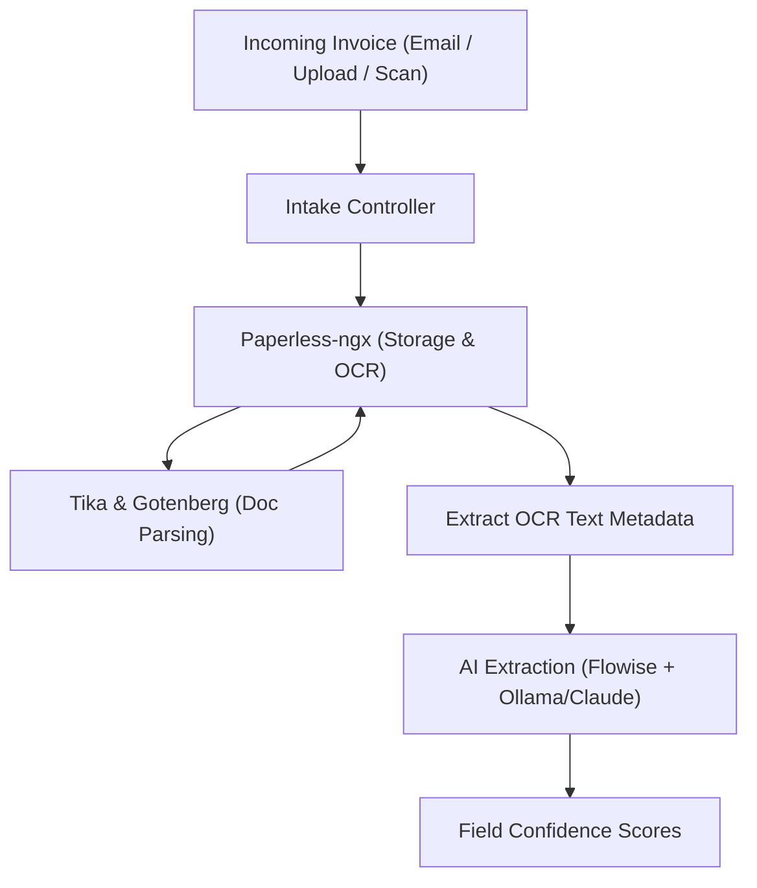
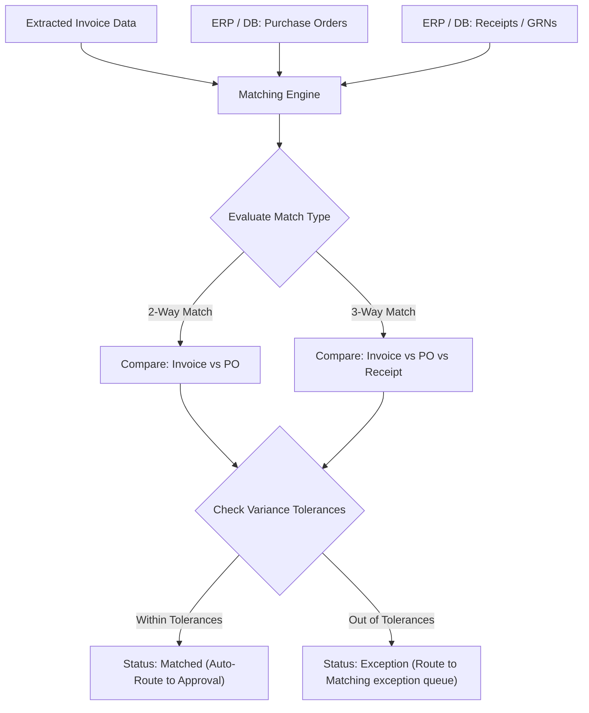
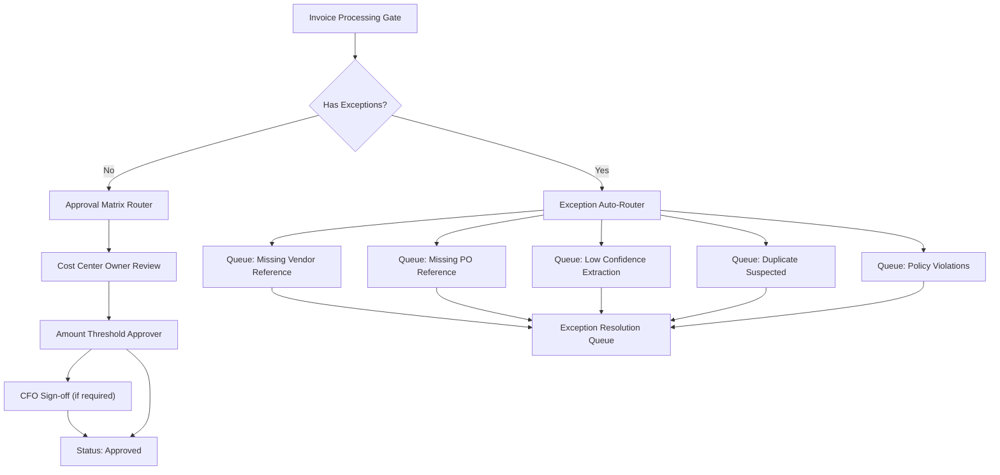
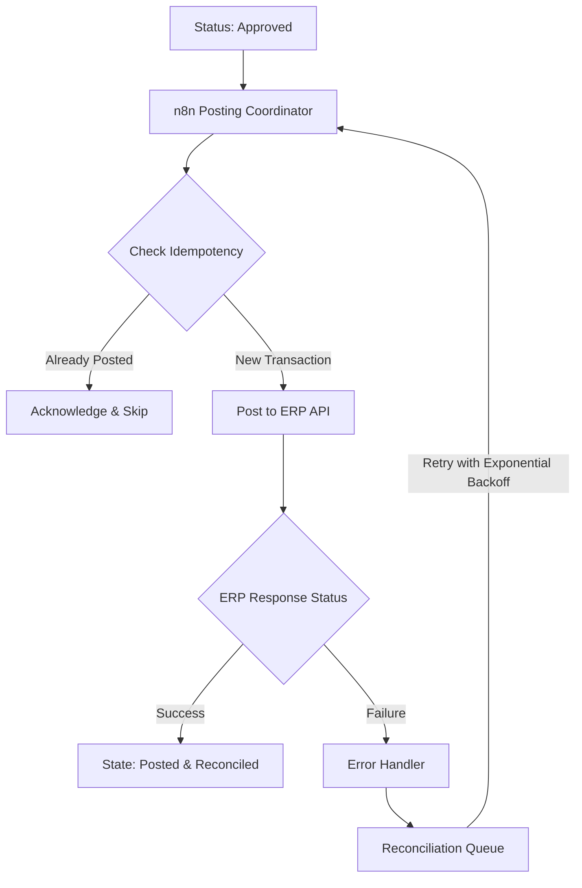
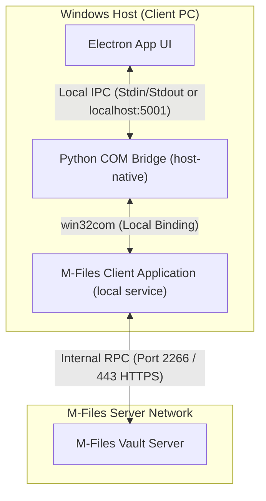
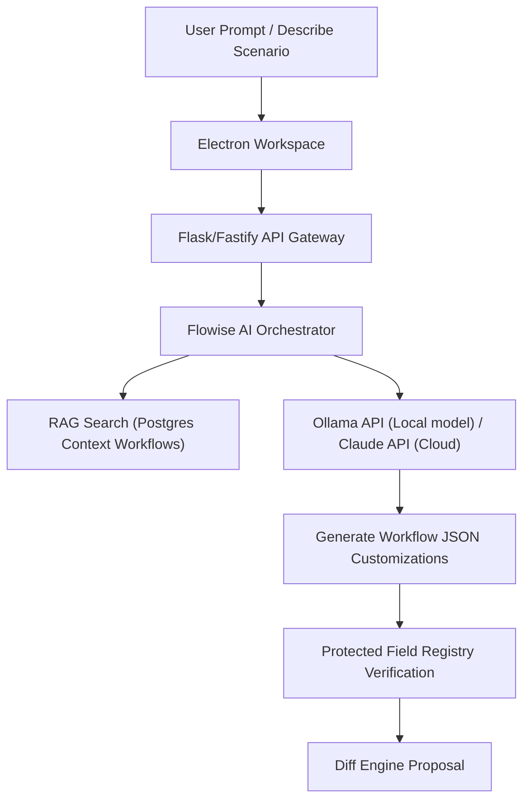

# AI Proviso Product Requirements Document (PRD)
## Version 6.0 — Unified Enterprise Blueprint (AP-First, AI-Native, Modular, Docker-Based)

---

## Document Metadata

| Field | Detail |
| :--- | :--- |
| **Product** | AI Proviso — AP-First Automation Platform |
| **Version** | 6.0 — Final Architecture |
| **Classification** | Internal — Confidential |
| **Author** | Harry Joseph / scriptdotnet — Xerox Canada |
| **Primary Stakeholder** | Michel LeBrun — Director, Software Pre-sales & Solution Design |
| **Demo Target** | 12-Week Michel LeBrun Pilot (Phase I Working Vertical Slice) |
| **Phase I Timeline** | 8 Weeks to Working Demo · 16 Weeks Production Hardening |
| **Architecture** | 9-Module Contract-First Isolation · Docker Compose · n8n Event Spine |
| **AI Stack** | Ollama · Flowise (Config-as-Code) · PaddleOCR · DocTR · react-flow |
| **Data Layer** | PostgreSQL 16 (Platform Master) + SQLite (Local Workspace Client Cache) |

---

## Three Locked Architectural Decisions

> [!IMPORTANT]
> **Decision 1 — Paperless-ngx Boundary:** Paperless-ngx is strictly a document archive, search, and thumbnail storage service. **`PAPERLESS_OCR_MODE=skip`** is enforced in the Docker Compose environment. **MOD-02** owns the text OCR and layout extraction entirely.
>
> **Decision 2 — Flowise Configuration-as-Code:** Flowise flows are not mutable infrastructure. Visual prompt chains are exported as JSON, committed to the Git repository, and auto-seeded via the Flowise REST API on container deployment. The Fastify API calls Flowise over HTTP, making it fully swappable for a native LangChain/LlamaIndex python microservice.
>
> **Decision 3 — Phase I Demo Scope:** The pilot targets a working vertical slice consisting of **MOD-01 (Intake)** + **MOD-02 (Extraction)** + **MOD-04 (Workflow/Diff Approval)**. **MOD-03 (Matching)** and **MOD-05 (ERP Posting)** are simulated via mock database tables and mock webhook callbacks to maintain the narrative without integration blockers.

---

## 1. Vision & Strategic Promise

AI Proviso is a next-generation Accounts Payable (AP) automation platform designed to deliver enterprise-grade outcomes with a business-user-first experience. It is explicitly positioned to replace brittle M-Files-based AP configurations and legacy template capture tools (like ABBYY FlexiCapture and CapturePerfect) through superior AI extraction, no-code visual configuration, and intelligent workflow reuse.

### 1.1 Core Commitments
* **Speed to Value:** Full AP deployment in under 7 days via a guided First-Run Wizard.
* **AI-First OCR:** PaddleOCR + DocTR + LLM semantic ensemble that outperforms single-engine tools on complex, rotated, multi-currency invoices.
* **No-Code Platform:** Drag-and-drop workflow, form, and app builders. No engineering required for configuration adjustments.
* **Workflow Integrity:** Every state transition is programmatically policy-enforced. Zero bypass paths. Zero passive pending states.
* **Learning System:** Every approved invoice makes the next one faster. Vendor profiles and ERP mappings accumulate confidence automatically.
* **Modular by Design:** 9 contract-isolated modules. Swap, upgrade, or extend any service layer without impact on the others.

### 1.2 Competitive Positioning

| Capability | Legacy Tools (M-Files / ABBYY) | AI Proviso v6 |
| :--- | :--- | :--- |
| **OCR Engine** | Single template-based OCR engine | Ensemble: PaddleOCR + DocTR + LLM semantic fallback |
| **Workflow Config** | Proprietary XML — consultant-only edits | Drag-and-drop React canvas + AI RAG generation |
| **ERP Mapping** | Manual matching per deployment | Registry reuse — map once, reuse forever |
| **Onboarding** | Weeks to months of setup | Under 7 days via guided First-Run Wizard |
| **Exception Mgmt** | Passive "pending" states in standard queues | Named queues + SLA timers + escalation chains |
| **Deployment** | Heavyweight server installation | Docker Compose — runs on a developer's laptop |

---

## 2. Product Strategy & Phasing

### 2.1 Phase Roadmap

| Phase | Scope | Timeline | Demo Target |
| :--- | :--- | :--- | :--- |
| **Phase I — Vertical Slice** | MOD-01 Intake + MOD-02 OCR + MOD-04 Workflow. Stub matching and ERP posting. | Weeks 1–8 | Michel LeBrun 12-week demo |
| **Phase II — Full Pipeline** | MOD-03 Matching + MOD-05 ERP + MOD-06 Exceptions + MOD-07 Audit live. | Weeks 9–16 | First pilot client deployment |
| **Phase III — Scale & Learn** | Full builders + SLA timers + vendor AI tuning + template library + DMS. | Weeks 17–24 | Production General Availability (GA) |

### 2.2 Target Market
* SMB and mid-market organizations (50–2,000 employees) processing 200–50,000 invoices per month.
* ERP-integrated operating environments (SAP, Dynamics 365, NetSuite, QuickBooks, custom).
* Organizations currently using M-Files or legacy capture tools (direct replacement opportunity).

---

## 3. Architecture Overview

### 3.1 The Golden Rule: Contract-First Module Isolation
> [!IMPORTANT]
> * No module imports another module's source code.
> * Every module reads and writes only from the canonical PostgreSQL schema defined in **MOD-00**.
> * Every module communicates asynchronously by firing event topics via **n8n webhooks**.
> * This rule ensures every module is independently replaceable, testable, and deployable.
> * To safeguard operations, any transactional or external-facing event is backed by a persistent queue buffer.

### 3.1.1 Event Buffering & Reliable Queueing (Redis BullMQ + DLQ)
To guarantee message delivery and prevent data loss during container restarts, network dropouts, or downstream system outages (e.g. ERP downtime or M-Files temporary lockups), all inter-module communication is buffered using **Redis BullMQ** job streams:
* **Event Ingestion & Queueing:** Fastify and n8n push events to Redis-backed BullMQ streams. Webhook endpoints do not process events synchronously; they write to the stream and acknowledge receipt immediately.
* **Retry Policy & Backoff:** Queue workers consume tasks from the queue with an automatic retry configuration:
  - *Max Retry Attempts:* 5.
  - *Backoff Interval:* Exponential (e.g., $1000\text{ms} \times 2^{\text{attempt}-1}$), giving the system up to 16 seconds to recover from transient glitches.
* **Dead Letter Queue (DLQ) Routing:**
  - If an event continues to fail after the 5th attempt, the BullMQ worker intercepts the failure and moves the payload to a Dead Letter Queue (`dlq:events`).
  - The fail state, event payload, correlation ID, and full error trace are logged into the database and flagged in the AP Workbench under the **AP Compliance Lead** exception queue for manual retry or correction.

```
                  ┌────────────────────────┐
                  │   MOD-01: Intake       │
                  └───────────┬────────────┘
                              │ invoice.received
                              ▼
                  ┌────────────────────────┐
                  │   MOD-02: Extraction   │
                  └───────────┬────────────┘
                              │ invoice.extracted
                              ▼
                  ┌────────────────────────┐
                  │   MOD-04: Workflow     │◄─── [MOD-08: UI React Client]
                  └───────────┬────────────┘
                              │ invoice.approved
                              ▼
                  ┌────────────────────────┐
                  │   MOD-05: ERP Adapter  │
                  └────────────────────────┘
```

### 3.2 Module Directory

| Module | Name | Phase | Single Responsibility |
| :--- | :--- | :--- | :--- |
| **MOD-00** | Core (Contract Layer) | Always | Canonical schemas, PostgreSQL migrations, n8n event topic definitions |
| **MOD-01** | Document Intake | Phase I | Accept documents from any source. Produce `invoice.received` event |
| **MOD-02** | OCR & AI Extraction | Phase I | OCR ensemble + LLM field extraction + confidence scoring |
| **MOD-03** | Matching Engine | Phase II | 2-way / 3-way PO and receipt matching with tolerance rules (Phase I stub) |
| **MOD-04** | Workflow & Approval | Phase I | State machine + approval routing + drag-and-drop designer |
| **MOD-05** | ERP Adapter | Phase II | Connector + Mapper + Poster. Idempotent ERP integration (Phase I stub) |
| **MOD-06** | Exception Management | Phase II | Named queues + SLA timers + escalation chains + resolution workflows |
| **MOD-07** | Audit Trail | Phase I | Append-only event store. INSERT-only DB role. Immutable trail |
| **MOD-08** | UI & Builders | Phase I+ | React builders: workflow canvas, form builder, AP workbench |

### 3.3 Canonical Event Schema

Every event crossing module boundaries must conform to the canonical JSON envelope defined in **MOD-00**:
```json
{
  "event": "invoice.extracted",
  "schema_version": "1.0",
  "invoice_id": "uuid-v4",
  "tenant_id": "uuid-v4",
  "payload": {
    "vendor": "Acme Corp",
    "invoice_number": "INV-2026-001",
    "total": 12500.00
  },
  "confidence": {
    "vendor": 0.97,
    "invoice_number": 0.95,
    "total": 0.99
  },
  "source_module": "ocr",
  "correlation_id": "uuid-v4",
  "timestamp": "2026-05-25T21:43:00Z"
}
```

### 3.4 Event Registry

| Event | Fired By | Consumed By |
| :--- | :--- | :--- |
| `invoice.received` | MOD-01 | MOD-02 |
| `invoice.extracted` | MOD-02 | MOD-03 (Phase II) / MOD-04 (Phase I stub) |
| `invoice.matched` | MOD-03 | MOD-04 |
| `invoice.exception` | MOD-03 / MOD-02 | MOD-06 |
| `invoice.approved` | MOD-04 | MOD-05 |
| `invoice.posted` | MOD-05 | MOD-07 |
| `invoice.rejected` | MOD-04 | MOD-06 / MOD-07 |
| `audit.event` | ALL modules | MOD-07 |

---

## 4. Technology Stack & Service Map

### 4.1 Service Directory

| Layer | Technology | Version | Role |
| :--- | :--- | :--- | :--- |
| **Infrastructure** | Docker + Docker Compose | Latest | All platform services — single compose file deployment |
| **Data — Master** | PostgreSQL | 16 | Invoices, workflows, audit logs, vectors, ERP configurations |
| **Data — Cache/Broker** | Redis | 7 | Session cache, retry queues, pub/sub event routing |
| **Data — Local Cache** | SQLite | 3 | Electron client workspace cache only — never AP transactions |
| **DMS / Archive** | Paperless-ngx | Latest | Document storage, thumbnails, and search. OCR DISABLED |
| **Doc Conversion** | Gotenberg + Tika | Latest | Office-to-PDF conversion, text pre-extraction before OCR |
| **Workflow Orch.** | n8n | Latest | Event spine — coordinates all inter-module communication |
| **AI Orchestration** | Flowise | Latest | LangChain agents, RAG pipelines — flows saved as Git JSON |
| **LLM Runtime** | Ollama | Latest | External HTTP service — decoupled from client binary |
| **OCR — Primary** | PaddleOCR | 2.7+ | Deep learning character line recognition, tabular processing |
| **OCR — Layout** | DocTR | 0.9+ | Visual text block grouping, logical reading order detection |
| **OCR — Fallback** | Tesseract | 5 | Clean, standard, high-contrast document parsing |
| **Backend API** | Fastify | 4 | API gateway — production service gateway replacing Flask |
| **Frontend** | React + Vite | 18/6 | Electron desktop client UI |
| **Workflow Canvas** | react-flow | 11 | Drag-and-drop workflow designer |
| **Vector Search** | pgvector | 0.7+ | RAG embeddings in PostgreSQL master database |

### 4.2 Docker Compose Service Topology

| Service | Port | Profile | Deployment Boundary & Notes |
| :--- | :--- | :--- | :--- |
| **postgres** | 5432 | default | Persistent volume. Never wiped between restarts |
| **redis** | 6379 | default | Ephemeral memory cache for queues and pub/sub |
| **backend-api** | 5000 | default | Fastify gateway — single entry for React client |
| **n8n** | 5678 | default | Event spine — flows auto-seeded from `/config/n8n/` |
| **paperless-ngx** | 8000 | default | `PAPERLESS_OCR_MODE=skip` environment variable enforced |
| **gotenberg** | 3000 | default | Office-to-PDF engine invoked by MOD-01 |
| **tika** | 9998 | default | Raw text pre-extraction invoked by MOD-01 |
| **flowise** | 3001 | default | Prompt flows auto-seeded from `/config/flowise/` on start |
| **ollama** | 11434 | local-ai | Optional compose profile (e.g. for development environment) |
| **ollama-pull** | — | local-ai | Helper container — pulls default model weights on startup, then exits |
| **com-bridge** | 5001 | host-native | Windows host utility — never containerized |

### 4.3 AI Runtime Boundary
* **API-First Isolation:** LLM execution uses Ollama over HTTP API and is strictly decoupled from both the desktop client and Docker services. No weights or model runtimes are compiled into the client executable.
* **Dedicated Hardware Profile (Mac M2 32GB):** To prevent GPU/CPU resource contention on the Windows host running OCR and local Windows/COM tasks, the system supports running Ollama on a dedicated local machine (recommended: Mac M2 with 32GB Unified Memory). This allows loading and running larger models entirely in Apple Silicon's shared high-speed GPU memory.
* **Dual-Mode AI Model Strategy:** The same Ollama host handles both design-time and run-time AI tasks dynamically:
  - **Design-Time AI (Client Cockpit):** Handles RAG-based search, natural language workflow scenario description parsing, customisation proposals, and SOW/PRD writing. Uses larger reasoning models (recommended: `qwen2.5:14b` or `deepseek-r1:14b`).
  - **Run-Time AI (AP Pipeline):** Processes raw OCR text chunks from n8n/Paperless to compile validation-ready JSON structures. Uses fast, highly-efficient models (recommended: `llama3.2:3b` or `phi4-mini`).
* **Flowise Orchestration:** Flowise manages the LangChain/LlamaIndex agents and routes requests to the configured Ollama model endpoints.
* **Persistence:** Agent memory (MemOS context) and RAG vectors are stored in the platform PostgreSQL database, keeping the Ollama runtime database-backed and stateless.

### 4.4 Port & Environment Governance
* All service endpoints must be environment-driven through `.env` configuration.
* **Ollama Remote Local Network Access (e.g. Mac M2):**
  - To allow the Docker containers (Backend API, Flowise) on the Windows host to communicate with Ollama on a separate Mac M2, Ollama on the Mac must bind to the network interface by setting environment variables `OLLAMA_HOST=0.0.0.0` and `OLLAMA_ORIGINS="*"` on launch.
  - The connection is configured in the Windows host `.env` using local mDNS domain names rather than dynamic IPs: `OLLAMA_BASE_URL=http://MacBook-M2.local:11434`.
* **M-Files Port 2266 / 443 Delegation:** Our application does **not** need to bind to or open port 2266 (TCP/IP RPC) or 443 (gRPC/HTTPS). The host-native COM Bridge establishes a local IPC (Inter-Process Communication) connection to the local M-Files Client software (`MFStatus.exe` / `MFClient.exe`). The M-Files Client background services handle routing to the remote M-Files Server automatically over these ports.

---

## 5. Module Specifications

### MOD-00 — Core (Contract Layer)
Shared schema and type packages. Zero business logic or runtime services. Defines canonical JSON schemas, PostgreSQL migrations, and event topics.
* **Owner:** Platform Architect
* **Consumes:** None (no runtime inputs)
* **Produces:** PostgreSQL schemas, event topic strings, canonical TypeScript types
* **Folder Contents:**
  - `core/schemas/` — JSON schemas for canonical objects (invoice, vendor, workflow, audit_event).
  - `core/migrations/` — Numbered SQL files executed on deployment.
  - `core/events.ts` — Shared event topic enums.
  - `core/types.ts` — Core TypeScript interfaces.

### MOD-01 — Document Intake
Accepts incoming documents from any inbound source, archives the raw files in Paperless-ngx, and produces a normalized `invoice.received` event.
* **Owner:** `MOD-01/intake-controller`
* **Consumes:** Email (IMAP), HTTP uploads, watched folders, scanner webhooks
* **Produces:** `invoice.received` $\rightarrow$ n8n
* **Archiving Policy:** Uploads the raw file to Paperless-ngx via REST API for archiving and thumbnail generation. Stores the Paperless document ID in PostgreSQL. Paperless OCR is explicitly disabled.

### MOD-02 — OCR & AI Extraction
The AI extraction engine. Runs the multi-engine OCR ensemble and semantic LLM parsing pipeline. Outputs structured invoice JSON with per-field confidence scores.
* **Owner:** `MOD-02/ocr-pipeline`
* **Consumes:** `invoice.received` (from n8n)
* **Produces:** `invoice.extracted` $\rightarrow$ n8n
* **Pluggable OCR Interface:**
  ```typescript
  interface OCRAdapter {
    extract(docId: string, rawBytes: Buffer): Promise<OCRResult>;
  }
  ```
  *Selected at runtime via the `ADAPTER_OCR` environment variable (e.g. `LocalAdapter` utilizing PaddleOCR+DocTR, `CloudAdapter` for Azure DI, or `TestAdapter` for mocks).*

### MOD-03 — Matching Engine
Compares extracted invoice fields (vendor, line items, amounts) against Purchase Orders and Receipt records.
* **Owner:** `MOD-03/matching-engine`
* **Consumes:** `invoice.extracted` (from n8n)
* **Produces:** `invoice.matched` or `invoice.exception` $\rightarrow$ n8n
* **Phase I Stub:** Simulated by querying a static JSON array inside PostgreSQL (`mock_purchase_orders` table). Always returns `invoice.matched` for target invoices to keep the Phase I demo path clean.

### MOD-04 — Workflow & Approval Engine
State machine governing the AP invoice lifecycle. Owns approval matrices, drag-and-drop workflow configuration, natural language generation, and the RAG dataset engine for workflow template reuse.
* **Owner:** `MOD-04/workflow-engine` + `MOD-04/designer-api` + `MOD-04/rag-engine`
* **Consumes:** `invoice.matched` or `invoice.extracted` (Phase I)
* **Produces:** `invoice.approved` or `invoice.rejected` $\rightarrow$ n8n

### MOD-05 — ERP Adapter
Pushes approved invoices to the ERP system. Includes the connection protocol, mapping registry, and posting runner.
* **Owner:** `MOD-05/erp-adapter`
* **Consumes:** `invoice.approved` (from n8n)
* **Produces:** `invoice.posted` or `audit.event` $\rightarrow$ n8n
* **Phase I Stub:** Mock webhook returning a successful payload (`{ "status": "posted", "ref": "SAP-98124" }`) after a simulated 1.5-second latency delay.
* **M-Files Lineage Fingerprinting & Named Value Storage:**
  During workflow exports to M-Files (via the Windows COM Bridge in Module 5), the system must write an immutable JSON metadata signature to M-Files Named Value Storage. This ensures complete audit traceability and drift detection back to Proviso's workflows database:
  - **Namespace:** `Proviso.Workflow.Metadata`
  - **Key:** `WorkflowSignature`
  - **Value (JSON Envelope):**
    ```json
    {
      "proviso_workflow_id": "uuid-v4",
      "parent_template_id": "uuid-v4-or-null",
      "tenant_id": "uuid-v4",
      "exported_at": "timestamp-iso8601",
      "exported_by": "user-uuid",
      "checksum": "sha256-hash-of-workflow-logic-json"
    }
    ```
  - *COM Bridge Execution:* The Python COM Bridge calls `VaultNamedValueStorageOperations.SetNamedValues` on the target vault using the `MFPersonalInformationNamespace` or a dedicated custom namespace to attach this structure to the workflow object/vault structure. M-Files scripts/VAF components read this to trace lineage and verify validity.
* **Multi-Tenant Vault Alias Isolation Prefixing:**
  To support safe multi-tenant operation on shared M-Files servers and prevent namespace/alias collisions across different clients:
  - *Alias Prefix Pattern:* All exported M-Files structural aliases (including Workflow, State, Transition, and Property aliases) must be dynamically prefixed using the rule:
    `WPS.{{TENANT_PREFIX}}.AliasName`
  - *Configuration:* The `TENANT_PREFIX` is a unique, sanitized alphanumeric identifier configured in the `tenant_configurations` table per tenant (e.g. `tenant_configurations.rules_metadata->>'alias_prefix'`).
  - *Translation:* The COM Bridge must intercept the export payload and dynamically substitute the template placeholder aliases. For example, a default template workflow state alias `WPS.State.InvoiceApproval` will be translated to `WPS.TENANTA.State.InvoiceApproval` for Tenant A, and `WPS.TENANTB.State.InvoiceApproval` for Tenant B, completely isolating their configurations inside a shared M-Files vault.

### MOD-06 — Exception Management
Manages invoices flagged with validation exceptions. Controls named queues, SLA countdowns, and escalation loops.
* **Owner:** `MOD-06/exception-router`
* **Consumes:** `invoice.exception` (from n8n)
* **Produces:** `invoice.resolved` $\rightarrow$ n8n (re-entering the approval workflow)

### MOD-07 — Immutable Audit Trail
Consumes all events passing through the platform and records them in an append-only table. Never updates, never deletes.
* **Owner:** `MOD-07/audit-consumer`
* **Consumes:** `audit.event` (all modules, via n8n)
* **Produces:** `audit_events` PostgreSQL table records and a read-only query API for the UI.

### MOD-08 — UI & Builders
The React desktop client. Incorporates the visual workflow builder canvas, form builder, and spreadsheet AP workbench.
* **Owner:** `MOD-08/react-client` (Electron host-native container wrapper)
* **Consumes:** REST APIs (`backend-api:5000`) and n8n webhooks
* **Produces:** User-facing interfaces. Fired events are channeled through `backend-api`.
* **Static Asset Proxy Endpoints (Fastify Gateway):**
  To avoid mounting shared Docker volumes directly into the host-native Electron application (which breaks container boundaries, creates network share dependencies, and introduces permission safety issues), the Fastify `backend-api` acts as a secure streaming proxy for Paperless-ngx documents and thumbnails:
  - `GET /api/invoices/:id/file`: Streams the original raw invoice PDF from Paperless-ngx.
  - `GET /api/invoices/:id/thumbnail`: Streams the generated invoice page thumbnail image.
  - *Governance & Security:* The gateway must validate the user's session token and verify that the requesting user's `tenant_id` matches the invoice's `tenant_id` in the database. Upon verification, Fastify internally fetches the asset via HTTP from Paperless-ngx (`http://paperless-ngx:8000/api/documents/:paperless_id/download/` or `/preview/`) using Paperless system credentials, streaming the bytes back to Electron. This ensures air-tight multi-tenant isolation.

---

## 6. Data Model & Database Schemas

### 6.1 Core PostgreSQL Schema Definitions (MOD-00)

```sql
-- Core Invoices Table
CREATE TABLE invoices (
  id              UUID PRIMARY KEY DEFAULT gen_random_uuid(),
  tenant_id       UUID NOT NULL,
  status          VARCHAR(50) NOT NULL, -- received, extracted, matched, approved, exception, posted
  correlation_id  UUID NOT NULL,
  paperless_id    VARCHAR(100),
  received_at     TIMESTAMPTZ DEFAULT now()
);

-- OCR Extraction Metadata
CREATE TABLE invoice_extractions (
  invoice_id      UUID REFERENCES invoices(id) ON DELETE CASCADE,
  extracted_json  JSONB NOT NULL,
  confidence_json JSONB NOT NULL,
  ocr_engine      VARCHAR(50) NOT NULL,
  created_at      TIMESTAMPTZ DEFAULT now()
);

-- Vendor Registry
CREATE TABLE vendors (
  id                 UUID PRIMARY KEY DEFAULT gen_random_uuid(),
  tenant_id          UUID NOT NULL, -- ensures strict tenant isolation
  name               VARCHAR(255) NOT NULL, -- used for fuzzy name matching
  erp_vendor_number  VARCHAR(100) NOT NULL,
  account_number     VARCHAR(100),
  tax_id             VARCHAR(100),
  email_domain       VARCHAR(100),
  risk_score         DECIMAL(3,2) DEFAULT 0.00
);

-- Mock Purchase Orders (MOD-03 Phase I Stub)
CREATE TABLE mock_purchase_orders (
  id              UUID PRIMARY KEY DEFAULT gen_random_uuid(),
  vendor_id       UUID REFERENCES vendors(id),
  po_number       VARCHAR(100) NOT NULL,
  total           DECIMAL(12,2) NOT NULL,
  currency        VARCHAR(10) NOT NULL,
  status          VARCHAR(50) NOT NULL
);

-- Approval Routing Rules Matrix
CREATE TABLE approval_matrix (
  id              UUID PRIMARY KEY DEFAULT gen_random_uuid(),
  tenant_id       UUID NOT NULL,
  rules_json      JSONB NOT NULL,
  version         VARCHAR(50) NOT NULL,
  active          BOOLEAN DEFAULT TRUE
);

-- Active Workflow Definitions
CREATE TABLE workflow_definitions (
  id              UUID PRIMARY KEY DEFAULT gen_random_uuid(),
  tenant_id       UUID NOT NULL,
  workflow_json   JSONB NOT NULL,
  version         VARCHAR(50) NOT NULL,
  active          BOOLEAN DEFAULT TRUE
);

-- Workflow RAG Dataset (MOD-04 Engine)
CREATE TABLE workflows_dataset (
  id              UUID PRIMARY KEY DEFAULT gen_random_uuid(),
  parent_id       UUID REFERENCES workflows_dataset(id) ON DELETE SET NULL, -- traces lineage of customized templates
  name            VARCHAR(255) NOT NULL,
  scenario_text   TEXT,
  workflow_json   JSONB NOT NULL,
  type            VARCHAR(100) NOT NULL, -- AP, contract, NDA, approbation
  industry        VARCHAR(100) NOT NULL,
  complexity      VARCHAR(50) NOT NULL,
  source          VARCHAR(50) NOT NULL, -- manual, ai_generated, ai_customized, imported
  usage_count     INT DEFAULT 0,
  embedding       vector(768), -- semantic embeddings vector (nomic-embed-text default; falls back to 1536 if OpenAI text-embedding-3-small / text-embedding-ada-002 is configured via env)
  sanitized_json  JSONB NOT NULL,
  tenant_id       UUID NOT NULL,
  created_at      TIMESTAMPTZ DEFAULT now()
);

-- ERP Integration Configurations Registry (MOD-05)
CREATE TABLE erp_configs (
  id                UUID PRIMARY KEY DEFAULT gen_random_uuid(),
  erp_type          VARCHAR(100) NOT NULL, -- SAP, Dynamics365, QuickBooks, NetSuite
  erp_version       VARCHAR(50),
  entity_type       VARCHAR(100) NOT NULL, -- invoice_posting, vendor_master, po_matching
  mapping_json      JSONB NOT NULL,
  auto_mapped       BOOLEAN DEFAULT FALSE,
  confidence_score  DECIMAL(4,3) DEFAULT 0.750,
  usage_count       INT DEFAULT 0,
  last_used_at      TIMESTAMPTZ,
  created_by        UUID,
  tenant_id         UUID NOT NULL
);

-- Exception Instances Router (MOD-06)
CREATE TABLE exception_cases (
  id              UUID PRIMARY KEY DEFAULT gen_random_uuid(),
  invoice_id      UUID REFERENCES invoices(id) ON DELETE CASCADE,
  reason_code     VARCHAR(100) NOT NULL, -- VENDOR_UNKNOWN, PO_REQUIRED, MATCH_VARIANCE
  queue           VARCHAR(100) NOT NULL,
  assignee_id     UUID,
  sla_due         TIMESTAMPTZ NOT NULL,
  resolved_at     TIMESTAMPTZ
);

-- Immutable Append-Only Audit Store (MOD-07)
CREATE TABLE audit_events (
  id              BIGSERIAL PRIMARY KEY,
  event_type      VARCHAR(80) NOT NULL,
  invoice_id      UUID NOT NULL,
  user_id         UUID, -- NULL for system execution events
  old_value       JSONB,
  new_value       JSONB,
  reason          TEXT, -- Mandatory on human overrides
  source_module   VARCHAR(20) NOT NULL,
  tenant_id       UUID NOT NULL,
  recorded_at     TIMESTAMPTZ DEFAULT now() -- Server-generated timestamp
);

-- Workflow Simulation Audit Trails (MOD-04 / MOD-08)
CREATE TABLE workflow_simulation_runs (
  id                  UUID PRIMARY KEY DEFAULT gen_random_uuid(),
  workflow_id         UUID REFERENCES workflow_definitions(id) ON DELETE CASCADE,
  tenant_id           UUID NOT NULL,
  simulated_by        UUID NOT NULL,
  run_date            TIMESTAMPTZ DEFAULT now(),
  input_payload       JSONB NOT NULL,
  execution_trace     JSONB NOT NULL,
  success             BOOLEAN NOT NULL,
  unreachable_states  JSONB,
  report_pdf_path     VARCHAR(500) -- link to stored audit PDF
);

-- Tenant Policy Configurations
CREATE TABLE tenant_configurations (
  tenant_id           UUID PRIMARY KEY,
  po_matching_policy  VARCHAR(50) DEFAULT 'optional', -- required, optional, none
  matching_mode       VARCHAR(50) DEFAULT '2-way',    -- 2-way, 3-way
  variance_tolerance  DECIMAL(5,2) DEFAULT 0.00,
  default_currency    VARCHAR(10) DEFAULT 'USD',
  sla_config          JSONB NOT NULL,                 -- SLA durations per exception reason code
  rules_metadata      JSONB                           -- other dynamic tenant policies
);
```

### 6.2 SQLite Local Client Tables (Electron Client Side)
* **`conformity_refs`:** Stores M-Files compliance settings and configuration templates.
* **`projects`:** Manages consultant work-in-progress workspace configurations.
* **`conversations`:** Stores AI chat histories per workspace tab.
* **`protected_fields`:** Tracks protected M-Files states and transitions that must not be deleted.

---

## 7. Workflow Dataset & Reuse Engine (RAG)

The system becomes increasingly valuable with every deployment, forming a continuous improvement flywheel:

```
Consultant defines a workflow (Manual / AI) ──► Saved to workflows_dataset with scenario text
                                                             │
                                                             ▼
                                                RAG vector embedding generated
                                                             │
                                                             ▼
Next project: Consultant inputs prompt ──► RAG retrieves best match ──► AI customizes it -> Diff shown
```

### 7.1 Workflow Creation Paths

| Creation Path | Entry Point | AI Involvement | Saved to Dataset? |
| :--- | :--- | :--- | :--- |
| **Manual Build** | `react-flow` canvas drag-and-drop | None — consultant has full visual control | Yes, with scenario tags |
| **AI Generation** | Natural language prompt | Full — LLM parses requirements to JSON | Yes, `source = ai_generated` |
| **AI Customization** | RAG search + candidate match | High — LLM adapts base template to requirements | Yes, `source = ai_customized` |
| **Import** | M-Files XML / n8n JSON file upload | Sanitization script replaces client PII with anchors | Yes, `source = imported` |

### 7.2 Tiered Ingestion Sanitization Rules
Prior to saving any workflow definition to the master `workflows_dataset`, it passes through three levels of cleaning to remove client-specific data:
* **Level 1 — Direct Redaction:** Client names, domain names, user emails, and threshold amounts are scrubbed and replaced with placeholders (e.g. `Acme Corp` $\rightarrow$ `{{CLIENT_NAME}}`, `50000` $\rightarrow$ `{{APPROVAL_THRESHOLD}}`).
* **Level 2 — Semantic Generalization:** Specific organization titles are generalized (e.g. `"John's Approval"` $\rightarrow$ `{{ROLE_FINANCE_APPROVER}}`).
* **Level 3 — Pattern Abstraction:** Abstract rules are mapped to logical tags (e.g. `"If total exceeds 50000 post to CFO"` $\rightarrow$ `{ "pattern": "approval_by_amount" }`).

### 7.3 Diff Review & Approval Canvas
During customization, the visual interface displays a side-by-side diff:
* **Added Node:** Highlighted in green on the right canvas.
* **Deleted Node:** Displayed with red strikethrough styling.
* **Rule/Threshold Modification:** Side-by-side text block expression comparison with individual accept/reject checkbox triggers.

---

## 8. ERP Auto-Mapping Engine

To minimize manual mapping effort, Proviso coordinates an active learning mapping resolver:

```
[ New Invoice Input ]
         │
         ▼
[ Step 1: Check erp_mappings Registry ] ──(Exists & Confidence >= 0.90)──► Load & Auto-Apply
         │ (No Match or low confidence)
         ▼
[ Step 2: Run AI Auto-Map Inference ] ──(All fields matched >= 0.90)──► Apply & Save to Registry
         │ (Fail / Gaps detected)
         ▼
[ Step 3: Prompt Consultant for Manual Map ] ──► Save Mapping ──► Increment confidence score
```

### 8.1 Auto-Map Match Techniques

| Technique | How It Works | Best For |
| :--- | :--- | :--- |
| **Name Similarity** | Fuzzy string mapping (Levenshtein + phonetic distance) | Standard headers: `invoice_number`, `total_amount` |
| **Type Compatibility** | Restricts matches to matching field datatypes | Narrowing choices when names are ambiguous |
| **Semantic Embedding** | Cosine similarity between field descriptions | Mapping synonyms: `supplier` $\leftrightarrow$ `vendor` |
| **Historical Inference** | Evaluates previous mappings of the same ERP type | High-accuracy template match on repeat ERP installs |

### 8.2 Registry Versioning & Active Learning Loop
* **Versioning:** Mappings are locked to `erp_configs.erp_version` to prevent legacy schemas from writing to updated ERP tables.
* **Confidence Accumulation:** 
  - A mapping is saved to `erp_configs` with `confidence_score = 0.75` on first deployment.
  - Every successful transaction increments the confidence score by `+0.02` and `usage_count++`.
  - When `confidence_score >= 0.90`, the mapping auto-applies without prompt.
  - On transaction failure, `confidence_score -= 0.10`. If the score falls below `0.60`, it is flagged for review.

---

## 9. AP Workflow & Exception Routing Standards

### 9.1 Vendor Identity Resolution Order
If an invoice is missing an explicit Vendor Number or PO, the system attempts resolution in the following sequence:
1. **ERP Vendor Number:** Exact lookup on database records.
2. **Account Number:** Checks matching bank or billing accounts.
3. **Name Similarity:** Fuzzy match threshold $\ge 0.85$ over vendor tables.
4. **Tax / VAT ID:** Matches tax registration entries.
5. **Email Domain:** Matches the sender's domain (e.g. `@acme.com` $\rightarrow$ Acme Corp).
6. **Historical Pattern Fingerprint:** Pattern checks matching amounts and date cycles.

### 9.2 Exception Queues & Escalation Chain
Invoices failing validation are routed to named queues with strict SLA rules:
* **Missing Vendor:** routed to **AP Data Validation** (SLA: 4 hours).
* **Missing PO:** routed to **AP Matching Team** (SLA: 8 hours).
* **Missing Vendor & PO:** routed to **AP Compliance Lead** (SLA: 4 hours - CRITICAL).
* **Low Confidence OCR:** routed to **AP Data Validation** (SLA: 4 hours).
* **Duplicate Risk:** routed to **AP Compliance Lead** (SLA: 2 hours).

### Escalation Hierarchy:
1. **SLA Breach:** Notify Queue Owner and AP Manager.
2. **Double SLA Breach:** Notify Controller.
3. **Triple SLA Breach:** Notify Finance Operations Lead and place payment on hold.

---

## 10. Non-Functional Requirements

### 10.1 Performance
* **Invoice Intake Acknowledgment:** $< 500\text{ms}$.
* **OCR Pipeline (Intake to `invoice.extracted`):** $< 8\text{ seconds}$ per invoice page.
* **Approval UI Load Time:** $< 1.5\text{ seconds}$.
* **AP Workbench Queue Render (1,000 invoices):** $< 2\text{ seconds}$.

### 10.2 Security & Compliance
* **RBAC & SoD:** Enforces role-based access control and segregation of duties across all modules.
* **Encryption:** Column-level encryption for PII fields in PostgreSQL; TLS encryption in transit.
* **SSO:** OIDC and SAML identity integration capabilities.
* **Audit Trail:** Read-only access for users; database rules enforce append-only `INSERT-only` commands on `audit_events`.

### 10.3 Offline & Air-Gapped Operation
* Docker Compose mounts persistent local volumes for PostgreSQL and OCR data.
* Full offline operation when running the local Ollama profile.

---

## 11. Testing & Workflow Integrity Engine

### 11.1 Simulation Mode
* Steps test invoices through the state machine.
* Displays each routing decision along with the specific transition rule that triggered it.
* Highlights unreachable states or orphan transitions.
* Generates a sign-off simulation report PDF.

### 11.2 Test Pack Coverage

| Pack | Coverage | Executed On |
| :--- | :--- | :--- |
| **Unit: OCR Extraction** | 50 sample invoices across 5 formats; assert accuracy $\ge 95\%$ | Commit to MOD-02 |
| **Unit: Matching Logic** | 2-way and 3-way matches, including tolerance bounds | Commit to MOD-03 |
| **Unit: Workflow Rules** | 100 routing scenarios testing all approval configurations | Commit to MOD-04 |
| **Integration: Vertical Slice** | Full journey: intake $\rightarrow$ OCR $\rightarrow$ workflow $\rightarrow$ stub posting | Commit to any module |

---

## 12. First-Run Wizard — 7-Day Onboarding

The platform provides a guided First-Run Wizard to configure dynamic tenant policies, sync vendor records, and go live within 7 days:

| Step | Day | Consultant/User Action | Output & State Change |
| :--- | :--- | :--- | :--- |
| **1. Connect ERP** | Day 1 | Select ERP type, enter credentials, run connection test. AI auto-detects table schemas and API fields. | ERP connector configured, mapping registry loaded. |
| **2. Load Vendor Master** | Day 1 | Sync / import vendor list from ERP database. AI flags duplicates and missing fields. | `vendors` database table seeded with strict `tenant_id` keys. |
| **3. Approval Matrix** | Day 2 | Drag-and-drop approval matrix rules. Set amount thresholds, cost centre owners, and escalation chains. | `approval_matrix` table populated and activated. |
| **4. Map Top Vendors** | Day 3–4 | Process 10 sample invoices from top vendors. AI learns vendor profiles and extraction configurations. | Vendor matching profiles trained and stored. |
| **5. Validate Workflow** | Day 5 | Run simulation on 20 test invoices. Simulation mode steps through decisions to verify routing integrity. | `workflow_simulation_runs` audit trails recorded. |
| **6. Exception Policies** | Day 6 | Assign exception queue owners and set SLA durations matching company compliance guidelines. | Exception queue routing and escalations live. |
| **7. Go Live** | Day 7 | Route first real invoices through the intake adapters. Monitor flows from the visual AP Workbench. | Production execution begins. |

---

## 13. Risks & Mitigations

* **Risk: Overbuilding before demo:** (Likelihood: Medium / Impact: High). *Mitigation:* Strict Phase I scope gates. MOD-03 and MOD-05 are stubs until Phase II.
* **Risk: OCR accuracy below 95%:** (Likelihood: Medium / Impact: High). *Mitigation:* Ensemble engine. Low-confidence routing to human validators.
* **Risk: Flowise version updates break flow JSON:** (Likelihood: Medium / Impact: High). *Mitigation:* Flow configs are Git-tracked JSON, decoupled, and swappable.
* **Risk: User bypass of workflow canvas rules:** (Likelihood: Low / Impact: High). *Mitigation:* Database-level state enforcement. No API accepts out-of-sequence state updates.

---

## 14. Implementation Plan (Phase I Weeks 1-8)

* **Week 1:** MOD-00 Core schema, migrations, event definitions. Docker Compose stack running.
* **Week 2:** MOD-01 Inbound email/HTTP intake working. Paperless archive active.
* **Week 3-4:** MOD-02 OCR ensemble API, Flowise configurations, confidence scoring logic.
* **Week 5:** MOD-07 Audit consumer, PostgreSQL write rules, basic audit UI.
* **Week 6:** MOD-04 State machine, approval routing, React-Flow designer canvas.
* **Week 7:** MOD-08 AP Workbench, queue display, confidence coloring, inline corrections.
* **Week 8:** Hardening, matching and ERP posting stubs polished, demo script review.

---

## 15. Modular System Diagrams

To aid reading, implementation, and understanding, the platform is divided into the following separate workflow modules.

### 15.1 Module 1: Invoice Intake & OCR Flow


### 15.2 Module 2: Matching Engine (2-Way / 3-Way)


### 15.3 Module 3: Approval & Exception Routing Workflows


### 15.4 Module 4: ERP Integration & Posting Queue


### 15.5 Module 5: Windows Host & COM Sync Layer


### 15.6 Module 6: AI Orchestration & Customization Layer


---

*AI Proviso — scriptdotnet — Xerox Canada — Confidential 2025*
