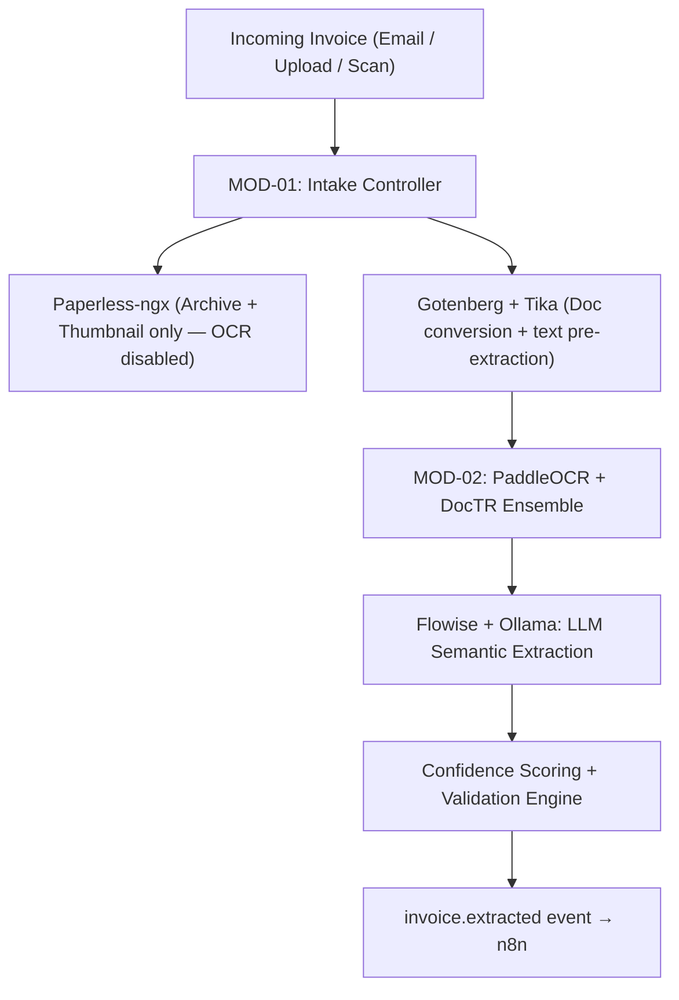
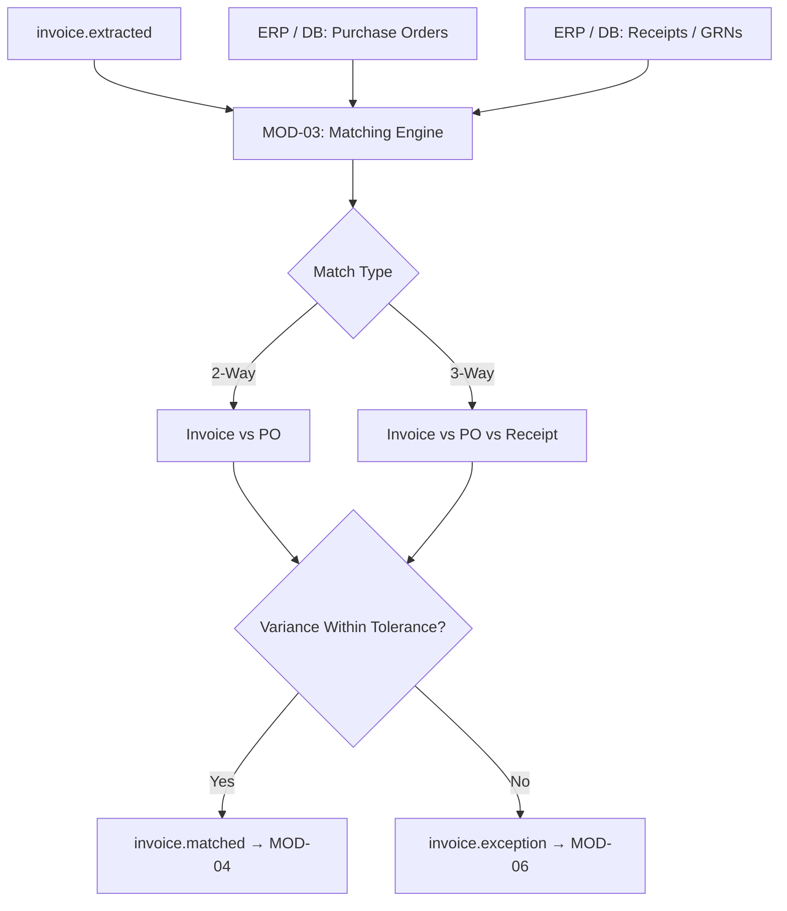
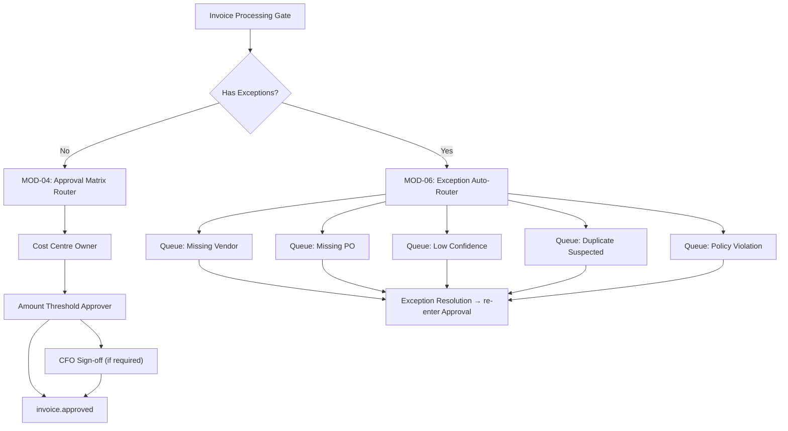
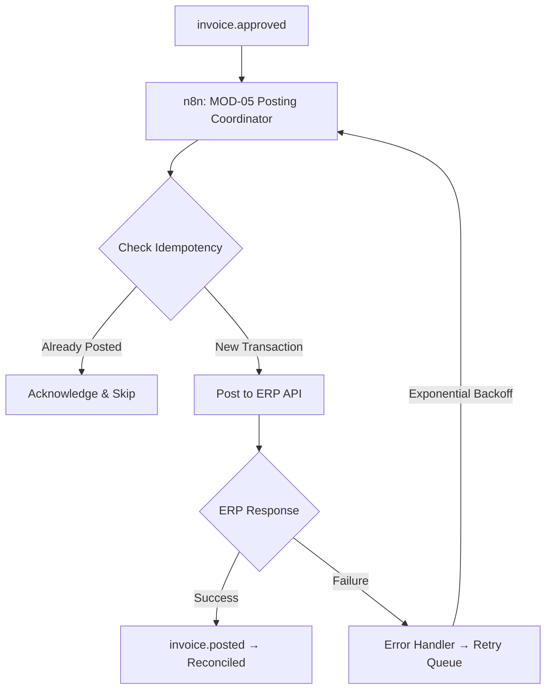
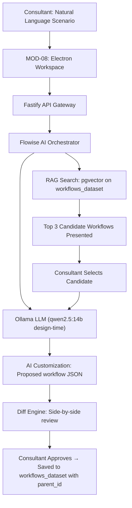
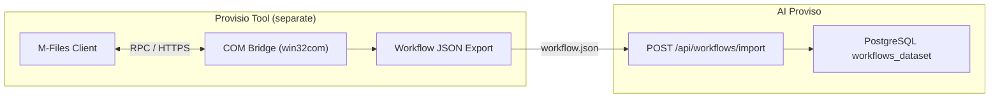

# AI Proviso Product Requirements Document (PRD)
## Version 9.0 — Platform Boundary Clarification (COM Bridge Removed · Clean Tool Separation)

---

## Document Metadata

| Field | Detail |
| :--- | :--- |
| **Product** | AI Proviso — AP-First Automation Platform |
| **Version** | 9.0 — Platform Boundary Clarification |
| **Classification** | Internal — Confidential |
| **Author** | Harry Joseph / scriptdotnet — Xerox Canada |
| **Previous Versions** | PRD v8.0 (Consolidated Production Architecture) + PRD v7.0 (Hardened Schema) |
| **Primary Stakeholder** | Michel LeBrun — Director, Software Pre-sales & Solution Design |
| **Demo Target** | 12-Week Michel LeBrun Pilot (Phase I Working Vertical Slice) |
| **Phase I Timeline** | 8 Weeks to Working Demo · 16 Weeks Production Hardening |
| **Architecture** | 9-Module Contract-First Isolation · Docker Compose · n8n Event Spine |
| **AI Stack** | Ollama · Flowise (Config-as-Code) · PaddleOCR · DocTR · react-flow |
| **Data Layer** | PostgreSQL 16 (Platform Master) + SQLite (Local Workspace Client Cache) |

---

## Three Locked Architectural Decisions

> [!IMPORTANT]
> **Decision 1 — Paperless-ngx Boundary:** Paperless-ngx is strictly a document archive, search, and thumbnail storage service. **`PAPERLESS_OCR_MODE=skip`** is enforced in the Docker Compose environment. **MOD-02** owns all OCR text and layout extraction.
>
> **Decision 2 — Flowise Configuration-as-Code:** Flowise flows are not mutable infrastructure. Visual prompt chains are exported as JSON, committed to the Git repository, and auto-seeded via the Flowise REST API on container deployment. The Fastify API calls Flowise over HTTP, making it fully swappable for a native LangChain/LlamaIndex Python microservice without frontend changes.
>
> **Decision 3 — Phase I Demo Scope:** The pilot targets a working vertical slice: **MOD-01 (Intake)** + **MOD-02 (Extraction)** + **MOD-04 (Workflow/Diff Approval)**. **MOD-03 (Matching)** and **MOD-05 (ERP Posting)** are simulated via mock database tables and mock webhook callbacks. MOD-07 (Audit) is wired from day one — it is never retrofitted.
>
> **Decision 4 — Clean Tool Boundary (COM Bridge Removed):** AI Proviso does **not** talk to the M-Files COM API. The separate **Provisio** tool owns COM export and produces a workflow JSON file. AI Proviso ingests that file via a single platform-agnostic endpoint: `POST /api/workflows/import`. This removes the Windows-only deployment requirement, the `win32com` dependency, and the `host-native` profile from AI Proviso entirely.

---

## 1. Vision & Strategic Promise

AI Proviso is a next-generation Accounts Payable automation platform designed to deliver enterprise-grade outcomes with a business-user-first experience. It is explicitly positioned to replace brittle M-Files-based AP configurations and legacy template capture tools (ABBYY FlexiCapture, CapturePerfect) through superior AI extraction, no-code visual configuration, and intelligent workflow reuse across deployments.

### 1.1 Core Commitments

| Pillar | Commitment |
| :--- | :--- |
| **Speed to Value** | Full AP deployment in under 7 days via a guided First-Run Wizard |
| **AI-First OCR** | PaddleOCR + DocTR + LLM semantic ensemble. Outperforms single-engine tools on complex, rotated, and multi-currency invoices |
| **No-Code Platform** | Drag-and-drop workflow, form, and app builders. No engineering required for configuration adjustments |
| **Workflow Integrity** | Every state transition is programmatically policy-enforced. Zero bypass paths. Zero passive pending states |
| **Learning System** | Every approved invoice makes the next one faster. Vendor profiles, ERP mappings, and workflow templates accumulate confidence automatically |
| **Modular by Design** | 9 contract-isolated modules. Swap, upgrade, or extend any service layer without impact on the others |

### 1.2 Competitive Positioning

| Capability | Legacy Tools (M-Files / ABBYY) | AI Proviso v8 |
| :--- | :--- | :--- |
| **OCR Engine** | Single template-based OCR engine | Ensemble: PaddleOCR + DocTR + LLM semantic fallback |
| **Workflow Config** | Proprietary XML — consultant-only edits | Drag-and-drop React canvas + AI RAG generation |
| **ERP Mapping** | Manual matching per deployment | Registry reuse — map once, reuse forever |
| **Onboarding** | Weeks to months of setup | Under 7 days via guided First-Run Wizard |
| **Exception Mgmt** | Passive pending states | Named queues + SLA timers + escalation chains |
| **Deployment** | Heavyweight server installation | Docker Compose — runs on a developer's laptop |
| **Cross-Project Learning** | None — every deployment starts from zero | Dataset flywheel — every deployment improves the next |

---

## 2. Product Strategy & Phasing

### 2.1 Phase Roadmap

| Phase | Scope | Timeline | Demo Target |
| :--- | :--- | :--- | :--- |
| **Phase I — Vertical Slice** | MOD-01 + MOD-02 + MOD-04. MOD-07 wired. Stubs for MOD-03 and MOD-05. | Weeks 1–8 | Michel LeBrun 12-week demo |
| **Phase II — Full Pipeline** | MOD-03 + MOD-05 + MOD-06 live. First-Run Wizard production-ready. | Weeks 9–16 | First pilot client deployment |
| **Phase III — Scale & Learn** | Full builders + SLA timers + vendor AI tuning + template library + DMS. | Weeks 17–24 | Production General Availability |

### 2.2 Target Market

- SMB and mid-market organizations (50–2,000 employees) processing 200–50,000 invoices per month.
- ERP-integrated operating environments: SAP, Dynamics 365, NetSuite, QuickBooks, custom.
- Organizations currently using M-Files or legacy capture tools — direct replacement opportunity.

---

## 3. Architecture Overview

### 3.1 The Golden Rule: Contract-First Module Isolation

> - No module imports another module's source code.
> - Every module reads and writes only from the canonical PostgreSQL schema defined in **MOD-00**.
> - Every module communicates asynchronously by firing event topics via **n8n webhooks**.
> - This rule ensures every module is independently replaceable, testable, and deployable.
> - To safeguard operations, any transactional or external-facing event is backed by a persistent queue buffer.

```
              ┌────────────────────────┐
              │   MOD-01: Intake       │
              └───────────┬────────────┘
                          │ invoice.received
                          ▼
              ┌────────────────────────┐
              │   MOD-02: Extraction   │
              └───────────┬────────────┘
                          │ invoice.extracted
                          ▼
              ┌────────────────────────┐
              │   MOD-04: Workflow     │◄─── [MOD-08: UI React Client]
              └───────────┬────────────┘
                          │ invoice.approved
                          ▼
              ┌────────────────────────┐
              │   MOD-05: ERP Adapter  │
              └────────────────────────┘
                          │ (all modules)
                          ▼
              ┌────────────────────────┐
              │   MOD-07: Audit Trail  │  ← always on, consumes every event
              └────────────────────────┘
```

### 3.1.1 Event Buffering & Reliable Queueing (Redis BullMQ + DLQ)

To guarantee message delivery and prevent data loss during container restarts, network dropouts, or downstream system outages (e.g. ERP downtime or M-Files temporary lockups), all inter-module communication is buffered using **Redis BullMQ** job streams:
* **Event Ingestion & Queueing:** Fastify and n8n push events to Redis-backed BullMQ streams. Webhook endpoints do not process events synchronously; they write to the stream and acknowledge receipt immediately.
* **Retry Policy & Backoff:** Queue workers consume tasks from the queue with an automatic retry configuration:
  - *Max Retry Attempts:* 5.
  - *Backoff Interval:* Exponential (e.g., $1000\text{ms} \times 2^{\text{attempt}-1}$), giving the system up to 16 seconds to recover from transient glitches.
* **Dead Letter Queue (DLQ) Routing:**
  - If an event continues to fail after the 5th attempt, the BullMQ worker intercepts the failure and moves the payload to a Dead Letter Queue (`dlq:events`).
  - The fail state, event payload, correlation ID, and full error trace are logged into the database and flagged in the AP Workbench under the **AP Compliance Lead** exception queue for manual retry or correction.

### 3.1.2 Event Transport Authoritative Flow Paths

To avoid dual-routing complexity and maintain deterministic state flows, event paths are partitioned by class:
* **Transactional/State-Change Events:** Fired upon database state mutations (`invoice.matched`, `invoice.approved`, `invoice.exception`, `invoice.resolved`, `invoice.posted`). These use **Redis BullMQ streams** as the authoritative transport, guaranteeing at-least-once delivery, sequencing, and transactional safety.
* **Internal Workflow Orchestration Hooks:** Synchronous/asynchronous rules executed inside a specific module workflow (e.g. email notifications, system-to-system webhook updates). These are routed via **n8n Webhook triggers**, acting as the logic connector.

### 3.2 Module Directory

| Module | Name | Phase | Single Responsibility |
| :--- | :--- | :--- | :--- |
| **MOD-00** | Core (Contract Layer) | Always | Canonical schemas, PostgreSQL migrations, n8n event topic definitions |
| **MOD-01** | Document Intake | Phase I | Accept documents from any source. Produce `invoice.received` event |
| **MOD-02** | OCR & AI Extraction | Phase I | OCR ensemble + LLM field extraction + per-field confidence scoring |
| **MOD-03** | Matching Engine | Phase II | 2-way / 3-way PO and receipt matching with configurable tolerance rules |
| **MOD-04** | Workflow & Approval | Phase I | State machine + approval routing + drag-and-drop designer + RAG engine |
| **MOD-05** | ERP Adapter | Phase II | Connector + Mapper + Poster. Idempotent ERP integration |
| **MOD-06** | Exception Management | Phase II | Named queues + SLA timers + escalation chains + resolution workflows |
| **MOD-07** | Audit Trail | Phase I* | Append-only event store. INSERT-only DB role. Immutable. |
| **MOD-08** | UI & Builders | Phase I+ | React builders: workflow canvas, form builder, AP workbench |

*\* MOD-07 is wired from day one — audit is never retrofitted.*

### 3.3 Canonical Event Schema

Every event crossing module boundaries must conform to the canonical envelope defined in **MOD-00**:

```json
{
  "event": "invoice.extracted",
  "schema_version": "1.0",
  "invoice_id": "uuid-v4",
  "tenant_id": "uuid-v4",
  "payload": {
    "vendor": "Acme Corp",
    "invoice_number": "INV-2026-001",
    "total": 12500.00
  },
  "confidence": {
    "vendor": 0.97,
    "invoice_number": 0.95,
    "total": 0.99
  },
  "source_module": "ocr",
  "correlation_id": "uuid-v4",
  "timestamp": "2026-05-25T21:43:00Z"
}
```

### 3.4 Event Registry

| Event | Fired By | Consumed By | Note / Description |
| :--- | :--- | :--- | :--- |
| `invoice.received` | MOD-01 | MOD-02 | Triggers OCR and document pre-extraction |
| `invoice.extracted` | MOD-02 | MOD-03 (Phase II) / MOD-04 (Phase I) | Delivers structured data fields and confidence scores |
| `invoice.matched` | MOD-03 | MOD-04 | Confirms PO/receipt matches within threshold limits |
| `invoice.exception` | MOD-03 / MOD-02 | MOD-06 | Routes to specific exceptions workbench |
| `invoice.resolved` | MOD-06 | MOD-04 | Re-enters approval workflow post-correction |
| `invoice.approved` | MOD-04 | MOD-05 | Initiates posting execution routines |
| `invoice.posted` | MOD-05 | MOD-07 | Confirms transaction posted to client ERP |
| `invoice.rejected` | MOD-04 | MOD-06 / MOD-07 | Ends invoice lifecycle and writes audit log |
| `audit.event` | ALL modules | MOD-07 | Logs payload for append-only audit trace |

---

## 4. Technology Stack & Service Map

### 4.1 Service Directory

| Layer | Technology | Version | Role |
| :--- | :--- | :--- | :--- |
| **Infrastructure** | Docker + Docker Compose | Latest | All platform services — single compose file deployment |
| **Data — Master** | PostgreSQL | 16 | Invoices, workflows, audit logs, vectors, ERP configurations |
| **Data — Cache/Broker** | Redis | 7 | Session cache, retry queues, pub/sub event routing |
| **Data — Local Cache** | SQLite | 3 | Electron client workspace only — never AP transactions |
| **DMS / Archive** | Paperless-ngx | Latest | Document storage, thumbnails, search. **OCR DISABLED** |
| **Doc Conversion** | Gotenberg + Tika | Latest | Office-to-PDF conversion, text pre-extraction before OCR |
| **Workflow Orch.** | n8n | Latest | Orchestration hook runtime — coordinates workflow hooks and integration automations |
| **AI Orchestration** | Flowise | Latest | LangChain agents, RAG pipelines — flows saved as Git-tracked JSON |
| **LLM Runtime** | Ollama | Latest | External HTTP service — decoupled from client binary |
| **OCR — Primary** | PaddleOCR | 2.7+ | Deep learning character recognition, tabular processing |
| **OCR — Layout** | DocTR | 0.9+ | Visual text block grouping, logical reading order detection |
| **OCR — Fallback** | Tesseract | 5 | Clean, standard, high-contrast document parsing |
| **Backend API** | Fastify | 4 | API gateway — production service gateway |
| **Frontend** | React + Vite | 18/6 | Electron desktop client UI |
| **Workflow Canvas** | react-flow | 11 | Drag-and-drop workflow designer |
| **Vector Search** | pgvector | 0.7+ | RAG embeddings stored in PostgreSQL master database |

### 4.2 Docker Compose Service Topology

| Service | Port | Profile | Notes |
| :--- | :--- | :--- | :--- |
| **postgres** | 5432 | default | Persistent volume. Never wiped between restarts |
| **redis** | 6379 | default | Ephemeral cache for queues and pub/sub |
| **backend-api** | 5000 | default | Fastify gateway — single entry point for React client |
| **ocr-worker** | — | default | Python container executing PaddleOCR + DocTR jobs |
| **n8n** | 5678 | default | Event spine — flows auto-seeded from `/config/n8n/` on startup |
| **paperless-ngx** | 8000 | default | `PAPERLESS_OCR_MODE=skip` enforced in compose env |
| **gotenberg** | 3000 | default | Office-to-PDF — invoked by MOD-01 |
| **tika** | 9998 | default | Raw text pre-extraction — invoked by MOD-01 |
| **flowise** | 3001 | default | Prompt flows auto-seeded from `/config/flowise/` on startup |
| **ollama** | 11434 | local-ai | Optional profile. Or point to Mac M2 via `OLLAMA_BASE_URL` |
| **ollama-pull** | — | local-ai | Helper container — pulls default model weights, then exits |

### 4.3 AI Runtime Boundary

- **API-First Isolation:** LLM execution uses Ollama over HTTP API. No weights or model runtimes are compiled into the client executable.
- **Dedicated Hardware Profile (Mac M2 32GB):** Ollama runs on a dedicated local machine to prevent GPU/CPU resource contention on the Windows host running OCR tasks.
- **Dual-Mode AI Model Strategy:**
  - **Design-Time AI (Cockpit):** RAG search, NL workflow generation, SOW/PRD writing. Use `qwen2.5:14b` or `deepseek-r1:14b`.
  - **Run-Time AI (AP Pipeline):** Fast invoice field extraction from raw OCR text. Use `llama3.2:3b` or `phi4-mini`.
- **OCR Execution & Scaling:** PaddleOCR and DocTR execute within the dedicated `ocr-worker` container. The worker polls job payloads from a Redis-backed queue. This isolates heavy-compute CPU/GPU operations and allows horizontal scaling (increasing the count of running replica containers) depending on daily queue depths.
- **Flowise Orchestration:** Manages LangChain/LlamaIndex agents. Routes to configured Ollama endpoints.
- **Persistence:** Agent memory (MemOS context) and RAG vectors stored in PostgreSQL. Ollama runtime remains stateless.

### 4.4 Port & Environment Governance

- All service endpoints are environment-driven via `.env` configuration.
- Remote Mac M2 Ollama access: set `OLLAMA_HOST=0.0.0.0` and `OLLAMA_ORIGINS="*"` on Mac. Set `OLLAMA_BASE_URL=http://MacBook-M2.local:11434` in the Windows host `.env`.
- M-Files COM integration is handled entirely by the **Provisio** tool (separate). AI Proviso has no M-Files ports, COM bridge, or `win32com` dependency.

### 4.5 Backend Transition Strategy: Flask (Current) vs Fastify (Target)

* **Current State (Phase I):** The development sandbox uses a Python/Flask application (`backend/app.py`) to handle API routing, prompt prototyping, and mocked database controllers. This speeds up validation and testing for the Michel LeBrun 12-week demo.
* **Target State (Phase II):** The architecture mandates transitioning to a Fastify (Node.js) API gateway (`backend-api:5000`) for deployment. Fastify is chosen for superior async message handling, low latency, JWT route authentication, and schema-driven request/response validation.

### 4.6 Workflow Import Contract

AI Proviso accepts workflow data through a single platform-agnostic HTTP endpoint:

- **Endpoint:** `POST /api/workflows/import`
- **Accepted format:** Provisio-exported JSON (produced by the separate **Provisio** tool)
- **Pipeline:** JSON received → XML/PII sanitization → schema validation → dataset ingestion → new workflow tab opened in designer
- **No COM dependency:** AI Proviso has no knowledge of M-Files vaults, GUIDs, or authentication. The Provisio tool owns that boundary.

---

## 5. Module Specifications

### MOD-00 — Core (Contract Layer)

Shared schema and type package. Zero business logic. Zero runtime services.

- **Owner:** Platform Architect
- **Consumes:** None
- **Produces:** PostgreSQL schemas, event topic strings, canonical TypeScript types
- **Contents:**
  - `core/schemas/` — JSON Schema files for every canonical type
  - `core/migrations/` — Numbered SQL migration files, executed in sequence on every deploy
  - `core/events.ts` — Event topic enums (all modules import from here — no hardcoding)
  - `core/types.ts` — TypeScript interfaces for all canonical data shapes

> **Developer Rule:** When changing a data shape, change it here first. Then update consuming modules. Never let modules define their own versions of shared types.

---

### MOD-01 — Document Intake

Accepts documents from any source. Archives to Paperless-ngx. Fires `invoice.received`.

- **Owner:** `MOD-01/intake-controller`
- **Consumes:** Email (IMAP), HTTP uploads, watched folders, scanner webhooks
- **Produces:** `invoice.received` → n8n

| Source | Mechanism | n8n Trigger |
| :--- | :--- | :--- |
| Email attachment | IMAP watcher (n8n email node) | On new email with attachment |
| HTTP upload | Fastify multipart endpoint | `POST /api/intake/upload` |
| Watched folder | n8n filesystem watcher | On file created in `/intake/drop/` |
| Scanner webhook | HTTP POST from scanner | `POST /api/intake/scan` |

**Archiving Policy:** Raw file uploaded to Paperless-ngx via REST API. Paperless document ID stored in `invoices.paperless_id`. Paperless OCR explicitly disabled. MOD-01 writes to Paperless — it never reads back.

**Swap Test:** To add a new intake source (e.g. WhatsApp, SFTP), create a new adapter posting to `POST /api/intake/upload`. Nothing else changes.

---

### MOD-02 — OCR & AI Extraction

Runs the multi-engine OCR ensemble and LLM semantic extraction pipeline. Outputs structured invoice JSON with per-field confidence scores.

- **Owner:** `MOD-02/ocr-pipeline`
- **Consumes:** `invoice.received` (from n8n)
- **Produces:** `invoice.extracted` → n8n

**5-Stage Pipeline:**

| Stage | Tool | Responsibility |
| :--- | :--- | :--- |
| 1 — Preprocessing | OpenCV / Gotenberg | Deskew, denoise, normalize resolution, convert to PNG slices |
| 2 — Classification | Lightweight CNN | Classify type: Invoice / Credit Note / PO / Receipt / Statement |
| 3 — OCR Ensemble | PaddleOCR + DocTR | Primary: PaddleOCR (tabular, fast). Secondary: DocTR (layout). Fallback: Tesseract |
| 4 — AI Extraction | Flowise + Ollama | LLM (`phi4-mini`) parses raw OCR text → structured invoice JSON |
| 5 — Confidence Score | Validation engine | Line item sum check, vendor DB lookup, format validation. Per-field 0.0–1.0 score |

**Pluggable OCR Interface:**
```typescript
interface OCRAdapter {
  extract(docId: string, rawBytes: Buffer): Promise<OCRResult>;
}
// Implementations: LocalAdapter (PaddleOCR+DocTR), CloudAdapter (Azure DI), TestAdapter (mock)
// Selected at runtime via ADAPTER_OCR environment variable
```

**Confidence Routing:**

| Threshold | Action |
| :--- | :--- |
| ≥ 0.90 all critical fields | Auto-route to workflow — no human review |
| 0.70–0.89 any critical field | Flag field for human review in AP Workbench. Continue pipeline |
| < 0.70 any critical field | Route to Low Confidence exception queue. Hold pending review |

**Swap Test:** To add Azure Document Intelligence: implement `AzureDIAdapter` satisfying `OCRAdapter`. Set `ADAPTER_OCR=azure` in `.env`. Zero pipeline changes.

---

### MOD-03 — Matching Engine

Compares extracted invoice fields against Purchase Orders and Receipt records.

- **Owner:** `MOD-03/matching-engine`
- **Consumes:** `invoice.extracted` (from n8n)
- **Produces:** `invoice.matched` or `invoice.exception` → n8n
- **Phase I Stub:** Queries `mock_purchase_orders` table. Returns `invoice.matched` for all demo invoices.

**Phase II Logic:**
- 2-way match: Invoice vs PO (vendor, amounts, currency within tolerance rules)
- 3-way match: Invoice vs PO vs GRN/Receipt (adds quantity and receipt confirmation)
- Tolerance rules stored as JSON in `tenant_configurations` — editable via UI without code changes

---

### MOD-04 — Workflow & Approval Engine

Pure state machine. Owns the AP invoice lifecycle, approval matrix, workflow designer, AI generation, and the RAG dataset engine.

- **Owner:** `MOD-04/workflow-engine` + `MOD-04/designer-api` + `MOD-04/rag-engine`
- **Consumes:** `invoice.matched` (Phase II) or `invoice.extracted` (Phase I)
- **Produces:** `invoice.approved` or `invoice.rejected` → n8n

**Two Workflow Creation Paths — One Destination:**

| Path | Entry Point | AI Role | Saved to Dataset |
| :--- | :--- | :--- | :--- |
| Manual Build | react-flow canvas drag-and-drop | None — consultant has full visual control | Yes, with scenario metadata |
| AI Generation | Natural language scenario description | Full — LLM generates complete workflow JSON | Yes, `source = ai_generated` |
| AI Customization | RAG candidate selection | High — LLM adapts base template to requirements | Yes, `source = ai_customized`, `parent_id` set |
| Import | Provisio JSON file (`POST /api/workflows/import`) | Sanitization pipeline — scrubs PII, normalizes | Yes, `source = imported` |

**Future Project — Workflow Reuse Flow:**

| Step | Actor | Action |
| :--- | :--- | :--- |
| 1 — Describe | Consultant | Types a natural language scenario for the new client |
| 2 — RAG Search | System | Embeds description. Hybrid search: vector similarity + structured filters (type, industry, complexity). Returns top 3 matches with similarity scores |
| 3 — Candidate Selection | Consultant | Reviews 3 candidate cards: name, scenario summary, similarity %, state count, usage count. Picks best starting point |
| 4 — AI Customization | LLM | Loads selected sanitized template JSON. Applies new requirements. Generates proposed customization |
| 5 — Diff Review | Consultant | Side-by-side diff: original template (left) vs AI-customized (right). Accept all / reject individual changes / edit manually |
| 6 — Approve & Activate | Consultant | Approved workflow saved as new dataset record. `usage_count` on source template incremented. `parent_id` set |

**Canonical AP Workflow States:**

| State | Entry Condition | Exits To |
| :--- | :--- | :--- |
| Received | `invoice.received` fired | Extracted |
| Extracted | `invoice.extracted` fired | Matched (Phase II) / Pending Approval (Phase I) |
| Matched | `invoice.matched` fired | Pending Approval |
| Pending Approval | Routed by approval matrix | Approved / Rejected / Exception |
| Approved | All required approvals completed | Posted (Phase II) / Reconciled |
| Exception | Any exception event | Pending Approval (after resolution) |
| Posted | ERP posting confirmed | Reconciled |
| Reconciled | Posting verified | — (terminal) |
| Rejected | Approver rejects | — (terminal, audited) |

**Workflow Integrity Controls:**
- Grid edits cannot bypass workflow states — all field changes route through the state machine
- Approval-required fields become read-only post-submission
- Posting is blocked in any state other than Approved — enforced at database level via CHECK constraint
- Bulk edits run per-row validation. Partial success committed row by row with individual audit records
- Optimistic locking on concurrent edits — conflict detection + merge/reload flow

---

### MOD-05 — ERP Adapter

Three independently versioned sub-components: Connector, Mapper, Poster.

- **Owner:** `MOD-05/erp-adapter`
- **Consumes:** `invoice.approved` (from n8n)
- **Produces:** `invoice.posted` or `audit.event` → n8n
- **Phase I Stub:** Mock webhook returns `{ "status": "posted", "ref": "SAP-98124" }` after 1.5s simulated latency.

**ERP Mapping Resolution Order (always in this sequence):**

```
Step 1 — Check erp_configs Registry
   Exists AND confidence >= 0.90  →  Load & apply automatically. Done.
   Exists AND confidence < 0.90   →  Load as draft. Highlight low-confidence fields for validation.
   Not found                      →  Proceed to Step 2.

Step 2 — AI Auto-Map
   All fields >= 0.90             →  Apply and save to registry. Done.
   Partial match                  →  Pre-fill matched fields. Highlight gaps. Proceed to Step 3.
   Auto-map fails                 →  Proceed to Step 3.

Step 3 — Manual Map
   Consultant maps remaining fields in field mapping UI.
   On save                        →  Saved to erp_configs. confidence_score = 0.75, usage_count = 1.
```

**Auto-Map Techniques:**

| Technique | How It Works | Best For |
| :--- | :--- | :--- |
| Name Similarity | Fuzzy string match (Levenshtein + phonetic) | Standard fields: `invoice_number`, `total_amount` |
| Type Compatibility | Restrict to matching data types — used as a filter | Narrowing when name similarity is ambiguous |
| Semantic Embedding | Cosine similarity between field name + description embeddings | Synonyms: `supplier` ↔ `vendor`, `due_date` ↔ `payment_due` |
| Historical Inference | Apply known mappings from previous deployments of same ERP type | Very high accuracy on repeat ERP installs |
| LLM Inference | LLM reasons about likely mapping for ambiguous fields | Last resort — always presented for human confirmation |

**Learning Loop:**
- `confidence_score = 0.75` on first save
- Each successful posting: `confidence_score += 0.02`, `usage_count++`
- At `confidence_score >= 0.90`: auto-applied without review prompt
- At `confidence_score >= 0.95` and `usage_count >= 10`: flagged as `is_trusted_standard = true` — visible to all consultants as a recommended starting point
- Failed posting: `confidence_score -= 0.10`. Score below `0.60`: flagged for review

**Template Versioning:**
- `erp_version` field prevents applying a SAP 2020 mapping to a SAP 2024 schema
- ERP version upgrade detected: existing template loads with version-mismatch flag. AI re-runs auto-map on new schema. Changed fields highlighted for consultant review
- Previous version archived, not deleted. Rollback available
- Consultant can fork a template (`forked_from` field set): client-specific variant maintained independently

**Workflow Lineage Fingerprinting:**
Every workflow saved to the dataset carries an immutable JSON signature stored in the `workflows` table. This provides complete audit traceability and drift detection:
```json
{
  "proviso_workflow_id": "uuid-v4",
  "parent_template_id": "uuid-v4-or-null",
  "tenant_id": "uuid-v4",
  "imported_at": "timestamp-iso8601",
  "imported_by": "user-uuid",
  "checksum": "sha256-hash-of-workflow-logic-json"
}
```
> **Note:** M-Files Named Value Storage (vault alias isolation, `VaultNamedValueStorageOperations`) is the responsibility of the **Provisio** tool. AI Proviso stores lineage in its own PostgreSQL dataset only.

---

### MOD-06 — Exception Management

Named exception queues with typed reason codes, SLA timers, and escalation chains. Deliberately separate from MOD-04 because exception policy changes frequently.

- **Owner:** `MOD-06/exception-router`
- **Consumes:** `invoice.exception` (from n8n)
- **Produces:** `invoice.resolved` → n8n (re-enters MOD-04 approval flow)

| Queue | Reason Code | Owner | SLA |
| :--- | :--- | :--- | :--- |
| Missing Vendor Reference | `VENDOR_UNKNOWN` | AP Data Validation | 4 hours |
| Missing PO Reference | `PO_REQUIRED` | AP Matching Team | 8 hours |
| Missing Vendor + PO | `VENDOR_AND_PO` | AP Compliance Lead | 4 hours (CRITICAL) |
| Low Confidence Extraction | `LOW_CONFIDENCE` | AP Data Validation | 4 hours |
| Duplicate Suspected | `DUPLICATE_RISK` | AP Compliance Lead | 2 hours |
| Policy Violation | `POLICY_BREACH` | AP Compliance Lead | 2 hours |
| ERP Reconciliation Failure | `ERP_POST_FAIL` | AP Integration Team | 4 hours |
| Match Variance | `MATCH_VARIANCE` | AP Matching Team | 8 hours |

**Escalation Chain:**
1. SLA breach: notify Queue Owner + AP Manager
2. Double SLA breach: notify Controller
3. Triple SLA breach: notify Finance Operations Lead + place payment on hold

---

### MOD-07 — Immutable Audit Trail

Consumes every event from every module. Writes to an append-only table. Never updates, never deletes.

- **Owner:** `MOD-07/audit-consumer`
- **Consumes:** `audit.event` (all modules, via n8n)
- **Produces:** Records in `audit_events` + read-only query API for UI

**Integrity Controls:**
- PostgreSQL role `audit_writer` has INSERT-only on `audit_events`. No UPDATE, no DELETE, no TRUNCATE.
- `recorded_at` is always set by the database (`DEFAULT now()`) — never accepted from client payload
- Audit export: full history as CSV or PDF, available to any authorised user on demand

---

### MOD-08 — UI & Builders

React desktop client. Three primary interfaces sharing one design system.

- **Owner:** `MOD-08/react-client` (Electron host-native)
- **Consumes:** REST API (`backend-api:5000`) and n8n webhooks
- **Produces:** User-facing interfaces. All state changes route through `backend-api`

**Builder 1 — Workflow Designer (react-flow):**
- Drag state nodes from a typed sidebar palette (AP states, approval states, exception states)
- Connect states with transition edges labelled with condition expressions
- Sidebar inspector: assign approvers, SLA timer, notification targets, escalation chain per state
- Simulation mode: step a test invoice through the workflow before activating. Shows each routing decision with the rule that fired
- Save → serializes to `workflow_json` (MOD-00 schema) → committed to `workflows_dataset`

**Builder 2 — Form Builder:**
- Drag field types onto canvas: text, number, date, dropdown, lookup, checkbox
- Field properties: label, required, default, validation rule, read-only conditions
- Preview mode: renders the form as an AP user would see it
- Forms stored as JSON in `form_definitions`

**Builder 3 — AP Invoice Workbench:**
- Spreadsheet-like invoice queue — fast, keyboard-navigable, bulk-action capable
- Confidence colour coding: green ≥ 0.90, amber 0.70–0.89, red < 0.70
- Inline field correction: click → edit → change flagged for audit with reason capture
- Bulk actions: approve selection, assign to user, export CSV
- Optimistic locking: conflict badge shown if another user edits the same invoice concurrently

**Static Asset Proxy Endpoints (Fastify Gateway):**
To avoid mounting shared Docker volumes directly into the host-native Electron application (which breaks container boundaries, creates network share dependencies, and introduces permission safety issues), the Fastify `backend-api` acts as a secure streaming proxy for Paperless-ngx documents and thumbnails:
- `GET /api/invoices/:id/file`: Streams the original raw invoice PDF from Paperless-ngx.
- `GET /api/invoices/:id/thumbnail`: Streams the generated invoice page thumbnail image.
- *Security & Isolation:* The gateway validates the user's session token and verifies that the requesting user's `tenant_id` matches the invoice's `tenant_id` in the database. Upon verification, Fastify internally fetches the asset via HTTP from Paperless-ngx (`http://paperless-ngx:8000/api/documents/:paperless_id/download/` or `/preview/`) using Paperless system credentials, streaming the bytes back to Electron. This ensures air-tight multi-tenant isolation.

---

### 5.1 System-Wide Security Controls & Auditor Compliance

* **Secret Management:** Plaintext credentials inside code or databases are strictly forbidden. Production settings use Docker Secrets or a secure HashiCorp Vault instance. Development environments load credentials via local, Git-ignored `.env` variables.
* **API Authentication:** All cross-container internal REST API calls between Fastify, Flowise, and n8n require authentication using ephemeral HS256 JWT tokens.
* **Key Rotation:** JWT signing keys are rotated automatically every 30 days via a background schedule in `MOD-00`.
* **Audit Log Retention Window:** The PostgreSQL database enforces a strict 7-year retention policy on `audit_events`. DB security policies revoke delete permissions from all runtime application accounts, preventing truncation or alteration.

### 5.2 Schema Evolution & Event Versioning Policy

To prevent schema changes from breaking downstream consumers in an event-driven setup, the platform mandates strict backward compatibility:
* **Event Versioning:** Every canonical event payload specifies a `schema_version` in SemVer format (e.g. `1.0.0`).
* **Additive Policy:** Updates to the event payload within a major schema version must be additive-only. Adding optional keys is permitted. Renaming, deleting, or changing the datatypes of existing keys is strictly prohibited.
* **Migration Strategy:** Major changes (e.g., `1.x.x` to `2.0.0`) must execute a corresponding payload mapping transformer inside n8n to translate legacy payloads to updated structures.

---

## 6. Data Model & Database Schemas

### 6.1 Complete PostgreSQL Schema (MOD-00 Migrations)

```sql
-- Enable pgvector extension if not already loaded
CREATE EXTENSION IF NOT EXISTS vector;

-- ─────────────────────────────────────────────────────────────
-- TENANT CONFIGURATION (v7 addition)
-- Single source of truth for all per-tenant AP policy settings.
-- ─────────────────────────────────────────────────────────────
CREATE TABLE tenant_configurations (
  id                  UUID PRIMARY KEY DEFAULT gen_random_uuid(),
  tenant_id           UUID NOT NULL UNIQUE,
  config_json         JSONB NOT NULL,
  -- config_json shape:
  -- {
  --   "po_required":          true,
  --   "match_type":           "3-way",  -- "2-way" | "3-way"
  --   "default_currency":     "CAD",
  --   "approval_thresholds":  [{ "amount": 5000, "approver_role": "manager" }, ...],
  --   "sla_overrides":        { "VENDOR_UNKNOWN": 2, "PO_REQUIRED": 6 },
  --   "ocr_confidence_floor": 0.70,
  --   "duplicate_window_days": 30,
  --   "alias_prefix":         "XERX"    -- v8 prefixing for vault alias configuration
  -- }
  version             INT DEFAULT 1,
  updated_at          TIMESTAMPTZ DEFAULT now()
);

-- ─────────────────────────────────────────────────────────────
-- USERS REGISTRY (v8 addition)
-- Core user identity, system roles, and multi-tenant isolation keys.
-- ─────────────────────────────────────────────────────────────
CREATE TABLE users (
  id           UUID PRIMARY KEY DEFAULT gen_random_uuid(),
  tenant_id    UUID NOT NULL REFERENCES tenant_configurations(tenant_id),
  email        VARCHAR(255) NOT NULL UNIQUE,
  display_name VARCHAR(255),
  role         VARCHAR(50) NOT NULL, -- admin, consultant, ap_operator, approver, viewer
  sso_subject  VARCHAR(255),         -- OIDC sub claim for SSO authentication linkage
  active       BOOLEAN DEFAULT TRUE,
  created_at   TIMESTAMPTZ DEFAULT now()
);

-- ─────────────────────────────────────────────────────────────
-- CORE INVOICES
-- ─────────────────────────────────────────────────────────────
CREATE TABLE invoices (
  id              UUID PRIMARY KEY DEFAULT gen_random_uuid(),
  tenant_id       UUID NOT NULL REFERENCES tenant_configurations(tenant_id),
  status          VARCHAR(50) NOT NULL
                    CHECK (status IN (
                      'received','extracted','matched','pending_approval',
                      'approved','exception','posted','reconciled','rejected'
                    )),
  correlation_id  UUID NOT NULL,
  paperless_id    VARCHAR(100),
  received_at     TIMESTAMPTZ DEFAULT now()
);

-- ─────────────────────────────────────────────────────────────
-- OCR EXTRACTION METADATA (v8: UUID PK, version, raw text, page/processing metrics)
-- ─────────────────────────────────────────────────────────────
CREATE TABLE invoice_extractions (
  id              UUID PRIMARY KEY DEFAULT gen_random_uuid(),
  invoice_id      UUID NOT NULL REFERENCES invoices(id) ON DELETE CASCADE,
  version         INT NOT NULL DEFAULT 1,
  extracted_json  JSONB NOT NULL,
  confidence_json JSONB NOT NULL,
  ocr_engine      VARCHAR(50) NOT NULL,
  raw_ocr_text    TEXT,           -- raw pre-LLM OCR output; retained for debugging
  page_count      INT,            -- number of pages processed
  processing_ms   INT,            -- total OCR pipeline duration in milliseconds
  created_at      TIMESTAMPTZ DEFAULT now(),
  UNIQUE (invoice_id, version)    -- prevents duplicates during extraction re-runs
);

-- ─────────────────────────────────────────────────────────────
-- VENDOR REGISTRY (v7: added name, display_name, tenant_id)
-- ─────────────────────────────────────────────────────────────
CREATE TABLE vendors (
  id                  UUID PRIMARY KEY DEFAULT gen_random_uuid(),
  tenant_id           UUID NOT NULL,           -- v7: tenant isolation
  name                VARCHAR(255) NOT NULL,   -- v7: required for fuzzy name match (section 9.1)
  display_name        VARCHAR(255),            -- v7: human-readable alias (e.g. "Acme Corp Ltd.")
  erp_vendor_number   VARCHAR(100) NOT NULL,
  account_number      VARCHAR(100),
  tax_id              VARCHAR(100),
  email_domain        VARCHAR(100),
  risk_score          DECIMAL(3,2) DEFAULT 0.00,
  created_at          TIMESTAMPTZ DEFAULT now()
);

-- ─────────────────────────────────────────────────────────────
-- VENDOR EXTRACTION PROFILES (v8 addition)
-- Learns and stores extraction layout coordinates, OCR anchors, and sample histories.
-- ─────────────────────────────────────────────────────────────
CREATE TABLE vendor_extraction_profiles (
  id              UUID PRIMARY KEY DEFAULT gen_random_uuid(),
  tenant_id       UUID NOT NULL REFERENCES tenant_configurations(tenant_id),
  vendor_id       UUID NOT NULL REFERENCES vendors(id) ON DELETE CASCADE,
  profile_json    JSONB NOT NULL,  -- field layout positions and known formats
  sample_count    INT DEFAULT 0,   -- number of invoices trained on
  accuracy_score  DECIMAL(4,3),    -- accuracy metrics for validation
  updated_at      TIMESTAMPTZ DEFAULT now()
);

-- ─────────────────────────────────────────────────────────────
-- MOCK PURCHASE ORDERS (Phase I Stub — MOD-03)
-- ─────────────────────────────────────────────────────────────
CREATE TABLE mock_purchase_orders (
  id              UUID PRIMARY KEY DEFAULT gen_random_uuid(),
  vendor_id       UUID REFERENCES vendors(id),
  po_number       VARCHAR(100) NOT NULL,
  total           DECIMAL(12,2) NOT NULL,
  currency        VARCHAR(10) NOT NULL,
  status          VARCHAR(50) NOT NULL
);

-- ─────────────────────────────────────────────────────────────
-- APPROVAL ROUTING MATRIX
-- ─────────────────────────────────────────────────────────────
CREATE TABLE approval_matrix (
  id              UUID PRIMARY KEY DEFAULT gen_random_uuid(),
  tenant_id       UUID NOT NULL,
  rules_json      JSONB NOT NULL,
  version         VARCHAR(50) NOT NULL,
  active          BOOLEAN DEFAULT TRUE
);

-- ─────────────────────────────────────────────────────────────
-- ACTIVE WORKFLOW DEFINITIONS
-- ─────────────────────────────────────────────────────────────
CREATE TABLE workflow_definitions (
  id              UUID PRIMARY KEY DEFAULT gen_random_uuid(),
  tenant_id       UUID NOT NULL REFERENCES tenant_configurations(tenant_id),
  workflow_json   JSONB NOT NULL,
  version         VARCHAR(50) NOT NULL,
  active          BOOLEAN DEFAULT TRUE,
  created_at      TIMESTAMPTZ DEFAULT now()
);

-- ─────────────────────────────────────────────────────────────
-- WORKFLOW RAG DATASET (v7: added parent_id for lineage tracking)
-- ─────────────────────────────────────────────────────────────
CREATE TABLE workflows_dataset (
  id              UUID PRIMARY KEY DEFAULT gen_random_uuid(),
  tenant_id       UUID NOT NULL,
  name            VARCHAR(255) NOT NULL,
  scenario_text   TEXT,                   -- searchable natural language description
  workflow_json   JSONB NOT NULL,         -- full workflow (may contain client data)
  sanitized_json  JSONB NOT NULL,         -- client PII replaced with placeholders
  type            VARCHAR(100) NOT NULL,  -- AP, contract, NDA, approbation
  industry        VARCHAR(100) NOT NULL,
  complexity      VARCHAR(50)  NOT NULL,  -- simple, standard, complex
  source          VARCHAR(50)  NOT NULL,  -- manual, ai_generated, ai_customized, imported
  parent_id       UUID REFERENCES workflows_dataset(id) ON DELETE SET NULL, -- v7: lineage
  usage_count     INT DEFAULT 0,          -- incremented each time reused as a base template
  embedding       vector(768),            -- semantic embeddings vector (nomic-embed-text default; falls back to 1536 if OpenAI text-embedding-3-small / text-embedding-ada-002 is configured via env)
  created_at      TIMESTAMPTZ DEFAULT now()
);

-- ─────────────────────────────────────────────────────────────
-- WORKFLOW SIMULATION RUNS (v7 addition)
-- Persists simulation results so sign-off PDFs can be regenerated.
-- ─────────────────────────────────────────────────────────────
CREATE TABLE workflow_simulation_runs (
  id                  UUID PRIMARY KEY DEFAULT gen_random_uuid(),
  tenant_id           UUID NOT NULL REFERENCES tenant_configurations(tenant_id),
  workflow_id         UUID REFERENCES workflow_definitions(id) ON DELETE CASCADE,
  run_by              UUID NOT NULL REFERENCES users(id), -- consultant who verified
  test_invoice_json   JSONB NOT NULL,             -- raw test values
  result_trace        JSONB NOT NULL,             -- step-by-step routing logic
  unreachable_states  TEXT[],                     -- lint warnings
  orphan_transitions  TEXT[],                     -- edge warnings
  passed              BOOLEAN NOT NULL,
  pdf_ref             VARCHAR(255),               -- local storage pointer
  ran_at              TIMESTAMPTZ DEFAULT now()
);

-- ─────────────────────────────────────────────────────────────
-- ERP INTEGRATION CONFIGURATIONS (v7: added is_trusted_standard, forked_from)
-- ─────────────────────────────────────────────────────────────
CREATE TABLE erp_configs (
  id                  UUID PRIMARY KEY DEFAULT gen_random_uuid(),
  erp_type            VARCHAR(100) NOT NULL,  -- SAP, Dynamics365, QuickBooks, NetSuite, custom
  erp_version         VARCHAR(50),
  entity_type         VARCHAR(100) NOT NULL,  -- invoice_posting, vendor_master, po_matching
  mapping_json        JSONB NOT NULL,
  auto_mapped         BOOLEAN DEFAULT FALSE,
  confidence_score    DECIMAL(4,3) DEFAULT 0.750,
  usage_count         INT DEFAULT 0,
  is_trusted_standard BOOLEAN DEFAULT FALSE,  -- v7: promoted at confidence>=0.95, usage>=10
  forked_from         UUID REFERENCES erp_configs(id) ON DELETE SET NULL, -- v7: fork lineage
  last_used_at        TIMESTAMPTZ,
  created_by          UUID,
  tenant_id           UUID NOT NULL REFERENCES tenant_configurations(tenant_id)
);

-- ─────────────────────────────────────────────────────────────
-- EXCEPTION CASES (MOD-06)
-- ─────────────────────────────────────────────────────────────
CREATE TABLE exception_cases (
  id              UUID PRIMARY KEY DEFAULT gen_random_uuid(),
  invoice_id      UUID REFERENCES invoices(id) ON DELETE CASCADE,
  reason_code     VARCHAR(100) NOT NULL,
  queue           VARCHAR(100) NOT NULL,
  assignee_id     UUID,
  sla_due         TIMESTAMPTZ NOT NULL,
  resolved_at     TIMESTAMPTZ
);

-- ─────────────────────────────────────────────────────────────
-- IMMUTABLE AUDIT TRAIL (MOD-07)
-- INSERT-only. Database role audit_writer has no UPDATE or DELETE.
-- ─────────────────────────────────────────────────────────────
CREATE TABLE audit_events (
  id              BIGSERIAL PRIMARY KEY,
  event_type      VARCHAR(80) NOT NULL,
  invoice_id      UUID NOT NULL,
  user_id         UUID REFERENCES users(id),
  old_value       JSONB,
  new_value       JSONB,
  reason          TEXT,                 -- mandatory on human overrides and approvals
  source_module   VARCHAR(20) NOT NULL,
  tenant_id       UUID NOT NULL,
  recorded_at     TIMESTAMPTZ DEFAULT now()  -- server-set, never client-supplied
);

-- Enforce INSERT-only at the database level
REVOKE UPDATE, DELETE, TRUNCATE ON audit_events FROM audit_writer;

-- ─────────────────────────────────────────────────────────────
-- FORM DEFINITIONS (MOD-08)
-- ─────────────────────────────────────────────────────────────
CREATE TABLE form_definitions (
  id              UUID PRIMARY KEY DEFAULT gen_random_uuid(),
  tenant_id       UUID NOT NULL REFERENCES tenant_configurations(tenant_id),
  name            VARCHAR(255) NOT NULL,
  form_json       JSONB NOT NULL,
  version         VARCHAR(50) NOT NULL,
  active          BOOLEAN DEFAULT TRUE,
  created_at      TIMESTAMPTZ DEFAULT now()
);

-- ─────────────────────────────────────────────────────────────
-- ENFORCE SIMULATION PASS BEFORE ACTIVATION GATE
-- Enforces that a workflow cannot set active=true unless a passed simulation exists.
-- ─────────────────────────────────────────────────────────────
CREATE OR REPLACE FUNCTION check_workflow_simulation_pass()
RETURNS TRIGGER AS $$
BEGIN
  IF NEW.active = TRUE THEN
    IF NOT EXISTS (
      SELECT 1 FROM workflow_simulation_runs
      WHERE workflow_id = NEW.id AND passed = TRUE
    ) THEN
      RAISE EXCEPTION 'A workflow cannot be activated unless a simulation run with passed = true exists for it.';
    END IF;
  END IF;
  RETURN NEW;
END;
$$ LANGUAGE plpgsql;

CREATE CONSTRAINT TRIGGER trg_enforce_simulation_gate
AFTER INSERT OR UPDATE OF active ON workflow_definitions
DEFERRABLE INITIALLY DEFERRED
FOR EACH ROW EXECUTE FUNCTION check_workflow_simulation_pass();

-- ─────────────────────────────────────────────────────────────
-- ROW-LEVEL SECURITY (RLS) MULTI-TENANCY POLICIES
-- ─────────────────────────────────────────────────────────────
-- Enable RLS on all tenant-specific tables
ALTER TABLE tenant_configurations ENABLE ROW LEVEL SECURITY;
ALTER TABLE users ENABLE ROW LEVEL SECURITY;
ALTER TABLE invoices ENABLE ROW LEVEL SECURITY;
ALTER TABLE invoice_extractions ENABLE ROW LEVEL SECURITY;
ALTER TABLE vendors ENABLE ROW LEVEL SECURITY;
ALTER TABLE vendor_extraction_profiles ENABLE ROW LEVEL SECURITY;
ALTER TABLE mock_purchase_orders ENABLE ROW LEVEL SECURITY;
ALTER TABLE approval_matrix ENABLE ROW LEVEL SECURITY;
ALTER TABLE workflow_definitions ENABLE ROW LEVEL SECURITY;
ALTER TABLE workflows_dataset ENABLE ROW LEVEL SECURITY;
ALTER TABLE workflow_simulation_runs ENABLE ROW LEVEL SECURITY;
ALTER TABLE erp_configs ENABLE ROW LEVEL SECURITY;
ALTER TABLE exception_cases ENABLE ROW LEVEL SECURITY;
ALTER TABLE audit_events ENABLE ROW LEVEL SECURITY;
ALTER TABLE form_definitions ENABLE ROW LEVEL SECURITY;

-- Create policies to restrict access based on current tenant context
-- (Context is set per session using: SET LOCAL app.current_tenant_id = 'uuid')
CREATE POLICY tenant_isolation_policy ON tenant_configurations FOR ALL USING (tenant_id = NULLIF(current_setting('app.current_tenant_id', true), '')::uuid);
CREATE POLICY tenant_isolation_policy ON users FOR ALL USING (tenant_id = NULLIF(current_setting('app.current_tenant_id', true), '')::uuid);
CREATE POLICY tenant_isolation_policy ON invoices FOR ALL USING (tenant_id = NULLIF(current_setting('app.current_tenant_id', true), '')::uuid);
CREATE POLICY tenant_isolation_policy ON invoice_extractions FOR ALL USING (invoice_id IN (SELECT id FROM invoices));

-- Phase III optimization note:
-- For high-volume tenants, add a direct tenant_id column to invoice_extractions
-- to reduce nested policy evaluation and improve large-scale query performance.
CREATE POLICY tenant_isolation_policy ON vendors FOR ALL USING (tenant_id = NULLIF(current_setting('app.current_tenant_id', true), '')::uuid);
CREATE POLICY tenant_isolation_policy ON vendor_extraction_profiles FOR ALL USING (tenant_id = NULLIF(current_setting('app.current_tenant_id', true), '')::uuid);
CREATE POLICY tenant_isolation_policy ON mock_purchase_orders FOR ALL USING (vendor_id IN (SELECT id FROM vendors));
CREATE POLICY tenant_isolation_policy ON approval_matrix FOR ALL USING (tenant_id = NULLIF(current_setting('app.current_tenant_id', true), '')::uuid);
CREATE POLICY tenant_isolation_policy ON workflow_definitions FOR ALL USING (tenant_id = NULLIF(current_setting('app.current_tenant_id', true), '')::uuid);
CREATE POLICY tenant_isolation_policy ON workflows_dataset FOR ALL USING (tenant_id = NULLIF(current_setting('app.current_tenant_id', true), '')::uuid);
CREATE POLICY tenant_isolation_policy ON workflow_simulation_runs FOR ALL USING (tenant_id = NULLIF(current_setting('app.current_tenant_id', true), '')::uuid);
CREATE POLICY tenant_isolation_policy ON erp_configs FOR ALL USING (tenant_id = NULLIF(current_setting('app.current_tenant_id', true), '')::uuid);
CREATE POLICY tenant_isolation_policy ON exception_cases FOR ALL USING (invoice_id IN (SELECT id FROM invoices));
CREATE POLICY tenant_isolation_policy ON audit_events FOR ALL USING (tenant_id = NULLIF(current_setting('app.current_tenant_id', true), '')::uuid);
CREATE POLICY tenant_isolation_policy ON form_definitions FOR ALL USING (tenant_id = NULLIF(current_setting('app.current_tenant_id', true), '')::uuid);
```

### 6.2 SQLite Local Client Tables (Electron Workspace)

> These tables are local to the consultant's desktop. They are **never** the system of record for AP transactions.

| Table | Purpose |
| :--- | :--- |
| `conformity_refs` | M-Files compliance settings and configuration templates |
| `projects` | Consultant work-in-progress workspace configurations |
| `conversations` | AI chat histories per workspace tab |
| `protected_fields` | M-Files states and transitions that must not be deleted |

---

## 7. Workflow Dataset & Reuse Engine (RAG)

The system becomes increasingly valuable with every deployment:

```
Consultant defines workflow (Manual or AI)
        │
        ▼
Saved to workflows_dataset with scenario_text, type, industry, parent_id
        │
        ▼
RAG vector embedding generated from scenario_text + workflow summary
        │
        ▼
Next project: Consultant inputs prompt
        │
        ▼
RAG retrieves top 3 candidates (vector similarity + structured filters + usage_count weight)
        │
        ▼
Consultant selects best candidate
        │
        ▼
AI customizes → Diff shown → Consultant approves → Saved with parent_id set
```

### 7.1 Candidate Presentation

Each candidate card shows: workflow name, original scenario summary, industry tag, similarity %, state count, usage count. A read-only react-flow preview is available. Maximum 3 candidates. "None of these — build manually" always available as an escape hatch. Selection never modifies the source template.

### 7.2 Diff Review

| Change Type | Display | Consultant Action |
| :--- | :--- | :--- |
| State added | Green highlight in right panel | Accept (default) or remove |
| State removed | Red strikethrough in right panel | Accept (default) or restore |
| Transition condition changed | Side-by-side expression text | Accept or edit manually |
| Approver changed | Old name crossed out, new in green | Accept or override |
| Threshold changed | Old amount vs new highlighted | Accept or enter custom value |

### 7.3 Tiered Sanitization Before Saving

| Level | What Is Replaced | Example |
| :--- | :--- | :--- |
| Level 1 — Direct | Company names, emails, amounts | `Acme Corp` → `{{CLIENT_NAME}}` · `50000` → `{{APPROVAL_THRESHOLD}}` |
| Level 2 — Semantic | Role-specific organization titles | `CFO Approval` → `{{ROLE_FINANCE_APPROVER}}` |
| Level 3 — Pattern | Business logic abstracted to reusable rules | `if amount > 50000 → CFO` → `{ "pattern": "approval_by_amount" }` |

---

## 8. ERP Auto-Mapping Engine

See full resolution logic in MOD-05 above. Supported ERP connectors:

| ERP | Integration Method | Phase |
| :--- | :--- | :--- |
| SAP S/4HANA | REST API (OData v4) | Phase II — P1 |
| Microsoft Dynamics 365 | REST API (Graph + Finance) | Phase II — P1 |
| QuickBooks Online | REST API (OAuth 2.0) | Phase II — P2 |
| NetSuite | REST API (TBA 2.0) | Phase II — P2 |
| Custom / Legacy | Direct SQL (JDBC/ODBC) | Phase II — P3 |

---

## 9. AP Workflow & Exception Routing Standards

### 9.1 Vendor Identity Resolution Order

When an invoice is missing an explicit Vendor Number or PO:

1. ERP Vendor Number — exact lookup
2. Account Number — matches bank or billing accounts
3. Name Similarity — fuzzy match threshold ≥ 0.85 against `vendors.name`
4. Tax / VAT ID — matches tax registration entries
5. Email Domain — matches `vendors.email_domain`
6. Historical Pattern Fingerprint — amount + date cycle pattern

| Confidence | Action |
| :--- | :--- |
| ≥ 0.90 — High | Auto-link vendor. Record signal used in `audit_events`. Continue pipeline |
| 0.60–0.89 — Medium | Suggest top 3 candidates in AP Workbench. AP user confirms. Audit records choice |
| < 0.60 — Low | Route to Missing Vendor Reference queue. Hold invoice |

### 9.2 Exception Queues & Escalation

See MOD-06 specification above.

---

## 10. Non-Functional Requirements

### 10.1 Performance & Latency SLOs

| Metric / SLO | Target Threshold |
| :--- | :--- |
| Invoice intake acknowledgment | < 500ms (P95) |
| OCR pipeline latency (intake to `invoice.extracted`) | < 8 seconds per page (P90) |
| Approval UI load time | < 1.5 seconds (P95) |
| AP Workbench queue render (1,000 invoices) | < 2 seconds |
| ERP posting latency (Phase II) | < 10 seconds end-to-end |
| Queue retry max duration | Exponential backoff capped at 24 hours before DLQ escalation |
| Posting success rate (Phase II) | ≥ 99.5% clean API calls |

### 10.2 Security & Compliance

- **RBAC & SoD:** Role-based access control and segregation of duties enforced across all modules
- **Encryption:** Column-level encryption for PII fields in PostgreSQL; TLS in transit
- **SSO:** OIDC and SAML identity integration
- **Audit Trail:** Append-only `audit_events` table. INSERT-only database role
- **Webhooks:** Signed inbound webhooks on all n8n endpoints
- **Logs:** PII-safe structured logging — no invoice amounts or vendor names in log output

### 10.3 Offline & Air-Gapped Operation

- Docker Compose mounts persistent local volumes for PostgreSQL and OCR artifacts
- Full offline operation when running the `local-ai` Ollama profile
- Service startup profiles: `core-stack` (default) and `local-ai` (optional)

---

## 11. Testing & Workflow Integrity Engine

### 11.1 Simulation Mode

- Steps a test invoice through the state machine with configurable field values
- Displays each routing decision along with the specific transition rule that fired
- Highlights unreachable states and orphan transitions
- Simulation run persisted to `workflow_simulation_runs` for audit and PDF regeneration
- Generates a sign-off simulation report PDF — attached to the workflow activation audit record
- **A workflow cannot be activated unless a simulation run with `passed = true` exists for it**

### 11.2 Test Pack Coverage

| Pack | Coverage | Executed On |
| :--- | :--- | :--- |
| Unit: OCR Extraction | 50 sample invoices across 5 formats; assert accuracy ≥ 95% | Every commit to MOD-02 |
| Unit: Matching Logic | 2-way and 3-way match scenarios including tolerance edge cases | Every commit to MOD-03 |
| Unit: Workflow Rules | 100 routing scenarios covering all approval matrix combinations | Every commit to MOD-04 |
| Integration: Vertical Slice | Full journey: intake → OCR → workflow → approval → stub posting | Every commit to any module |
| Integration: ERP (Phase II) | Real ERP sandbox: post, idempotency, retry, reconciliation | Phase II — weekly |

### 11.3 Workflow Integrity Guarantees

- No state jump is possible without a valid defined transition
- Every transition records the triggering user, rule, and timestamp in `audit_events`
- Posting blocked in any state other than Approved — enforced via database CHECK constraint
- No workflow can go live without a passing simulation run on record

---

## 12. First-Run Wizard — 7-Day Onboarding

The First-Run Wizard is the primary onboarding interface. It writes directly to `tenant_configurations`, `vendors`, `approval_matrix`, and `workflow_definitions`. It guides a finance team from zero to live processing without requiring engineering support.

| Step | Day | Action | Output |
| :--- | :--- | :--- | :--- |
| 1 — Connect ERP | Day 1 | Select ERP type, enter credentials, test connection. AI auto-detects available API endpoints | ERP connector configured. First `erp_configs` record created |
| 2 — Configure AP Policy | Day 1 | Set: PO required (yes/no), match type (2-way/3-way), default currency, duplicate detection window | `tenant_configurations` seeded |
| 3 — Load Vendor Master | Day 2 | Import or sync vendor list from ERP. AI flags duplicates and missing fields | `vendors` table populated |
| 4 — Build Approval Matrix | Day 2–3 | Drag-and-drop approval rules. Set amount thresholds, cost centre owners, escalation chains | `approval_matrix` active |
| 5 — Map Top Vendors | Day 3–4 | Process 10 sample invoices from top vendors. AI learns extraction patterns per vendor | Vendor extraction profiles trained |
| 6 — Validate Workflow | Day 5 | Run simulation mode on 20 test invoices. Review routing decisions and sign off | `workflow_simulation_runs` record with `passed = true`. Activation unlocked |
| 7 — Exception Policies | Day 6 | Assign queue owners. Set SLA overrides in `tenant_configurations` to match company policy | Exception routing live |
| 8 — Go Live | Day 7 | Activate intake connectors. Monitor first real invoices in AP Workbench | Production processing begins |

---

## 13. Implementation Plan

### Phase I — Vertical Slice (Weeks 1–8)

| Week | Focus | Deliverable |
| :--- | :--- | :--- |
| Week 1 | MOD-00 + Infrastructure | Core schemas, all migrations (including v8 tables), event topics. Docker Compose stack running |
| Week 2 | MOD-01 Intake | Email + HTTP intake. `invoice.received` events firing. Paperless archive confirmed |
| Week 3–4 | MOD-02 OCR | PaddleOCR + DocTR pipeline. Flowise flow for LLM extraction. Confidence scoring live |
| Week 5 | MOD-07 Audit | Audit consumer wired. INSERT-only role confirmed. Basic audit UI in MOD-08 |
| Week 6 | MOD-04 Workflow | State machine live. Approval routing by amount threshold. react-flow designer scaffold |
| Week 7 | MOD-08 AP Workbench | Invoice queue with confidence colour coding. Inline field correction. Approval buttons |
| Week 8 | Demo Hardening | MOD-03 + MOD-05 stubs polished. Simulation mode working. First-Run Wizard scaffold. Demo script rehearsed |

* **Migration Sequencing Note:** During Week 1 migrations, all database schemas are created. However, only Phase I tables (`tenant_configurations`, `users`, `invoices`, `invoice_extractions`, `vendors`, `vendor_extraction_profiles`, `workflow_definitions`, `workflow_simulation_runs`, `audit_events`) are activated. Phase II tables (`mock_purchase_orders`, `erp_configs`, `exception_cases`, `form_definitions`) are created in the database but remain inactive until Phase II execution starts.

### Phase II — Full Pipeline (Weeks 9–16)

- MOD-03: Real 2-way / 3-way matching against live ERP PO data
- MOD-05: First real ERP connector (SAP or Dynamics 365 based on client priority)
- MOD-06: Exception queues, SLA timers, escalation chains live
- First-Run Wizard production-complete (all 8 steps functional)
- Security hardening: RBAC, SoD enforcement, SSO integration, column-level PII encryption

### Phase III — Scale & Learn (Weeks 17–24)

- Form builder and app/menu builder complete
- SLA dashboard and month-end AP analytics
- Vendor-specific AI tuning — fine-tune extraction profiles on accumulated invoice history
- Workflow and form template library — RAG-powered onboarding for new clients
- Broader DMS capabilities: contract management, NDA workflows, approbation

### 13.1 Phase Acceptance & Sign-Off Criteria

* **Phase I Acceptance Criteria (Michel LeBrun Demo Gate):**
  - Intake triggers the `invoice.received` event within 500ms of document arrival.
  - OCR ensemble extracts fields in $< 8$ seconds per page with $\ge 95\%$ accuracy on the 50 unit-test sample invoices.
  - State machine dynamically routes the mock invoices based on amount thresholds.
  - The react-flow workspace canvas successfully loads, edits, and saves workflow JSON.
  - A mock workflow simulation successfully runs and generates a sign-off audit PDF.
* **Phase II Acceptance Criteria (Pilot Deployment Gate):**
  - Matching engine executes 2-way/3-way checks under configured tolerance rules.
  - ERP posting connects, posts, and registers reconciliation tokens idempotently.
  - Exception routing routes SLA breach escalations to AP Managers in $< 60$ seconds.
  - First-run onboarding wizard seeds client environment setup from scratch in $< 1$ hour.
  - RLS policies block database reads/writes if session `app.current_tenant_id` context is omitted.

---

## 14. Risks & Mitigations

| Risk | Likelihood | Impact | Mitigation |
| :--- | :--- | :--- | :--- |
| Overbuilding before demo | Medium | High | Strict Phase I scope gates. MOD-03 and MOD-05 are stubs until Phase II |
| OCR accuracy below 95% on edge cases | Medium | High | Ensemble strategy. Confidence routing to human review. Feedback loop improves vendor profiles |
| ERP integration edge cases | High | Medium | Idempotent posting. Retry queue. Reconciliation report. Stub for demo |
| Flowise version breaking flows | Medium | High | Flows are Git-tracked JSON. Seeded via REST API. Flowise is swappable |
| User bypass of workflow controls | Low | High | Database-level CHECK constraints. No API endpoint accepts out-of-state transitions |
| Module boundary violation by developer | Medium | Medium | MOD-00 contract layer. Code review gate: does this module import another module's source? |
| **Multi-tenancy data leakage** | Medium | Critical | `tenant_id` column and Row-Level Security (RLS) policies on PostgreSQL. Every request executes under `app.current_tenant_id` session context |
| **Simulation gap — workflow goes live untested** | Low | High | Database trigger `trg_enforce_simulation_gate` prevents setting `workflow_definitions.active = true` without a passing `workflow_simulation_runs` record |
| **Dataset lineage blind spot** | Low | Medium | `parent_id` on `workflows_dataset` and `forked_from` on `erp_configs` make all template derivation traceable |

---

## 15. Success Metrics

| Metric | Phase I Target | Phase III Target |
| :--- | :--- | :--- |
| Touchless invoice processing rate | 40% | 70%+ |
| OCR field extraction accuracy | ≥ 95% | ≥ 98% |
| Vendor auto-identification rate | ≥ 80% | ≥ 95% |
| Approval cycle time reduction | Demo baseline established | 50%+ reduction |
| ERP mapping reuse rate | N/A (stub) | ≥ 70% |
| Workflow template reuse rate | ≥ 60% (RAG active) | ≥ 80% |
| Onboarding time to first processed invoice | Demo in 1 hour | Live in 7 days |
| Simulation pass rate before go-live | 100% (enforced by DB) | 100% |

---

## 16. Modular System Diagrams

### Module 1: Invoice Intake & OCR Flow



### Module 2: Matching Engine (2-Way / 3-Way)



### Module 3: Approval & Exception Routing



### Module 4: ERP Integration & Posting Queue



### Module 5: AI Orchestration & Workflow Generation



### Tool Boundary: Provisio → AI Proviso



> M-Files COM interaction is fully isolated in the Provisio tool. AI Proviso only receives normalized JSON.

---

## 17. Appendix: Implementation Reality Map

To assist developers in mapping this PRD against the active sandbox code and settings in the repository workspace, use the following linkage:

| Core PRD Target Architecture | Relevant Section | Target Stack Service | Active Sandbox File in Repository |
| :--- | :--- | :--- | :--- |
| **API Gateway Backend** | Section 4.5 / MOD-08 | Fastify (Node.js) gateway (`backend-api:5000`) | `backend/app.py` (current Flask Python sandbox backend) |
| **Services Stack orchestration** | Section 4.2 | 10-container Docker Compose schema | `docker-compose.yml` |
| **Workflow Import Endpoint** | Section 4.6 / MOD-04 | `POST /api/workflows/import` (Provisio JSON) | `backend/app.py` — `/api/workflows/import` route |
| **Docker Configuration Specs** | Section 4.2 | Container deployment configurations | Removed from active repository (refer to Git history if needed) |
| **Historical Blueprint Shifts** | Section 2.1 | Design trajectory and past planning references | `Proviso_Change_Blueprint.md` |

---

*AI Proviso — scriptdotnet — Xerox Canada — Confidential 2026*
